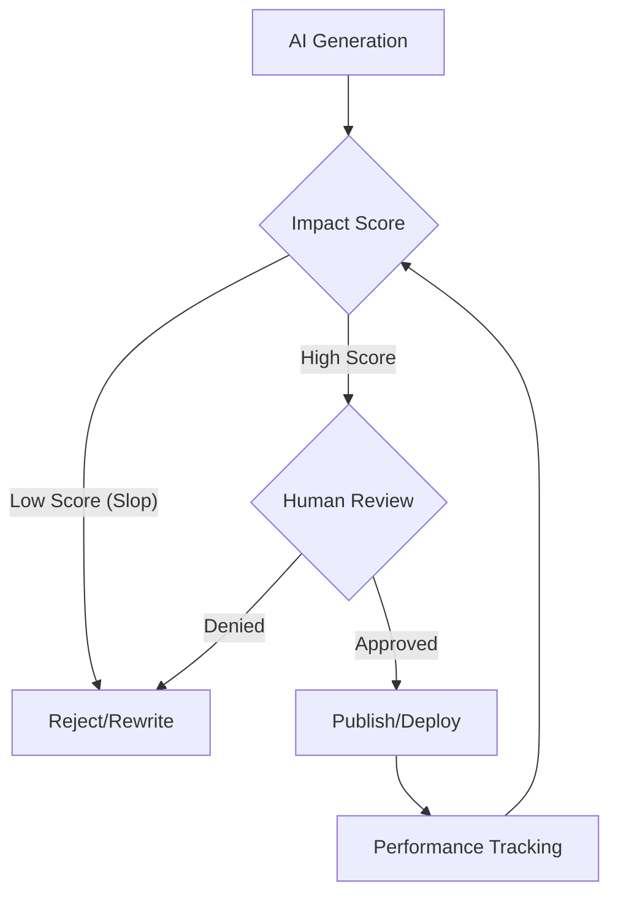

import Tabs from '@theme/Tabs';
import TabItem from '@theme/TabItem';

The honeymoon phase of "generate everything with AI" is officially over, as major platforms like WordPress and Cloudflare are now forced to build guardrails against the resulting tide of low-quality "slop."

## Why I Built It
While I didn't push a new repo for this specific analysis, the shift in industry standards directly affects how I build my own agent workflows. The "slop" problem isn't just about bad blog posts; it's about the erosion of trust in both content and code. WordPress's new guidelines and the Cloudflare Matrix debate highlight a critical technical debt: if you can't verify or maintain what you generate, you shouldn't publish it.

## The Solution: Human-Centric AI Governance
The industry is moving toward a "Human-in-the-Loop" (HITL) requirement. WordPress is now explicitly targeting mass-produced, low-value content, while the Cloudflare community is debating whether AI-generated code for complex systems (like Matrix homeservers) is a feature or a liability.

The technical fix isn't to ban AI, but to implement scoring and verification pipelines.

### Slop vs. Substance
When building content generators, we need to shift from "is this grammatically correct?" to "does this add value?".

<Tabs>
  <TabItem value="slop" label="AI Slop Indicators">
    - Generic, repetitive phrasing ("In the rapidly evolving landscape...").
    - Lack of specific data or personal anecdotes.
    - Zero external links or citations.
    - High frequency of hallucinations or outdated facts.
  </TabItem>
  <TabItem value="quality" label="High-Impact Content">
    - Specific, actionable takeaways.
    - Unique "opinionated" perspective (The Victor approach).
    - Verified code snippets or data points.
    - Clear attribution of AI assistance.
  </TabItem>
</Tabs>

:::warning
Using AI to generate complex infrastructure code (like a Matrix homeserver) without a deep understanding of the output is a security risk. The Cloudflare debate proves that "it runs" is no longer the bar—"it is maintainable" is.
:::

## The Code
No separate repo—this is a review of external guidelines and industry shifts that are reshaping my development roadmap.

## What I Learned
- **Disclosure is Mandatory:** WordPress is pushing for clear disclosure. As a builder, I'm integrating "Generated by" metadata into all my CMS-related agents.
- **Maintainability > Speed:** The Cloudflare Matrix debate reminds us that AI code is only fast until the first bug happens. If you can't debug it, don't ship it.
- **Heuristic Scoring:** I'm starting to build local heuristic checkers to catch "slop" patterns (like the "AI-isms" we've all grown to hate) before content reaches a human reviewer.
- **Security First:** The Moltbook breach and GitHub's false positive updates show that as we automate more, our "Layered Defenses" must be more robust, not less.

## References
- [WordPress Releases Guidelines to Combat 'AI Slop'](https://vertexaisearch.cloud.google.com/grounding-api-redirect/AUZIYQHqAmoYfc60txZn0POGA3WSc5BlBzdikkNbnY56f0G3pzwgwFnWv4mdHmYFeajEFZNxhOeipZkDoP2Yho3wrrkx6rZCb5SaAs_5K378dT7BSRT0D5NScTi7Em9bLKL5jlzPRh651XNh8Eb07o6Kz2w=)
- [Cloudflare Matrix Homeserver Demo Sparks AI Code Debate](https://vertexaisearch.cloud.google.com/grounding-api-redirect/AUZIYQGisgd_1hN2fw9bm6k8zmSDrQ-rEUmbOWpHJaEMsxiJaluIOAuTr8KcyrXxOXkaiXMrMJ2YI9DqKjlbkP8BB9g40lUlelkhvy6x9IuSsdG0vxO7gHRkHqMF)
- [GitHub Updates Layered Defenses After False Positives](https://vertexaisearch.cloud.google.com/grounding-api-redirect/AUZIYQGisgd_1hN2fw9bm6k8zmSDrQ-rEUmbOWpHJaEMsxiJaluIOAuTr8KcyrXxOXkaiXMrMJ2YI9DqKjlbkP8BB9g40lUlelkhvy6x9IuSsdG0vxO7gHRkHqMF)
