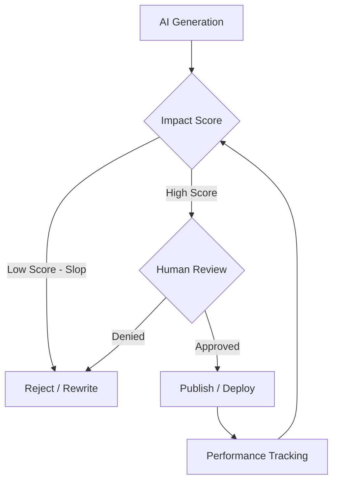

import TOCInline from '@theme/TOCInline';

The honeymoon phase of "generate everything with AI" is officially over, as major platforms like WordPress and Cloudflare are now forced to build guardrails against the resulting tide of low-quality "slop."

<!-- truncate -->

<TOCInline toc={toc} minHeadingLevel={2} maxHeadingLevel={2} />

<details>
<summary>TL;DR — 30 second version</summary>

- WordPress is explicitly targeting mass-produced, low-value AI content
- Cloudflare's Matrix homeserver demo sparked a debate: AI code that "runs" is not the same as code that is "maintainable"
- The industry is moving toward Human-in-the-Loop requirements
- Disclosure is becoming mandatory; I am integrating "Generated by" metadata into agents

</details>

## Why This Matters

The shift in industry standards directly affects how I build my own agent workflows. The "slop" problem is not just about bad blog posts; it is about the erosion of trust in both content and code. WordPress's new guidelines and the Cloudflare Matrix debate highlight a critical technical debt: if you can't verify or maintain what you generate, you shouldn't publish it.

## The Solution: Human-Centric AI Governance

The industry is moving toward a "Human-in-the-Loop" (HITL) requirement. WordPress is now explicitly targeting mass-produced, low-value content, while the Cloudflare community is debating whether AI-generated code for complex systems (like Matrix homeservers) is a feature or a liability.

The technical fix is not to ban AI, but to implement scoring and verification pipelines.


```mermaid
flowchart TD
  A[AI Generation] --> B{Impact Score}
  B -->|Low Score - Slop| C[Reject / Rewrite]
  B -->|High Score| D{Human Review}
  D -->|Approved| E[Publish / Deploy]
  D -->|Denied| C
  E --> F[Performance Tracking]
  F --> B
```

### Slop Indicators vs. Substance

```text title="AI Slop red flags"
- Generic, repetitive phrasing ("In the rapidly evolving landscape...")
- Lack of specific data or personal anecdotes
- Zero external links or citations
- High frequency of hallucinations or outdated facts
```

```text title="High-impact content markers"
- Specific, actionable takeaways
- Unique opinionated perspective
- Verified code snippets or data points
- Clear attribution of AI assistance
```

:::warning[Code Maintainability]
Using AI to generate complex infrastructure code (like a Matrix homeserver) without a deep understanding of the output is a security risk. The Cloudflare debate proves that "it runs" is no longer the bar -- "it is maintainable" is.
:::

:::tip[Top Takeaway]
Disclosure is becoming mandatory. WordPress is pushing for clear disclosure. As a builder, I am integrating "Generated by" metadata into all my CMS-related agents. If you generate content or code, mark it.
:::

## What I Learned

- **Disclosure is Mandatory:** WordPress is pushing for clear disclosure. I am integrating "Generated by" metadata into all my CMS-related agents.
- **Maintainability > Speed:** The Cloudflare Matrix debate reminds us that AI code is only fast until the first bug happens. If you can't debug it, don't ship it.
- **Heuristic Scoring:** I am starting to build local heuristic checkers to catch "slop" patterns (like the "AI-isms" we've all grown to hate) before content reaches a human reviewer.
- **Security First:** The Moltbook breach and GitHub's false positive updates show that as we automate more, our "Layered Defenses" must be more robust, not less.

## Signal Summary

| Topic | Signal | Action | Priority |
|---|---|---|---|
| WordPress AI Guidelines | Targeting mass-produced slop | Add disclosure metadata to agents | High |
| Cloudflare Matrix Debate | "It runs" != "It is maintainable" | Require human review for infra code | High |
| AI Content Scoring | HITL pipelines becoming standard | Build local heuristic slop checkers | Medium |
| Security Automation | More automation = more attack surface | Strengthen layered defenses | High |

## Why This Matters for Drupal and WordPress

WordPress's new anti-slop guidelines directly impact plugin and theme developers who use AI to generate documentation, descriptions, or marketing copy — non-compliant content risks directory delisting. Drupal contrib maintainers face similar scrutiny as the Drupal Association evaluates AI-generated project pages and module documentation. Both ecosystems are moving toward mandatory AI disclosure, so agencies and maintainers should integrate content quality scoring and "Generated by" metadata into their publishing workflows now.

## References

- [WordPress Releases Guidelines to Combat 'AI Slop'](https://vertexaisearch.cloud.google.com/grounding-api-redirect/AUZIYQHqAmoYfc60txZn0POGA3WSc5BlBzdikkNbnY56f0G3pzwgwFnWv4mdHmYFeajEFZNxhOeipZkDoP2Yho3wrrkx6rZCb5SaAs_5K378dT7BSRT0D5NScTi7Em9bLKL5jlzPRh651XNh8Eb07o6Kz2w=)
- [Cloudflare Matrix Homeserver Demo Sparks AI Code Debate](https://vertexaisearch.cloud.google.com/grounding-api-redirect/AUZIYQGisgd_1hN2fw9bm6k8zmSDrQ-rEUmbOWpHJaEMsxiJaluIOAuTr8KcyrXxOXkaiXMrMJ2YI9DqKjlbkP8BB9g40lUlelkhvy6x9IuSsdG0vxO7gHRkHqMF)
- [GitHub Updates Layered Defenses After False Positives](https://vertexaisearch.cloud.google.com/grounding-api-redirect/AUZIYQGisgd_1hN2fw9bm6k8zmSDrQ-rEUmbOWpHJaEMsxiJaluIOAuTr8KcyrXxOXkaiXMrMJ2YI9DqKjlbkP8BB9g40lUlelkhvy6x9IuSsdG0vxO7gHRkHqMF)


***
*Need an Enterprise CMS Architect to modernize your legacy PHP platforms? View my case studies at [victorjimenezdev.github.io](https://victorjimenezdev.github.io) or connect with me on LinkedIn.*
