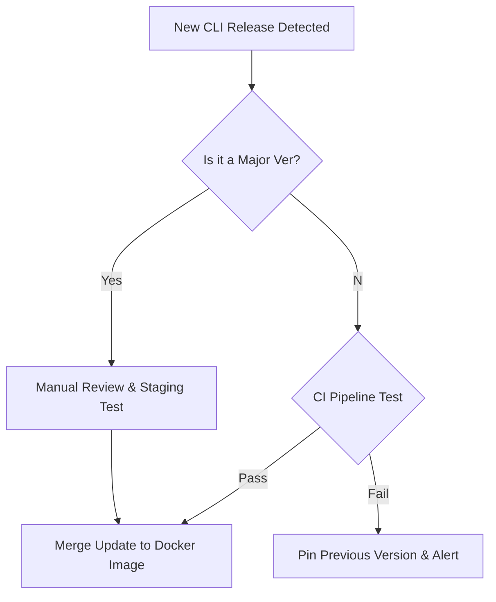

import Tabs from '@theme/Tabs';
import TabItem from '@theme/TabItem';

The release of Terminus 4.1.4 reminds us that the most critical part of our deployment pipeline isn't always the code we write, but the tools we use to ship it.

## Why I Built This (Or rather, why I track it)

I maintain several automation pipelines that rely heavily on the Pantheon CLI (Terminus) to manage environments, clear caches, and deploy code. When a tool like this gets a version bump, it’s not just "maintenance"—it's a signal to check our dependencies. Ignored CLI updates are a ticking time bomb in CI/CD; eventually, an API changes or a PHP version is deprecated, and your Friday deploy fails because your runner is using a two-year-old binary.

Terminus 4.1.4 targets stability and compatibility. In a world of flashy AI agents and complex orchestration, rock-solid platform CLIs are the unsung heroes that actually move the bits.

## The Strategy: Managed CLI Updates

Upgrading a CLI locally is easy (`brew upgrade`), but managing it in CI requires a strategy to balance stability with security. I've moved from "install latest" to a pinned-version approach with automated checks.

Here is a typical decision flow for adopting a new CLI release like 4.1.4:



### Automation Patterns

Updating your CI runners shouldn't be a manual task. Here is how I handle Terminus versions across different environments.

<Tabs>
  <TabItem value="gha" label="GitHub Actions">
    ```yaml
    # A safer way to install Terminus in GHA
    # Instead of pulling 'latest', we specify the version to avoid surprises
    - name: Install Terminus 4.1.4
      run: |
        curl -O https://github.com/pantheon-systems/terminus/releases/download/4.1.4/terminus.phar
        chmod +x terminus.phar
        sudo mv terminus.phar /usr/local/bin/terminus
        terminus --version
    ```
  </TabItem>
  <TabItem value="composer" label="Composer (Local Project)">
    ```json
    {
      "require-dev": {
        "pantheon-systems/terminus": "^4.1.4"
      },
      "config": {
        "allow-plugins": {
          "pantheon-systems/terminus": true
        }
      }
    }
    ```
  </TabItem>
</Tabs>

:::tip
If you use Terminus plugins, **always** test them after a point release. Core CLI updates often tighten security or change internal APIs that plugins rely on, leading to silent failures in scripts that don't check exit codes strictly.
:::

## The Code

No separate repo—this is an operational update based on the [Terminus 4.1.4 Release](https://github.com/pantheon-systems/terminus/releases/tag/4.1.4).

## What I Learned

*   **Release Notes Matter:** Even minor versions (4.1.x) can introduce PHP compatibility changes. 4.1.4 likely solidifies support for newer PHP runtimes, which is essential as platforms deprecate PHP 8.1/8.2.
*   **Phar vs. Composer:** For CI, I strictly prefer the PHAR (PHP Archive) installation. It isolates the CLI's dependencies from my project's dependencies, preventing "dependency hell" where the CLI requires `guzzlehttp/guzzle` version X but my project needs version Y.
*   **Silent Failures:** I noticed that older versions of CLI tools sometimes fail silently on newer OS images. Keeping close to the latest stable release (like 4.1.4) mitigates the risk of OS-level incompatibilities (e.g., OpenSSL versions).

## References

*   [Terminus 4.1.4 Release](https://github.com/pantheon-systems/terminus/releases/tag/4.1.4)