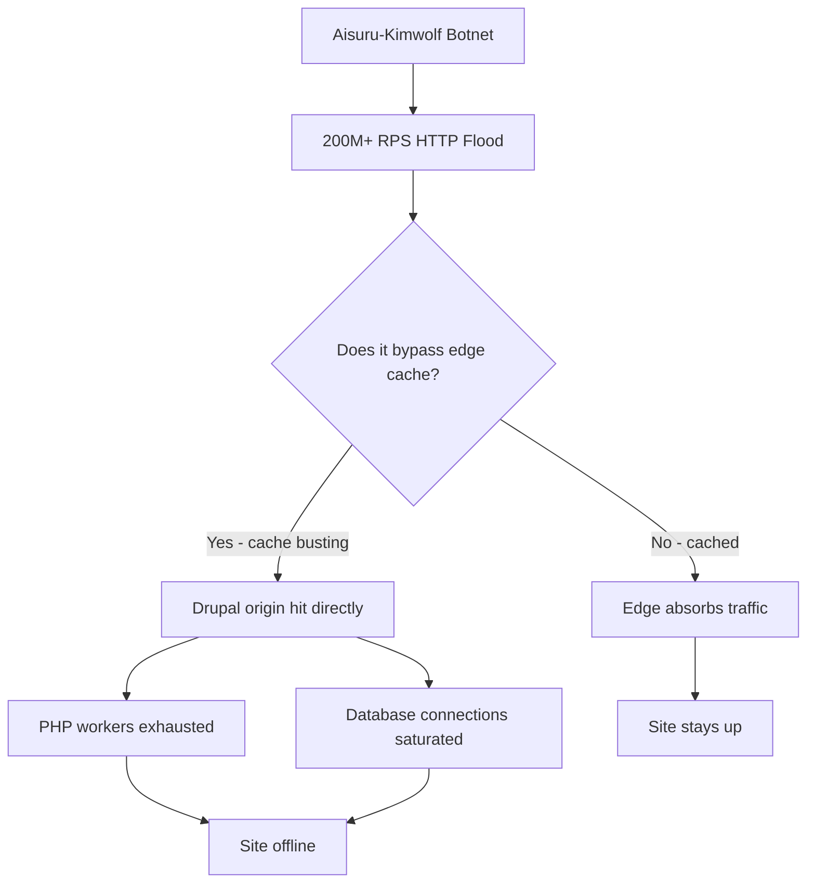

import Tabs from '@theme/Tabs';
import TabItem from '@theme/TabItem';

The Cloudflare 2025 Q4 DDoS threat report just dropped, and the numbers are brutal. A record-breaking **31.4 Tbps attack** mitigated in November 2025, and hyper-volumetric attacks up **700%**. For Drupal site owners, these are not just statistics — they represent a fundamental shift in the scale of threats your infrastructure must handle.

<!-- truncate -->

## The Key Findings

> "A record-breaking 31.4 Tbps attack was mitigated in November 2025, and hyper-volumetric attacks have grown by 700%."
>
> — Cloudflare, 2025 Q4 DDoS Threat Report

:::info[Context]
The **Aisuru-Kimwolf botnet** uses compromised Android TVs to launch HTTP DDoS attacks exceeding **200 million requests per second (RPS)**. When an attack at that scale hits a CMS like Drupal, even the most optimized database queries become a bottleneck if the attack bypasses the edge cache.
:::

## Attack Patterns That Matter for Drupal

<Tabs>
<TabItem value="findings" label="Key Findings">

| Finding | Impact on Drupal |
|---|---|
| Short, intense bursts (under 1 minute) | Can knock unprotected Drupal sites offline before any human response |
| Cache-busting tactics | Forces Drupal application server to process every request |
| 200M+ RPS HTTP floods | Overwhelms PHP workers regardless of optimization |
| 700% increase in hyper-volumetric attacks | Scale of threat has fundamentally changed |
| Telecom/service providers top targets | Any high-profile site is at risk |

</TabItem>
<TabItem value="vectors" label="Attack Vectors">



</TabItem>
</Tabs>

## Defense-in-Depth: What Actually Works

I built a **DDoS Resilience Toolkit** for Drupal that provides application-level safeguards to complement edge protection like Cloudflare.

| Defense Layer | What It Does | Why It Matters |
|---|---|---|
| Cloudflare Integrity Enforcement | Ensures origin only talks to Cloudflare | Prevents attackers from bypassing WAF via direct IP |
| Adaptive Rate Limiting | Cache-backed throttling of suspicious IPs | Protects PHP workers before they are exhausted |
| Pattern-Based Blocking | Detects cache-buster query strings | Stops the most common cache-bypass technique |

```php title="modules/contrib/ddos_resilience/src/Middleware/CloudflareIntegrity.php"
public function handle(Request $request, Closure $next) {
    $cfIP = $request->server->get('HTTP_CF_CONNECTING_IP');
    // highlight-next-line
    if (!$this->isCloudflareIP($request->getClientIp())) {
        return new Response('Direct access denied', 403);
    }
    return $next($request);
}
```

:::caution[Reality Check]
Application-level DDoS protection is a last line of defense, not a primary one. If a 31.4 Tbps attack reaches your origin, no amount of PHP middleware will save you. The point of application-level controls is to handle what leaks through edge protection — cache busters, slow drips, and direct-IP attacks.
:::

<details>
<summary>Full toolkit features</summary>

1. **Cloudflare Integrity Enforcement**: Verifies all incoming requests pass through Cloudflare IP ranges. Rejects direct-to-origin requests.
2. **Adaptive Rate Limiting**: Cache-backed mechanism that throttles suspicious IP addresses based on request frequency. No database dependency.
3. **Pattern-Based Blocking**: Detects cache-buster query strings that deviate from normal site usage patterns. Configurable via admin UI.

</details>

## The Code

[View Code](https://github.com/victorstack-ai/drupal-ddos-resilience-toolkit)

## What I Learned

- The scale of DDoS attacks has fundamentally changed. Relying on default configurations is not enough.
- Combining edge mitigation with application-level resilience gives Drupal sites a realistic chance under extreme pressure.
- The Aisuru-Kimwolf botnet using Android TVs is a reminder that attack surfaces are expanding to consumer IoT devices.
- Short, intense bursts under one minute are the new norm. Your monitoring needs sub-minute alerting.

## Why This Matters for Drupal and WordPress

Drupal and WordPress sites are prime DDoS targets because their PHP-based architectures exhaust worker pools quickly under cache-busting floods. Drupal sites should enforce Cloudflare IP integrity at the middleware level and use cache-backed rate limiting that avoids database dependency. WordPress sites benefit from the same pattern — plugins like Wordfence provide partial protection, but application-level cache-buster detection and direct-IP blocking are rarely configured and represent a critical gap in most WordPress hosting setups.

## References

- [Cloudflare 2025 Q4 DDoS Threat Report](https://blog.cloudflare.com/ddos-threat-report-for-2025-q4/)


***
*Looking for an Architect who doesn't just write code, but builds the AI systems that multiply your team's output? View my enterprise CMS case studies at [victorjimenezdev.github.io](https://victorjimenezdev.github.io) or connect with me on LinkedIn.*
