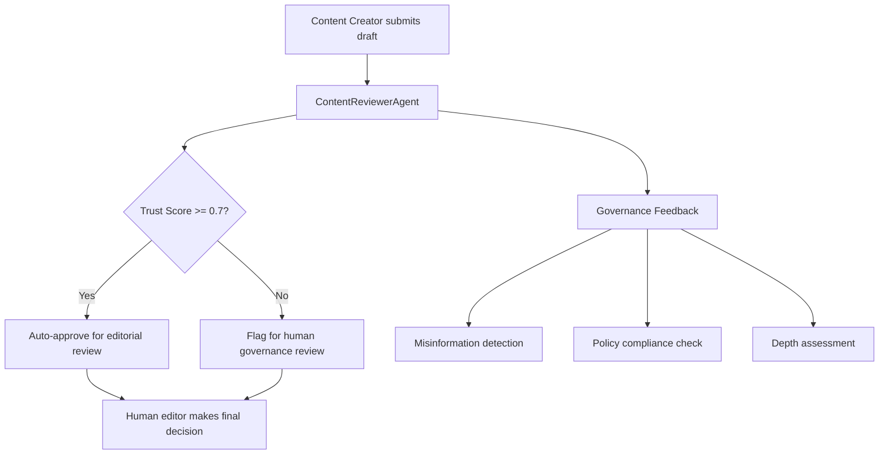

import Tabs from '@theme/Tabs';
import TabItem from '@theme/TabItem';

The **Drupal AI Hackathon: Play to Impact 2026**, held in Brussels on January 27-28, was a pivotal moment for the Drupal AI Initiative. The focus was on practical, AI-driven solutions that enhance teamwork while upholding trust, governance, and human oversight.

The most compelling challenge: creating **AI Agents for Content Creators** — not simple content generation, but agentic workflows where AI acts as collaborator, researcher, or reviewer.

<!-- truncate -->

## The Hackathon Core Question

> "How do we move beyond simple content generation to agentic workflows where AI acts as a collaborator, researcher, or reviewer?"
>
> — Drupal AI Hackathon 2026, Brussels

:::info[Context]
This hackathon is part of the broader Drupal AI Initiative. The emphasis on governance and human-in-the-loop models sets it apart from the typical "AI generates everything" hackathon. These are Drupal contributors thinking about production trust, not demo flash.
:::

## What I Built: ContentReviewerAgent

Inspired by the hackathon emphasis on governance, I built a prototype module: **Drupal AI Hackathon 2026 Agent**.

The module implements a `ContentReviewerAgent` service designed to check content against organizational policies.

<Tabs>
<TabItem value="features" label="Agent Capabilities">

| Capability | What It Does |
|---|---|
| Trust Score | Numerical reliability indicator for content |
| Governance Feedback | Actionable insights: misinformation risk, insufficient depth, policy violations |
| Human-in-the-loop | AI provides first-layer validation; humans make final decisions |
| Structured Output | Machine-readable results for workflow integration |

</TabItem>
<TabItem value="code" label="Implementation">

```php title="src/Service/ContentReviewerAgent.php" showLineNumbers
class ContentReviewerAgent {
public function review(NodeInterface $node): ReviewResult {
$content = $node->get('body')->value;

// highlight-next-line
$trustScore = $this->evaluateTrust($content);
$feedback = $this->checkPolicies($content);

return new ReviewResult(
trustScore: $trustScore,
feedback: $feedback,
requiresHumanReview: $trustScore < 0.7,
);
}
}
```

</TabItem>
</Tabs>

## The Architecture



## Hackathon Outcomes: What Matters vs What is Demo

| What the Hackathon Showed | Real Value | Demo-Only Value |
|---|---|---|
| AI agents checking content policies | Production-ready pattern | N/A |
| Trust scoring for editorial workflows | Quantifiable quality signal | Without calibration, just a number |
| Human-in-the-loop governance | Regulatory compliance baseline | Without enforcement, just theater |
| Structured agent output | Integration with editorial workflows | Without consumers, just JSON |
| Drupal AI ecosystem maturity | Module/service architecture works | Framework without adoption is potential |

:::caution[Reality Check]
Building AI agents in Drupal 10/11 is becoming streamlined thanks to the core AI initiative. But the key is treating AI not as a black box, but as a specialized service that can be tested, monitored, and governed just like any other business logic. The hackathon showed this is possible. Whether teams actually adopt governance-first patterns is a different question.
:::

<details>
<summary>Technical takeaway: AI as a Drupal service</summary>

The pattern that emerged from the hackathon:

1. Define AI agents as Drupal services (dependency-injectable, testable)
2. Use structured input/output contracts (not free-form prompt/response)
3. Integrate with existing Drupal workflows (content moderation, permissions)
4. Make governance checks explicit and auditable
5. Keep human oversight as a first-class requirement, not an afterthought

This is the same approach you would use for any business-critical service in Drupal. The AI part is just the implementation detail.

</details>

## The Code

[View the prototype on GitHub](https://github.com/victorstack-ai/drupal-ai-hackathon-2026-agent)

## What I Learned

- The hackathon focused on the right problem: governance and trust, not just generation.
- Building AI agents as Drupal services makes them testable and auditable.
- Trust scores are only useful if they are calibrated against real editorial standards.
- The Drupal AI Initiative is pushing toward production patterns, not just demos. That matters.

## References

- [Drupal AI Initiative](https://www.drupal.org/about/starshot/initiatives/ai)
