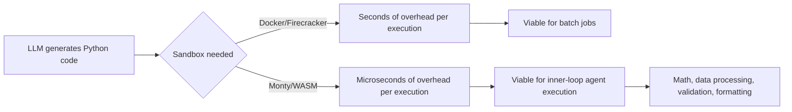

import Tabs from '@theme/Tabs';
import TabItem from '@theme/TabItem';

Simon Willison shared research on running Pydantic's **Monty** in WebAssembly. Monty is a minimal, secure Python interpreter written in Rust, designed specifically for safely executing code generated by LLMs. I put together a demo project to test both the Python integration and the WebAssembly build.

This is one of the few sandboxing approaches I have seen that actually addresses the real problem.

<!-- truncate -->

## The Problem

> "AI agents often need to execute code to solve problems. Traditional sandboxing (Docker, Firecracker) has significant overhead."
>
> — Simon Willison, [Research Notes](https://simonwillison.net/2026/Feb/6/pydantic-monty/)

:::info[Context]
Monty is not trying to be a full Python implementation. It is a **subset** of Python implemented in Rust. Unlike Pyodide or MicroPython, which aim for full or broad compatibility, Monty is built specifically for speed and security in LLM-generated code execution scenarios.
:::

## Monty vs The Alternatives

| Feature | Monty | Pyodide | MicroPython | Docker Sandbox |
|---|---|---|---|---|
| Language coverage | Python subset | Near-full CPython | Broad subset | Full Python |
| Runtime | Rust / WASM | Emscripten / WASM | C / WASM | Full OS |
| Startup latency | Microseconds | Seconds | Milliseconds | Seconds |
| File system access | **None by default** | Emulated | Limited | Configurable |
| Network access | **None by default** | Limited | Limited | Configurable |
| Ideal for agent inner loops | **Yes** | No (too slow) | Maybe | No (too heavy) |
| Browser execution | Yes (WASM) | Yes (WASM) | Yes (WASM) | No |

<Tabs>
  <TabItem value="capabilities" label="What Monty Provides">

1. **Restricted Environment**: No access to the host file system or network by default.
2. **Fast Startup**: Ideal for serverless or agentic workflows where you need to run small snippets frequently.
3. **Rust Foundation**: Leveraging Rust's safety and performance guarantees.
4. **WASM Target**: Compiles to WebAssembly for browser or edge execution.

  </TabItem>
  <TabItem value="browser" label="Running in the Browser">

By compiling Monty to WebAssembly, you get a Python REPL that runs entirely on the client side. This is useful for:

- Interactive documentation
- Playground environments
- Edge-side code execution
- Secure client-side computation

```html title="index.html"
<script type="module">
  // highlight-next-line
  import { MontyRuntime } from './monty_wasm.js';

  const runtime = await MontyRuntime.init();
  const result = runtime.exec('2 + 2');
  console.log(result); // 4
</script>
```

  </TabItem>
</Tabs>

## Why This Matters for AI Agents



AI agents often need to execute code to solve problems — math, data processing, validation. Traditional sandboxing (Docker, Firecracker) has significant overhead that makes it impractical for the inner loop of an LLM interaction. Monty offers a "sandbox-in-a-sandbox" approach that is lightweight enough to be part of every turn.

:::caution[Reality Check]
Monty is a Python **subset**. It will not run your Django app or your pandas pipeline. It is designed for small, self-contained computations — exactly the kind of code LLMs tend to generate for tool use. If your agent needs full Python, you still need a heavier sandbox. The question is whether your agent *actually* needs full Python for most of its code execution, and the answer is usually no.
:::

<details>
<summary>What Monty cannot do (by design)</summary>

- Import arbitrary third-party packages
- Access the file system
- Make network requests
- Use threading or multiprocessing
- Run code that depends on CPython C extensions
- Execute long-running computations (configurable timeout)

These limitations are features, not bugs. They are what make the microsecond startup possible.

</details>

## The Code

[View Code](https://github.com/victorstack-ai/pydantic-monty-wasm-demo)

## What I Learned

- Monty fills a real gap: microsecond-latency sandboxed execution for LLM-generated code.
- The WASM compilation target makes browser-side and edge-side execution practical.
- For AI agent inner loops, the subset limitation is actually the right trade-off.
- Docker and Firecracker are overkill for "compute 2+2 and format a date string" — which is most of what agents need.

## References

- [Simon Willison: Pydantic Monty Research](https://simonwillison.net/2026/Feb/6/pydantic-monty/)
- [Pydantic Monty WASM Demo](https://github.com/victorstack-ai/pydantic-monty-wasm-demo)
