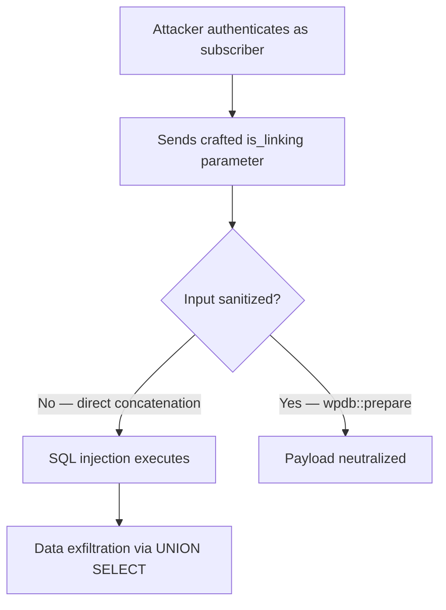

I tore apart CVE-2025-9318 — a critical SQL injection in the **Quiz and Survey Master** WordPress plugin affecting every version up to 10.3.1. Classic `$wpdb` concatenation, trivially exploitable by any authenticated subscriber.

<!-- truncate -->

:::danger[Critical — Patch Now]
CVE-2025-9318 allows authenticated SQL injection with subscriber-level permissions. If you run QSM below 10.3.2, you are exposed right now. Update today.
:::

## Severity Snapshot

| CVE | Severity | Affected Versions | Patched Version | Action |
|---|---|---|---|---|
| CVE-2025-9318 | Critical | &lt;= 10.3.1 | 10.3.2 | Update immediately |

## What Happened

The `is_linking` parameter was concatenated straight into a SQL string. No `prepare()`, no sanitization, no type casting. Subscriber-level access was enough to fire arbitrary queries at the database.



## The Vulnerable Code

I simplified the pattern for clarity, but the shape is identical to what shipped.

```php title="Vulnerable pattern (pre-10.3.2)" showLineNumbers
function qsm_request_handler($is_linking) {
    global $wpdb;

    // highlight-next-line
    // VULNERABLE: Direct concatenation of user input into SQL
    $query = "SELECT * FROM wp_qsm_sections WHERE is_linking = " . $is_linking;

    return $wpdb->get_results($query);
}
```

A payload like `1 OR 1=1` rewrites the query logic. `UNION SELECT` extracts data from any table the database user can reach.

## The Fix

Version 10.3.2 switched to `$wpdb->prepare()`. The `%d` placeholder forces integer casting — any non-numeric payload gets squashed to `1`.

```php title="Fixed pattern (10.3.2+)" showLineNumbers
function qsm_request_handler($is_linking) {
    global $wpdb;

    // highlight-next-line
    // FIXED: Using wpdb::prepare to safely handle the parameter
    $query = $wpdb->prepare(
        "SELECT * FROM wp_qsm_sections WHERE is_linking = %d",
        $is_linking
    );

    return $wpdb->get_results($query);
}
```

:::tip[Fast Triage]
Run `wp plugin list --format=table | grep quiz-and-survey-master` to check your installed version. Takes 5 seconds.
:::

## Triage Checklist

- [ ] Check if QSM is installed and which version
- [ ] Update to 10.3.2+ via dashboard or WP-CLI
- [ ] Clear any object caches
- [ ] Review database logs for suspicious queries against `wp_qsm_sections`
- [x] Verify the fix with the audit repo tests

## Audit Repository

I built a standalone audit project that simulates both the vulnerable and fixed environments with automated tests to verify detection.

> "The vulnerability allowed authenticated attackers, with Subscriber-level access and above, to append additional SQL queries into already existing queries that can be used to extract sensitive information from the database."
>
> — Wordfence, [CVE-2025-9318](https://www.wordfence.com/threat-intel/vulnerabilities/wordpress-plugins/quiz-master-next/)

<details>
<summary>Key defensive patterns for WordPress plugin developers</summary>

1. **Never trust user input.** Even parameters that look internal should be treated as hostile.
2. **Use prepared statements.** `$wpdb->prepare()` is the primary defense against SQL injection in WordPress.
3. **Type cast numeric parameters.** Casting to `(int)` provides defense-in-depth on top of prepared statements.
4. **Audit subscriber-accessible endpoints.** Low-privilege code paths get less review attention but carry the same SQL injection risk.

</details>

```bash title="Terminal — verify your version"
wp plugin list --format=table | grep quiz-and-survey-master
```

```bash title="Terminal — update QSM"
wp plugin update quiz-and-survey-master
```

## Why This Matters for Drupal and WordPress

This vulnerability is a textbook example of the SQL injection pattern that affects both ecosystems. WordPress developers must use `$wpdb->prepare()` the same way Drupal developers must use `$connection->query()` with placeholders — direct string concatenation in database queries is the single most common critical vulnerability in both CMS plugin/module ecosystems. Drupal's database abstraction layer provides similar protections, but contrib modules still ship with raw query concatenation. Every WordPress plugin developer and Drupal module maintainer should audit their subscriber-accessible endpoints for this exact pattern.

**View the audit code:** [wp-qsm-sql-injection-audit on GitHub](https://github.com/victorstack-ai/wp-qsm-sql-injection-audit)


***
*Looking for an Architect who doesn't just write code, but builds the AI systems that multiply your team's output? View my enterprise CMS case studies at [victorjimenezdev.github.io](https://victorjimenezdev.github.io) or connect with me on LinkedIn.*
