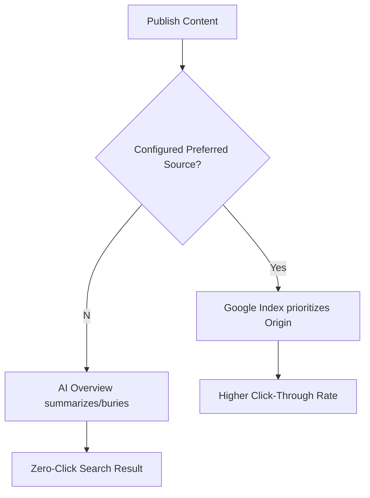

import Tabs from '@theme/Tabs';
import TabItem from '@theme/TabItem';

Google just handed independent publishers a way to fight back against AI scraping with their "Preferred Sources" tool, while hackers are simultaneously punishing anyone who ignores their `composer.lock` with a massive new malware campaign.

## Why I'm Watching This

If you run a WordPress site in 2026, you're fighting a two-front war: visibility and integrity.

1.  **Visibility:** AI Overviews often bury the original source. If you break a story or write the definitive guide, you want Google to know *you* are the primary source, not the AI summarizer.
2.  **Integrity:** The "Widespread WordPress Malware Campaign" reported this week isn't sophisticated—it's just opportunistic. It targets the lazy.

I've been spending time this weekend auditing my sites against these two updates.

## The Analysis

### Google's "Preferred Sources"
According to the latest reports, this tool allows publishers to explicitly signal "original reporting" via structured data or Search Console configuration. It's effectively a canonical tag for facts.

Here is how the flow changes for content producers:



If you are a technical writer or news breaker, ignoring this means you are voluntarily feeding the model without getting the traffic credit.

### The Malware Wave
The report from *Squared Tech* highlights that this campaign specifically targets "outdated plugins." This isn't a zero-day exploit in core; it's an exploit of the "set it and forget it" mentality.

The most dangerous thing you can do right now is rely on auto-updates that might fail silently. You need active scanning.

<Tabs>
  <TabItem value="audit" label="The Right Way (CLI)">
    ```bash
    # Don't just update; audit first.
    # Check for known vulnerabilities in your lock file.
    composer audit
    
    # If clean, then update safely
    composer update --with-dependencies
    ```
  </TabItem>
  <TabItem value="ui" label="The Wrong Way (UI)">
    ```text
    Dashboard -> Updates -> "Update All"
    
    # Why this fails:
    # 1. No audit trail.
    # 2. PHP timeouts can leave sites in maintenance mode.
    # 3. Doesn't check against vulnerability databases (usually).
    ```
  </TabItem>
</Tabs>

## The Code

No separate repo—this is an operational update based on industry reports.

I am currently updating my `drupal-eu-sovereignty-checklist` (which applies to WP as well) to include a check for these "Preferred Source" meta tags, as I suspect this will become a compliance standard for EU publishers wanting to protect their IP rights.

## What I Learned

*   **SEO is now "Source Authority":** Keywords matter less than proving provenance. If Google offers a tool to claim authorship, use it immediately.
*   **"Preferred Sources" needs Schema:** While the UI exists, likely the heavy lifting is done via JSON-LD. I'm digging into the specs to see if `NewsArticle` schema needs a specific property for this.
*   **Composer Audit is non-negotiable:** The malware campaign targeting "outdated plugins" is easily thwarted by running `composer audit` in your CI/CD pipeline. If you aren't blocking deployments on high-severity CVEs, you're asking for trouble.
*   **Old plugins are liabilities:** If a plugin hasn't been updated in 6 months, replace it. The attack surface is too high.

## References

*   [Google's 'Preferred Sources' Tool: A New SEO Frontier for WordPress Publishers](https://mean.ceo/google-preferred-sources-wordpress/)
*   [Widespread WordPress Malware Campaign Targets Outdated Plugins](https://squaredtech.co/wordpress-malware-report-feb-2026)