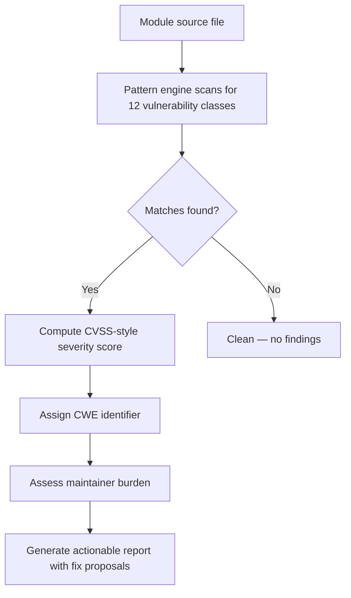

AI is making vulnerability discovery faster and cheaper. That is the easy part. The hard part is what happens next: an open-source maintainer with limited hours receives a flood of security reports and must decide which ones deserve immediate attention, which are false positives, and which can wait.

<!-- truncate -->

**Drupal AI Vulnerability Guardian** was built to close that gap. It started as a 3-pattern scanner. It now ships as a **12-pattern detection engine** with CVSS-style scoring, CWE identifiers, maintainer burden assessment, and a test suite that validates every detection path.

:::danger[Detection Is Not Triage]
A scanner that dumps findings without severity, CWE context, and effort estimates creates more work for maintainers, not less. This tool attaches actionable metadata to every finding so maintainers can make decisions, not just read alerts.
:::

## The Problem

Drupal's security surface is wide. Modules interact with the database, render user-supplied markup, handle file uploads, and redirect between routes. A single module can expose multiple vulnerability classes simultaneously.

Manual code review catches these issues — eventually. Maintainers need triage speed, not just detection.

## 12 Vulnerability Patterns

The engine covers 12 distinct vulnerability classes, each mapped to a CWE identifier.

| Pattern | CWE | Description |
|---|---|---|
| SQL Injection | CWE-89 | Direct variable concatenation in `db_query()` or `$connection->query()` |
| XSS via `Markup::create` | CWE-79 | Unsanitized variables passed to `Markup::create()` |
| XSS via `#markup` | CWE-79 | Unsanitized variables in render array `#markup` keys |
| XSS via `SafeMarkup` | CWE-79 | Deprecated `SafeMarkup::format()` with raw variables |
| Access Bypass | CWE-284 | Missing or improperly configured access callbacks on routes |
| CSRF | CWE-352 | Form handlers without token validation on state-changing operations |
| Open Redirect | CWE-601 | Unvalidated user input in `TrustedRedirectResponse` or `RedirectResponse` |
| File Upload | CWE-434 | Missing extension validation or MIME type checks on upload handlers |
| Insecure Deserialization | CWE-502 | `unserialize()` called on user-controlled input |
| SSRF | CWE-918 | User-controlled URLs passed to `httpClient->request()` without allowlist |
| Path Traversal | CWE-22 | Unsanitized file paths using `../` sequences in file operations |
| IDOR | CWE-639 | Direct object references without ownership validation |

Every pattern is defined as a data structure: regex, CWE ID, base severity score, and a human-readable description. Adding a new pattern does not require touching detection logic.



:::tip[Run It Now]
`./bin/vulnerability-guardian triage examples/VulnerableModule.php` — scans a realistic test fixture with 10 vulnerability patterns and outputs scored, actionable findings.
:::

## CVSS-Style Scoring

Each finding receives a severity score on a 0-10 scale aligned with CVSS v3.

| Severity | Score Range | Meaning |
|---|---|---|
| Critical | 9.0 - 10.0 | Exploitable without authentication, leads to full compromise |
| High | 7.0 - 8.9 | Significant impact, requires minimal preconditions |
| Medium | 4.0 - 6.9 | Exploitable under specific conditions or limited blast radius |
| Low | 0.1 - 3.9 | Informational or defense-in-depth concerns |

Scores are computed from the pattern's base severity adjusted by context signals: Is the input user-controlled? Is the code reachable from a public route? Does an existing sanitization layer sit between the input and the sink?

## Maintainer Burden Assessment

Every finding includes a maintainer burden rating. This answers the question a maintainer actually asks: "How much work is this going to take to fix and verify?"

| Burden | What It Means |
|---|---|
| Critical | Requires architectural changes or affects multiple subsystems |
| High | Requires careful refactoring with regression risk |
| Moderate | Requires code validation and targeted patch |
| Low | Straightforward fix, minimal regression risk |

## Example Output

```bash title="Terminal — run the scanner"
./bin/vulnerability-guardian triage examples/VulnerableModule.php
```

```text title="Example output (truncated)" showLineNumbers
Vulnerability #1: SQL Injection [CWE-89]
-----------------------------------------
Direct variable concatenation in database query.

Metric              Value
// highlight-next-line
Severity Score      9.5 / 10.0 (Critical)
Confidence          95 / 100
Maintainer Burden   Moderate - Requires code validation
CWE                 CWE-89

Proposed Fix
------------
[PATCH] Replace direct concatenation with placeholders:
        $connection->query("SELECT ... WHERE uid = :uid", [":uid" => $uid]);

Vulnerability #2: XSS via Markup::create [CWE-79]
---------------------------------------------------
Unsanitized variable passed directly to Markup::create().

Metric              Value
// highlight-next-line
Severity Score      7.8 / 10.0 (High)
Confidence          90 / 100
Maintainer Burden   Low - Straightforward sanitization
CWE                 CWE-79
```

## Test Coverage

The project includes **17 tests with 55 assertions** covering every detection pattern, scoring bracket, CWE mapping, and edge case. Each vulnerability class has dedicated test cases that verify both true positive detection and false positive suppression.

## Triage Checklist

- [ ] Clone the repository
- [ ] Run scanner against your module: `./bin/vulnerability-guardian triage path/to/Module.php`
- [ ] Review findings sorted by severity score
- [ ] Address Critical and High findings first
- [ ] Run the scanner again to verify fixes
- [x] Add scanner to CI pipeline for continuous monitoring

> "Triage is the bottleneck, not detection. A scanner that dumps findings without severity, CWE context, and effort estimates creates more work for maintainers, not less."

<details>
<summary>Technical architecture: patterns as data</summary>

The design principle is that detection logic never changes when new patterns are added. Each pattern is a data structure containing:

- **Regex pattern** — what to match in source code
- **CWE ID** — formal vulnerability classification
- **Base severity score** — starting point for CVSS-style computation
- **Description** — human-readable explanation
- **Proposed fix template** — actionable remediation guidance

Adding a new vulnerability pattern means adding one data entry. No new code paths, no new test infrastructure (beyond a test case for the new pattern itself). The engine iterates the registry and applies each pattern uniformly.

The included `VulnerableModule.php` demonstrates 10 vulnerability patterns in a single Drupal module file, providing a realistic test fixture for the engine.

</details>

**View Code:** [drupal-ai-vulnerability-guardian on GitHub](https://github.com/victorstack-ai/drupal-ai-vulnerability-guardian)

## Why This Matters for Drupal and WordPress

Drupal contrib maintainers receive security reports but lack tooling to triage them at scale — this scanner attaches severity scores, CWE identifiers, and fix effort estimates so maintainers can prioritize effectively. The 12 vulnerability patterns (SQL injection, XSS, CSRF, open redirect, SSRF, and more) map directly to the OWASP Top Ten issues that plague WordPress plugins too. WordPress plugin developers can adapt the regex-based detection patterns to scan for `$wpdb` concatenation, unescaped `echo` output, and missing nonce checks using the same data-driven architecture.

## References

- [Dries Buytaert — AI-Driven Vulnerability Discovery](https://socket.dev/blog/ai-accelerating-vulnerability-discovery-in-open-source)
- [MITRE CWE List](https://cwe.mitre.org/)
- [CVSS v3.1 Specification](https://www.first.org/cvss/v3.1/specification-document)
- [Drupal Security Advisories](https://www.drupal.org/security)
- [OWASP Top Ten](https://owasp.org/www-project-top-ten/)


***
*Looking for an Architect who doesn't just write code, but builds the AI systems that multiply your team's output? View my enterprise CMS case studies at [victorjimenezdev.github.io](https://victorjimenezdev.github.io) or connect with me on LinkedIn.*
