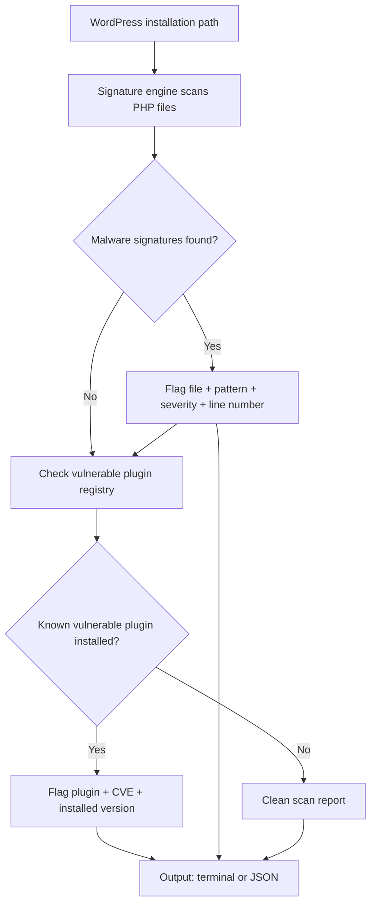

WordPress malware campaigns share a pattern. Attackers exploit one vulnerable plugin, drop a backdoor, then pivot across the entire installation. Most site owners discover the breach weeks later, after search engines have already flagged the domain.

<!-- truncate -->

**WP Malware Sentinel** started as a single-plugin scanner. It now ships as a full-featured CLI tool with an expanded signature database, a data-driven vulnerable plugin registry, JSON output, and a comprehensive test suite.

:::danger[Detection Gap Is Real]
Most WordPress malware infections go undetected for weeks. By the time search engines flag the domain, the attacker has already established persistence. Automated scanning is not optional — it is the difference between catching a backdoor in hours versus months.
:::

## The Problem

Scanning WordPress installations manually is slow and error-prone. Signature lists go stale. Plugin vulnerability checks get hardcoded as one-off if-blocks that nobody maintains. When a new CVE drops, teams scramble to patch detection logic instead of responding to the threat.

The goal: build a scanner that scales with the threat landscape, not against it.

## Signature Database

The engine detects the techniques attackers actually use in the wild.

| Signature | Description | Severity |
|---|---|---|
| `eval(base64_decode())` | Classic obfuscation wrapper | Critical |
| `shell_exec` | Direct command execution | Critical |
| `system` | Shell invocation vector | Critical |
| `passthru` | Binary-safe command output | Critical |
| `assert()` | Dynamic code evaluation disguised as assertion | High |
| `create_function()` | Anonymous function injection (deprecated but exploited) | High |
| `preg_replace` with `/e` | Regex-triggered code execution | High |
| `eval` + `$_REQUEST/$_POST/$_GET` | User-controlled code execution | Critical |

Each signature maps to a regex pattern with a severity label. No hardcoded string matching. Adding a new pattern is a one-line change to the registry.



## Vulnerable Plugin Database

The registry covers **12 plugins with specific CVE references**. Adding a new plugin means adding one array entry — no branching logic, no copy-paste.

| Plugin | CVE |
|---|---|
| Contact Form 7 | CVE-2020-35489 |
| Elementor | CVE-2022-29455 |
| WPForms Lite | CVE-2024-2053 |
| All in One SEO | CVE-2021-25036 |
| Yoast SEO | CVE-2023-40680 |
| WooCommerce | CVE-2023-28121 |
| UpdraftPlus | CVE-2022-0633 |
| Quiz And Survey Master | CVE-2025-67987 |
| Really Simple SSL | CVE-2022-45839 |
| LiteSpeed Cache | CVE-2024-28000 |
| Ninja Forms | CVE-2023-37979 |
| Essential Addons for Elementor | CVE-2023-32243 |

:::tip[Fast Scan]
Run `./bin/wp-sentinel scan /var/www/html` to scan an entire WordPress installation. Add `--json` for machine-readable output that pipes into CI dashboards.
:::

## JSON Output for CI Pipelines

CI pipelines and automation agents need structured data, not terminal colors. The `--json` flag produces machine-readable output.

```bash title="Terminal — scan with JSON output"
./bin/wp-sentinel scan /var/www/html --json
```

```json title="Example JSON output" showLineNumbers
{
    "scan_results": {
        "malware_signatures": [
            {
                "file": "wp-content/plugins/compromised/backdoor.php",
                // highlight-next-line
                "pattern": "eval(base64_decode())",
                "severity": "critical",
                "line": 42
            }
        ],
        "vulnerable_plugins": [
            {
                "plugin": "Quiz And Survey Master",
                // highlight-next-line
                "cve": "CVE-2025-67987",
                "installed_version": "10.2.1",
                "status": "vulnerable"
            }
        ]
    }
}
```

This makes it trivial to pipe results into dashboards, Slack webhooks, or incident response tooling.

## Triage Checklist

- [ ] Install WP Malware Sentinel on your monitoring host
- [ ] Run initial scan against all managed WordPress installations
- [ ] Review flagged files for confirmed malware signatures
- [ ] Cross-reference vulnerable plugin detections against installed versions
- [ ] Update or remove flagged plugins
- [x] Schedule recurring scans in CI/cron

## Test Coverage

The project includes **8 tests with 30 assertions** covering signature detection, plugin version parsing, JSON output formatting, and edge cases like empty directories and clean installations. Tests run on PHPUnit and validate that the scanner produces zero false positives against a stock WordPress core.

> "Treat detection logic as data, not code. When signatures and plugin entries live in a registry instead of branching logic, the scanner scales linearly with the threat landscape."

<details>
<summary>Architecture: data-driven detection</summary>

The design principle: detection logic never changes when new signatures or plugins are added.

**Signatures** are regex patterns in a registry array. Each entry has a pattern, a severity label, and a description. The engine iterates the registry against every PHP file in the scan path.

**Vulnerable plugins** are entries in a separate registry. Each entry defines a plugin slug, vulnerable version range, and CVE identifier. The scanner iterates the registry, parses each plugin's `readme.txt` for its stable tag, and flags matches.

Adding a new CVE means adding one data entry. No new code path, no new test infrastructure beyond a test case for the new entry. The scanner scales linearly with the threat landscape — new threats are data, not code.

</details>

**View Code:** [wp-malware-sentinel on GitHub](https://github.com/victorstack-ai/wp-malware-sentinel)

## Why this matters for Drupal and WordPress

WordPress agencies managing dozens of client sites need automated malware scanning that runs in CI and catches backdoors before they spread across shared hosting environments. The signature-based approach applies equally to Drupal sites — `eval(base64_decode())`, `shell_exec`, and `system` calls are the same red flags in Drupal custom modules and themes. Hosting providers running mixed Drupal/WordPress fleets can extend this scanner's registry pattern to cover Drupal-specific vectors like compromised `.module` files or rogue `hook_menu` implementations.

## References

- [CVE-2025-67987 — Quiz And Survey Master SQL Injection](https://nvd.nist.gov/)
- [CVE-2024-28000 — LiteSpeed Cache Privilege Escalation](https://nvd.nist.gov/)
- [CVE-2023-32243 — Essential Addons for Elementor Privilege Escalation](https://nvd.nist.gov/)
- [CVE-2022-29455 — Elementor Stored XSS](https://nvd.nist.gov/)
- [WordPress Plugin Security Best Practices](https://developer.wordpress.org/plugins/security/)


***
*Need an Enterprise CMS Architect to modernize your legacy PHP platforms? View my case studies at [victorjimenezdev.github.io](https://victorjimenezdev.github.io) or connect with me on LinkedIn.*
