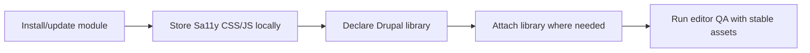

The biggest takeaway: serving Sa11y CSS/JS locally in Drupal gives you more predictable accessibility checks, especially when external asset delivery is unreliable or restricted.

## Why I Built It

I wanted a safer accessibility integration path for Drupal sites that run in locked-down environments, strict CSP setups, or government networks where third-party asset delivery can fail silently. Accessibility tooling is only useful when it is consistently available; if your script host blips, your QA confidence drops with it.

## The Solution

The practical pattern is simple: download Sa11y assets, ship them with your module/theme, and attach them as local libraries instead of relying on remote URLs.

:::warning
Local assets improve reliability, but they also shift maintenance to you. If you forget to update Sa11y versions, you can drift behind upstream fixes.
:::

Gotchas I’d watch:

- Works best when your deployment process already handles static asset versioning.
- Falls over when teams assume “local” means “never update” and stop tracking upstream changes.
- Can conflict with aggressive caching unless you have clear cache-busting rules for library updates.

## The Code

No separate repo. This was an implementation review and integration pattern study based on upstream Drupal discussion, not a standalone build.

## What I Learned

- Local-first asset delivery is worth it when compliance or network controls make CDN usage fragile.
- “Stable loading” beats “latest by default” for editorial accessibility workflows.
- If you self-host accessibility tooling, treat upstream updates as a recurring maintenance task, not a one-time setup.
- CSP-heavy environments are a strong signal to prefer local libraries from day one.

## References

- [Download and serve sa11y CSS and JS files locally](https://www.drupal.org/project/localgov_sa11y/issues/3573175)
