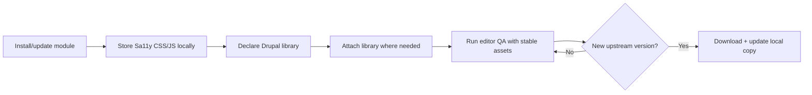

import TOCInline from '@theme/TOCInline';

The biggest takeaway: serving Sa11y CSS/JS locally in Drupal gives you more predictable accessibility checks, especially when external asset delivery is unreliable or restricted.

<!-- truncate -->

<TOCInline toc={toc} minHeadingLevel={2} maxHeadingLevel={2} />

<details>
<summary>TL;DR — 30 second version</summary>

- Local Sa11y assets improve reliability in locked-down/CSP-heavy environments
- The trade-off: you own the maintenance burden for upstream updates
- "Stable loading" beats "latest by default" for editorial accessibility workflows
- CSP-heavy environments are a strong signal to prefer local libraries from day one

</details>

## Why I Built It

I wanted a safer accessibility integration path for Drupal sites that run in locked-down environments, strict CSP setups, or government networks where third-party asset delivery can fail silently. Accessibility tooling is only useful when it is consistently available; if your script host blips, your QA confidence drops with it.

## The Solution

The practical pattern is simple: download Sa11y assets, ship them with your module/theme, and attach them as local libraries instead of relying on remote URLs.


```mermaid
flowchart LR
  A[Install/update module] --> B[Store Sa11y CSS/JS locally]
  B --> C[Declare Drupal library]
  C --> D[Attach library where needed]
  D --> E[Run editor QA with stable assets]
  E --> F{New upstream version?}
  F -->|Yes| G[Download + update local copy]
  F -->|No| E
```

### Library Declaration

```yaml title="my_module.libraries.yml"
sa11y:
  version: "4.x"
  css:
    theme:
      css/sa11y.min.css: { minified: true }
  js:
    js/sa11y.min.js: { minified: true }
  dependencies:
    - core/drupal
```

:::warning[Maintenance Trade-off]
Local assets improve reliability, but they also shift maintenance to you. If you forget to update Sa11y versions, you can drift behind upstream fixes. Treat upstream updates as a recurring maintenance task, not a one-time setup.
:::

:::tip[Top Takeaway]
CSP-heavy environments are a strong signal to prefer local libraries from day one. Don't wait until CDN failures break your accessibility workflow in production.
:::

## Gotchas

- Works best when your deployment process already handles static asset versioning.
- Falls over when teams assume "local" means "never update" and stop tracking upstream changes.
- Can conflict with aggressive caching unless you have clear cache-busting rules for library updates.

## The Code

No separate repo. This was an implementation review and integration pattern study based on upstream Drupal discussion, not a standalone build.

## What I Learned

- Local-first asset delivery is worth it when compliance or network controls make CDN usage fragile.
- "Stable loading" beats "latest by default" for editorial accessibility workflows.
- If you self-host accessibility tooling, treat upstream updates as a recurring maintenance task, not a one-time setup.
- CSP-heavy environments are a strong signal to prefer local libraries from day one.

## Signal Summary

| Topic | Signal | Action | Priority |
|---|---|---|---|
| Local Sa11y Assets | CDN unreliable in restricted networks | Bundle Sa11y locally | High |
| CSP Compatibility | Strict CSP blocks remote scripts | Prefer local libraries | High |
| Upstream Updates | Local assets drift behind | Schedule recurring update checks | Medium |
| Cache Busting | Stale cached assets after update | Implement library versioning | Medium |

## References

- [Download and serve sa11y CSS and JS files locally](https://www.drupal.org/project/localgov_sa11y/issues/3573175)
