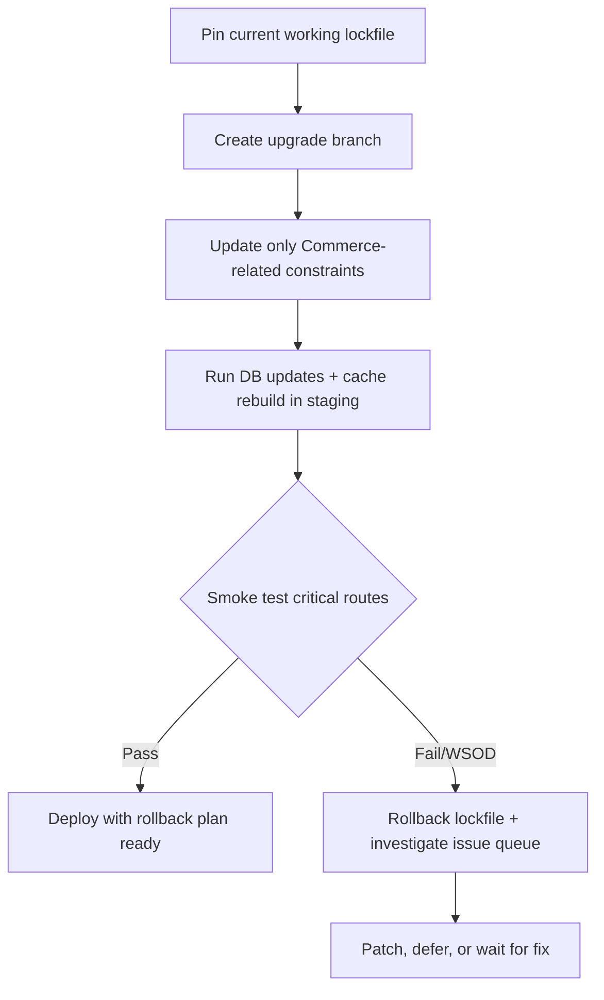

Upgrading Drupal Commerce from 3.2 to 3.3 can take a healthy site straight to WSOD, and that is exactly the kind of release risk you need to pre-plan for.

## Why I Built It

I dug into this because "minor version" tends to make teams drop their guard, and that is how production outages happen.

If your release process assumes `composer update` on Commerce minors is low-risk, this issue is a warning sign: dependency and runtime behavior can still shift enough to break every route. I care less about blame and more about operational reality: if a minor can blank the site, your process was under-defended.

## The Solution

My takeaway is not "never upgrade." It is "treat Commerce minors like controlled change windows."

What I would enforce before any 3.2 -> 3.3 rollout:

- A reproducible staging clone with production-like config and content shape.
- A lockfile rollback path tested before deployment.
- Automated smoke tests for homepage, checkout, cart, and user account routes.
- A hard stop rule: if any WSOD appears, revert immediately and triage offline.

:::warning
This pattern works when you already have disciplined CI/CD and lockfile control.  
It falls over if your team updates dependencies ad hoc in shared environments.
:::

## The Code

No separate repo; this is an upgrade-risk analysis based on a Drupal Commerce issue report, not a new code deliverable.

## What I Learned

- "Minor" does not mean "safe" in Commerce-heavy Drupal stacks; treat it as potentially breaking until proven otherwise.
- WSOD-level failures justify rollback-first operations, not live debugging in production.
- Issue queues are not just for maintainers; they are early-warning systems for release managers.
- If your upgrade checklist lacks route-level smoke tests, you are betting availability on luck.

## References

- [Updating from commerce 3.2 to 3.3 causes WSOD for every page on site [#3573220]](https://www.drupal.org/project/commerce/issues/3573220)
