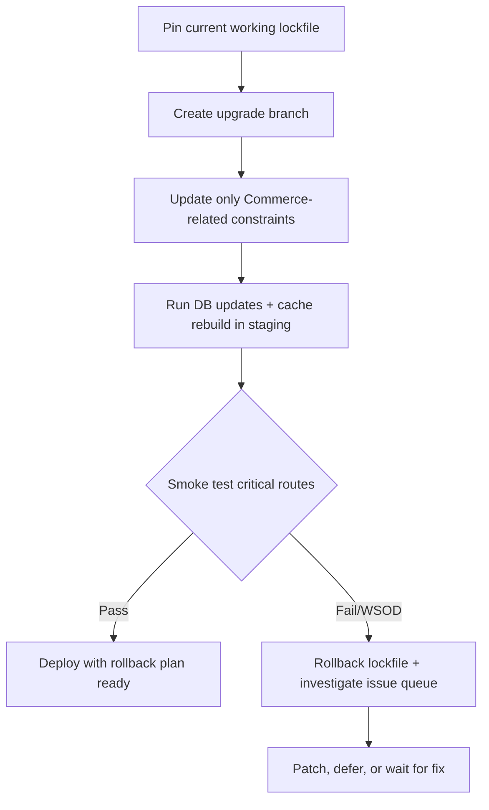

import TOCInline from '@theme/TOCInline';

Upgrading Drupal Commerce from 3.2 to 3.3 can take a healthy site straight to WSOD, and that is exactly the kind of release risk you need to pre-plan for.

<!-- truncate -->

<TOCInline toc={toc} minHeadingLevel={2} maxHeadingLevel={2} />

<details>
<summary>TL;DR — 30 second version</summary>

- Commerce 3.2 to 3.3 can cause WSOD on every page
- "Minor version" does not mean "safe" in Commerce-heavy Drupal stacks
- Treat Commerce minors like controlled change windows with staging clones and lockfile rollback
- If any WSOD appears, revert immediately and triage offline

</details>

## Why I Built It

I dug into this because "minor version" tends to make teams drop their guard, and that is how production outages happen.

If your release process assumes `composer update` on Commerce minors is low-risk, this issue is a warning sign: dependency and runtime behavior can still shift enough to break every route. I care less about blame and more about operational reality: if a minor can blank the site, your process was under-defended.

## The Upgrade Safeguard Flow

My takeaway is not "never upgrade." It is "treat Commerce minors like controlled change windows."


```mermaid
flowchart TD
  A[Pin current working lockfile] --> B[Create upgrade branch]
  B --> C[Update only Commerce-related constraints]
  C --> D[Run DB updates + cache rebuild in staging]
  D --> E{Smoke test critical routes}
  E -->|Pass| F[Deploy with rollback plan ready]
  E -->|Fail/WSOD| G[Rollback lockfile + investigate issue queue]
  G --> H[Patch, defer, or wait for fix]
```

### Pre-Rollout Checklist

What I would enforce before any 3.2 -> 3.3 rollout:

```bash title="Terminal — pre-upgrade lockfile pin"
# Pin the current working lockfile before touching anything
cp composer.lock composer.lock.rollback
git add composer.lock.rollback
git commit -m "Pin rollback lockfile before Commerce 3.3 upgrade"
```

- A reproducible staging clone with production-like config and content shape.
- A lockfile rollback path tested before deployment.
- Automated smoke tests for homepage, checkout, cart, and user account routes.
- A hard stop rule: if any WSOD appears, revert immediately and triage offline.

:::warning[CI/CD Dependency]
This pattern works when you already have disciplined CI/CD and lockfile control. It falls over if your team updates dependencies ad hoc in shared environments.
:::

:::tip[Top Takeaway]
"Minor" does not mean "safe" in Commerce-heavy Drupal stacks. Treat every Commerce minor as potentially breaking until proven otherwise in staging with production-like data.
:::

## The Code

No separate repo; this is an upgrade-risk analysis based on a Drupal Commerce issue report, not a new code deliverable.

## What I Learned

- "Minor" does not mean "safe" in Commerce-heavy Drupal stacks; treat it as potentially breaking until proven otherwise.
- WSOD-level failures justify rollback-first operations, not live debugging in production.
- Issue queues are not just for maintainers; they are early-warning systems for release managers.
- If your upgrade checklist lacks route-level smoke tests, you are betting availability on luck.

## Signal Summary

| Topic | Signal | Action | Priority |
|---|---|---|---|
| Commerce 3.2 -> 3.3 | WSOD on every page | Pin lockfile + stage test first | Critical |
| Minor Version Risk | "Minor" != "safe" | Treat as controlled change window | High |
| Lockfile Rollback | Essential safety net | Test rollback path before deploy | High |
| Route Smoke Tests | Missing = betting on luck | Automate homepage/checkout/cart tests | Medium |

## Why this matters for Drupal and WordPress

Drupal Commerce teams should treat every minor release as a controlled change window with staging validation and lockfile rollback, because Commerce touches checkout, cart, and payment routes that are revenue-critical. WordPress WooCommerce maintainers face the exact same risk profile — WooCommerce minor updates have historically broken checkout flows, and the safeguard pattern here (pin lockfile, clone staging, smoke-test critical routes) applies directly to `composer update` or plugin update workflows in WooCommerce-heavy WordPress sites. Agencies running both Drupal Commerce and WooCommerce stores should standardize on this pre-rollout checklist across both platforms.

## References

- [Updating from commerce 3.2 to 3.3 causes WSOD for every page on site [#3573220]](https://www.drupal.org/project/commerce/issues/3573220)


***
*Need an Enterprise CMS Architect to modernize your legacy PHP platforms? View my case studies at [victorjimenezdev.github.io](https://victorjimenezdev.github.io) or connect with me on LinkedIn.*
