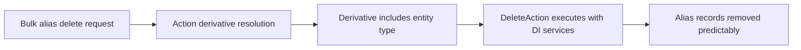

## The Hook
I shipped a Drupal 10/11-safe Pathauto delete action because alias cleanup is exactly the kind of workflow that quietly breaks during major-version transitions.

## Why I Built It
Path alias cleanup sounds simple until you run it in bulk operations, across entity types, in mixed environments that are already moving to Drupal 11 and preparing for WordPress 7.0-era editor changes.

The real problem was compatibility and predictability:

- Action plugins needed modernization for current Drupal patterns.
- Derivatives needed to expose entity type cleanly for VBO behavior.
- Safety mattered more than cleverness, because bad alias deletes are hard to unwind.

So what? If this layer is shaky, editors lose trust in automation and teams fall back to manual cleanup.

## The Solution
I implemented a D10/D11-compatible `DeleteAction` plugin with attributes plus dependency injection, then updated the deriver so generated action derivatives include entity `type` for VBO compatibility.

I also added a kernel test that validates:

- Derivative IDs are generated as expected.
- Derivative definitions include correct type metadata.
- Alias deletion behavior works end to end for the action path.

:::warning
Kernel tests here still depend on having a full Drupal test harness available. In lightweight repo contexts, bootstrap gaps can block execution even when code quality checks pass.
:::

So what? This is not just a refactor. It protects a high-impact editorial operation from subtle breakage during framework upgrades.

## The Code
[View Code](https://github.com/victorstack-ai/drupal-pathauto-issue-3514448/tree/issue-3514448-vbo-delete-alias-action)

Key files:

- `src/Plugin/Action/DeleteAction.php`
- `src/Plugin/Deriver/EntityUrlAliasDeleteActionDeriver.php`
- `tests/src/Kernel/PathautoKernelTest.php`
- `pathauto.permissions.yml`

## What I Learned
- Pathauto remains a better default than custom alias-delete plumbing when you need maintained behavior in Drupal 10/11.
- For one-off editorial UX needs, check maintained contrib first: `char_counter` and `pagenotfound_redirect` can save significant custom work.
- `ruffle` is a reminder to isolate legacy content concerns instead of contaminating modern rendering paths.
- On the WordPress side, Gutenberg release cadence is fast enough that deprecation readiness should be treated like routine maintenance, not a last-minute migration task.
- Worth trying: add derivative-focused kernel tests whenever you touch action plugins that participate in bulk operations.
- Avoid in production: shipping action/deriver rewrites without permission and derivative coverage, because failure modes show up at content-operations scale.

## References
- [Gutenberg Changelog #126 – Gutenberg Releases 22.3, 22.4, 22.5 and WordPress 7.0](https://gutenbergtimes.com/podcast/gutenberg-changelog-126-gutenberg-releases-22-3-22-4-22-5-and-wordpress-7-0/)
- [Can we enable watchSlidesProgress by default or add it as further property? \[#3573687\]](https://www.drupal.org/project/swiper_formatter/issues/3573687)
- [Char Counter](https://www.drupal.org/project/char_counter)
- [Page Not Found Redirect](https://www.drupal.org/project/pagenotfound_redirect)
- [Ruffle](https://www.drupal.org/project/ruffle)
