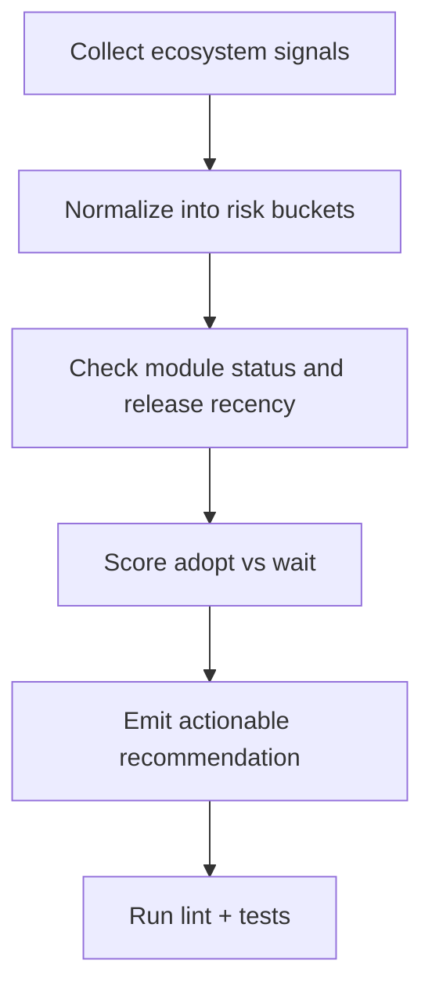

I shipped a release-audit tool for `security_advisories_nl` because release news, vulnerability records, and platform status pages are noisy unless you convert them into a clear adopt-or-wait decision. The module exists, is active, and has `1.0.0` released on February 15, 2026, so rebuilding from scratch would be wasteful. The useful move is to audit release metadata fast, confirm maintenance/security signals, and then adopt with guardrails instead of assumptions.

## The Hook

I shipped a focused audit tool so teams can decide quickly whether `security_advisories_nl` `1.0.0` should be adopted now or staged with controls.

## Why I Built It

The problem was signal overload, not lack of information.

- Drupal had fresh release activity (`dxpr_builder` alpha, `govuk_theme` stable) and an active core semantics discussion on config actions.
- WordPress had updated vulnerability records for high-install plugins (`WP Activity Log`, `Redirection for Contact Form 7`).
- Infrastructure status was green on Pantheon, which is useful but not enough for app-level risk decisions.

So what: when teams treat each feed as isolated news, they either overreact or miss real risk. I wanted one narrow output: "adopt, but with specific checks."

## The Solution

I built the workflow around one maintained contrib module that already exists (`security_advisories_nl`) and audited release readiness instead of duplicating functionality.

:::note
This approach is best when a maintained module already exists. If a project is abandoned for 12+ months, custom implementation may be justified.
:::

:::warning
A green platform status page does not reduce plugin/module vulnerability risk by itself. Keep infra health and app security as separate checks.
:::

Gotchas I had to account for

- "Minimally maintained" is not the same as abandoned, but it should change your rollout strategy.
- Updated vulnerability records are not always new exploits; sometimes the data quality improved. Treat them as prompts to re-validate exposure.
- Alpha releases (like DXPR Builder 3.0.0-alpha81) are valuable signals, but not production defaults.

## Related Posts

- [Preparing for Drupal 12: Auditing Database API Usage](/drupal-12-database-api-audit/)
- [Drupal Aggregation Guard](/build-drupal-aggregation-guard/)

## What I Learned

- `security_advisories_nl` is worth trying when you need fast advisory visibility without building custom plumbing.
- Avoid equating "operational" platform status with "secure" application posture in production.
- Treat vulnerability feed updates as revalidation triggers, not instant panic.
- Stable releases (`govuk_theme 3.1.3`) are better default candidates than alphas unless you are explicitly testing forward-compatibility.
- Core semantics discussions (like config-action behavior) are early warnings for future integration friction.

## References

- [Pantheon Status](https://status.pantheon.io/)
- [WP Activity Log Vulnerability Record](https://www.wordfence.com/threat-intel/vulnerabilities/wordpress-plugins/wp-security-audit-log)
- [Redirection for Contact Form 7 Vulnerability Record](https://www.wordfence.com/threat-intel/vulnerabilities/wordpress-plugins/wpcf7-redirect)
- [DXPR Builder 3.0.0-alpha81](https://www.drupal.org/project/dxpr_builder)
- [GOV.UK Theme 3.1.3](https://www.drupal.org/project/govuk_theme)
- [CNCF Case Study: Kubernetes/GitOps Migration](https://www.cncf.io/case-studies/cloudchipr/)
