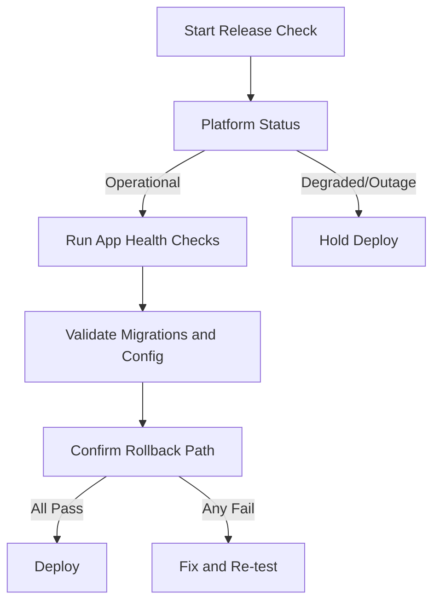

Pantheon reporting "All Systems Operational" is a good signal, but it is not a deploy approval by itself. I treat platform status as one input in a release gate that also checks app health, migration safety, and rollback readiness. That matters because many incidents are local to your code, data shape, or traffic pattern even when the platform is healthy. If you use Pantheon, keep the status page in your checklist, but do not let it be the checklist.

## Why I Built It

I kept seeing the same failure mode: teams read a green vendor status page, ship quickly, then spend hours debugging issues that were never platform-level. A healthy provider does not guarantee your config import, schema change, or cache invalidation path is safe.

So the real problem is decision quality at deploy time. I needed a repeatable way to separate platform risk from application risk before pressing the button.

## The Solution

I now use a compact release gate with explicit pass/fail criteria. Vendor status is only one branch.

:::warning
A green status page is a necessary signal for timing, not a sufficient signal for safety.
:::

My minimum release gate before production deploys

- Platform status is operational.
- Smoke checks pass on staging with production-like data shape.
- Migration/config changes are reversible or explicitly one-way with a fallback plan.
- Error budget is healthy (no unresolved high-severity incidents in the app).
- Rollback owner and command path are confirmed before deploy.

### Caveats and gotchas

- Status pages can lag short incidents or edge-region issues.
- "Operational" does not cover every third-party API your app depends on.
- If your deploy includes risky data transforms, platform health is almost irrelevant to the main risk.

## The Code

No separate repo, because this is an operational release policy pattern rather than a standalone build artifact.

## What I Learned

- Vendor status is worth checking when scheduling deploy windows, not for approving deploy safety.
- Avoid using one binary signal for release decisions in production.
- A small release gate beats heroic incident response every time.
- If you cannot roll back confidently, you are not ready to deploy even when the platform is green.

Related reading:
- [Kinsta Reliability at Scale Review](/2026-02-06-kinsta-reliability-at-scale-review/)
- [QSM SQL Injection Audit](/2026-02-07-wp-qsm-sql-injection-audit/)

## References

- [Pantheon Operations Status: All Systems Operational](https://status.pantheon.io/)
