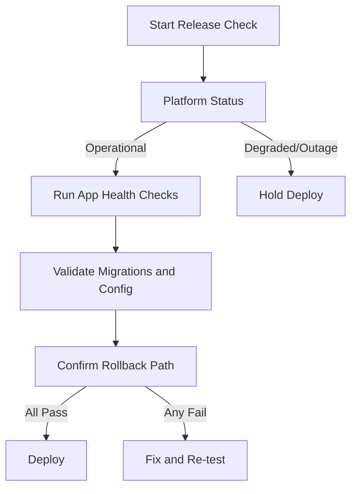

import TOCInline from '@theme/TOCInline';

Pantheon reporting "All Systems Operational" is a good signal, but it is not a deploy approval by itself. I treat platform status as one input in a release gate that also checks app health, migration safety, and rollback readiness.

<!-- truncate -->

<TOCInline toc={toc} minHeadingLevel={2} maxHeadingLevel={2} />

<details>
<summary>TL;DR — 30 second version</summary>

- A green vendor status page is necessary for timing, not sufficient for safety
- Most post-deploy incidents are local to your code, data shape, or traffic pattern
- Build a compact release gate with explicit pass/fail criteria
- If you cannot roll back confidently, you are not ready to deploy

</details>

## Why I Built It

I kept seeing the same failure mode: teams read a green vendor status page, ship quickly, then spend hours debugging issues that were never platform-level. A healthy provider does not guarantee your config import, schema change, or cache invalidation path is safe.

The real problem is decision quality at deploy time. I needed a repeatable way to separate platform risk from application risk before pressing the button.

## The Release Gate

I now use a compact release gate with explicit pass/fail criteria. Vendor status is only one branch.


```mermaid
flowchart TD
  A[Start Release Check] --> B[Platform Status]
  B -->|Operational| C[Run App Health Checks]
  B -->|Degraded/Outage| Z[Hold Deploy]
  C --> D[Validate Migrations and Config]
  D --> E[Confirm Rollback Path]
  E -->|All Pass| F[Deploy]
  E -->|Any Fail| Y[Fix and Re-test]
```

### Pre-Deploy Script Example

```bash title="Terminal — release gate check" showLineNumbers
#!/bin/bash
# Lightweight release gate — run before every production deploy

echo "=== Release Gate Check ==="

# 1. Platform status
echo "Checking Pantheon status..."
curl -s https://status.pantheon.io/api/v2/status.json | jq '.status.indicator'

# 2. Staging smoke test
echo "Running smoke tests on staging..."
drush @staging status-report --severity=2

# 3. Config validation
echo "Validating config import..."
drush @staging config:import --dry-run

# 4. Rollback path
echo "Confirming rollback lockfile exists..."
test -f composer.lock.rollback && echo "PASS" || echo "FAIL — no rollback lockfile"
```

:::warning[Green != Safe]
A green status page is a necessary signal for timing, not a sufficient signal for safety. Most incidents are local to your code, data shape, or traffic pattern.
:::

:::tip[Top Takeaway]
A small release gate beats heroic incident response every time. If you cannot roll back confidently, you are not ready to deploy even when the platform is green.
:::

<details>
<summary>My minimum release gate before production deploys</summary>

- Platform status is operational.
- Smoke checks pass on staging with production-like data shape.
- Migration/config changes are reversible or explicitly one-way with a fallback plan.
- Error budget is healthy (no unresolved high-severity incidents in the app).
- Rollback owner and command path are confirmed before deploy.

</details>

### Caveats and Gotchas

- Status pages can lag short incidents or edge-region issues.
- "Operational" does not cover every third-party API your app depends on.
- If your deploy includes risky data transforms, platform health is almost irrelevant to the main risk.

## The Code

No separate repo, because this is an operational release policy pattern rather than a standalone build artifact.

## What I Learned

- Vendor status is worth checking when scheduling deploy windows, not for approving deploy safety.
- Avoid using one binary signal for release decisions in production.
- A small release gate beats heroic incident response every time.
- If you cannot roll back confidently, you are not ready to deploy even when the platform is green.

Related reading:
- [QSM SQL Injection Audit](/2026-02-07-wp-qsm-sql-injection-audit/)

## Signal Summary

| Topic | Signal | Action | Priority |
|---|---|---|---|
| Platform Status | Necessary but not sufficient | Use for timing, not approval | High |
| App Health Checks | Local risks are the real threat | Run smoke tests on staging | High |
| Rollback Path | Must be tested before deploy | Confirm owner + command path | Critical |
| Config Validation | Bad imports cause outages | Dry-run config import in staging | High |

## References

- [Pantheon Operations Status: All Systems Operational](https://status.pantheon.io/)
