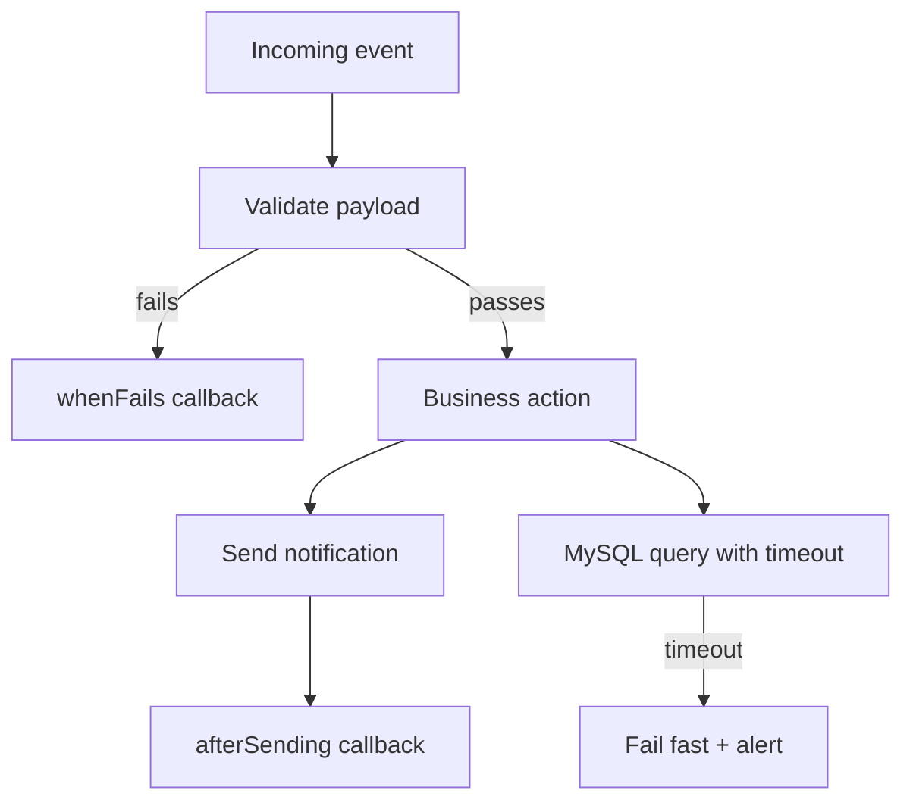

import Tabs from '@theme/Tabs';
import TabItem from '@theme/TabItem';

Laravel 12.51.0 matters because it gives me tighter control at exactly the points where production systems fail: after notifications are sent, when validation fails outside HTTP controllers, and when MySQL queries run too long.

<!-- truncate -->

## The Hook

I shipped a release-readiness playbook for Laravel 12.51.0 so I can adopt the useful parts now without waiting for the next outage to force cleanup.

## Why I Built It

Most framework upgrades are easy to postpone until they become painful. This one is different: it improves failure handling directly.

The pain points I wanted to fix:

1. Post-send side effects around notifications were spread across listeners and ad hoc callbacks.
2. Validation failures in jobs/commands still produced inconsistent flow control.
3. Slow queries were often detected too late, after queue backlogs or request timeouts.
4. Deprecation pressure is rising: `Request::get()` is now explicitly deprecated in the 12.51.0 stream.

## The Solution

I'm treating 12.51.0 as a reliability release, not a feature release.

<Tabs>
<TabItem value="what-to-adopt-now" label="Adopt Now">

- `afterSending()` on notifications for deterministic post-send actions.
- `whenFails()` / `whenPasses()` for explicit validation control in jobs and commands.
- Query `timeout()` (MySQL) for bounded latency and better blast-radius control.

</TabItem>
<TabItem value="migration-gotchas" label="Migration Gotchas">

- `timeout()` is MySQL-specific; do not assume parity on PostgreSQL/SQLite.
- `afterSending()` should stay idempotent because retries can execute it more than once depending on channel behavior.
- Replace deprecated `Request::get()` calls with direct access patterns (`$request->query()`, `$request->request`, or explicit attribute access) before the deprecation becomes a harder break in later framework/Symfony cycles.

</TabItem>
</Tabs>

:::warning
Do not upgrade and refactor everything in one pass. Roll out one reliability primitive at a time and watch error rate, queue lag, and p95 latency.
:::

If you're already hardening platform behavior, these related posts connect well with this release: [Laravel collection relationships in practice](/build-laravel-collection-has-many/), [WordPress 7.0 beta release readiness](/2026-02-17-wordpress-7-beta-1-feature-freeze-expectations/), and [reliability signals at scale](/2026-02-06-kinsta-reliability-at-scale-review/).

### Module/Plugin Check

No maintained Drupal module or WordPress plugin is the right abstraction for this specific work because these changes are Laravel core runtime patterns, not CMS extension features.

## The Code

No separate repo - this is a release-analysis and migration playbook, not a standalone build artifact.

## What I Learned

- `afterSending()` is worth trying when notification side effects must run with full channel context.
- `whenFails()` is better than scattered `if ($validator->fails())` checks when validation runs in queues, commands, or service classes.
- Query-level `timeout()` is a practical guardrail for MySQL hot paths, but only if I pair it with alerting and retry policy.
- Avoid leaving `Request::get()` in mature codebases; deprecations become expensive when mixed with larger upgrades.
- Avoid big-bang adoption in production. The safest path is staged rollout plus telemetry on each change.

## References

- [Laravel 12.51.0: afterSending Callbacks and whenFails Method](https://laravel-news.com/laravel-12-51-0)