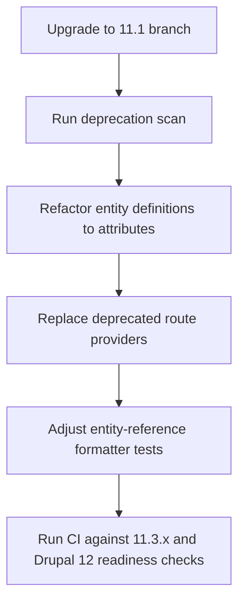

Drupal 11.1 does not break public APIs, but custom entity code can still break during upgrades because entity type definitions moved to attributes, some entity-related routes are deprecated for Drupal 12, and entity reference formatter output changed in access-sensitive contexts. If you maintain custom entities, treat Drupal 11.1 as a migration checkpoint, not just a patch-level bump.
<!-- truncate -->

## The Problem

Teams upgrading custom entity-heavy codebases from Drupal 10.4/11.0 to 11.1 often hit three real failures:

1. Entity definitions that still rely on annotations stop matching current core patterns and trigger tooling friction.
2. Entity permissions route providers emit deprecations and become hard blockers for Drupal 12.
3. Rendering/tests fail because entity reference labels are no longer always links.

Even when production pages still load, CI starts failing on deprecations, kernel/browser assertions, and static analysis.

## The Solution

Treat Drupal 11.1 as a focused refactor sprint around entity metadata, routing, and output assumptions.

| Area | 11.1 Change | Risk in Custom Entity Projects | Migration Move |
|---|---|---|---|
| Entity type definitions | Entity type plugins were converted from annotations to attributes | Custom entities drift from core conventions and tooling | Convert custom entity definitions to `#[ContentEntityType]`/`#[ConfigEntityType]` |
| Entity IDs | Content entities may use UUID as the primary ID key | Storage/integration code assuming integer IDs can break | Audit typed assumptions, casts, and external ID contracts |
| Entity permissions routes | `EntityPermissionsRouteProviderWithCheck` deprecated in 11.1, removed in 12 | Upgrade blockers and deprecation failures | Switch to `EntityPermissionsRouteProvider` |
| Entity reference label rendering | Label formatter now suppresses links when destination is inaccessible | Frontend and test selectors expecting `<a>` fail | Update assertions to accept link or plain text by access context |
| Hook system | OOP hooks introduced, with specific breaking caveats | Dynamic hook patterns and `ModuleHandler` internals can break | Move to hook classes and remove conditional hook definitions |

### 1) Convert entity type definitions to attributes

Drupal 11.1 formalized entity plugin conversion from annotations to attributes:

```php
use Drupal\Core\Entity\Attribute\ContentEntityType;

#[ContentEntityType(
  id: 'my_entity_type',
  entity_keys: [
    'id' => 'id',
    'label' => 'label',
    'uuid' => 'uuid',
  ],
)]
final class MyEntityType extends ContentEntityBase {}
```

If your custom entities still use docblock annotations, they may continue to work short-term, but you are building upgrade debt against Drupal 12+ conventions.

### 2) Handle UUID-as-ID capability safely

Drupal 11.1 allows mapping a content entity ID key directly to UUID:

```php
#[ContentEntityType(
  id: 'my_entity_type',
  entity_keys: [
    'id' => 'uuid',
    'label' => 'label',
    'langcode' => 'langcode',
    'uuid' => 'uuid',
  ],
)]
class MyEntityType extends ContentEntityBase {}
```

This is optional, but it means your custom code must stop assuming entity IDs are numeric. Check:

- strict casts like `(int) $entity->id()`
- schema/integration fields expecting integer foreign keys
- route requirements using `\d+` for entity IDs

### 3) Replace deprecated entity permissions route provider

Entity permission routes using the old provider now trigger deprecations:

```php
/**
 * @deprecated in drupal:11.1.0 and is removed from drupal:12.0.0.
 * Use EntityPermissionsRouteProvider instead.
 */
class EntityPermissionsRouteProviderWithCheck extends EntityPermissionsRouteProvider {}
```

For custom entities exposing bundle/entity permission tabs, move route provider configuration to `EntityPermissionsRouteProvider` now to avoid Drupal 12 breakage.

### 4) Fix formatter output assumptions in tests and UI logic

Drupal 11.1 changed the Entity Reference "Label" formatter to render plain text when users cannot access destination URLs. That is a behavior/security fix, but it breaks brittle assertions.

Use assertions that validate visible label text first, then conditionally assert link presence only when the acting user has access.



Related reading from this blog:
- [Drupal 12 Readiness Dashboard](/2026-02-08-drupal-12-readiness-dashboard/)
- [Drupal GitLab Issue Migration Workflow](/2026-02-16-drupal-gitlab-issue-migration-workflow/)
- [Drupal Context MCP Integration](/drupal-context-mcp-integration/)

## What I Learned

- Drupal 11.1 "no public API break" does not mean "no upgrade work" for custom entity implementations.
- Entity metadata modernization (attributes) is not cosmetic; it is the baseline for future core compatibility.
- The best time to remove 11.1 deprecations is before starting Drupal 12 work, not during it.
- Access-aware rendering changes are easy to miss and often surface first as flaky test failures.

## References

- https://www.drupal.org/project/drupal/releases/11.1.0
- https://www.drupal.org/project/drupal/releases
- https://www.drupal.org/node/3505422
- https://www.drupal.org/node/3458398
- https://www.drupal.org/node/3478634
- https://www.drupal.org/node/3442349
- https://api.drupal.org/api/drupal/core%21modules%21user%21src%21Entity%21EntityPermissionsRouteProviderWithCheck.php/11.x
- https://www.drupal.org/project/cms
