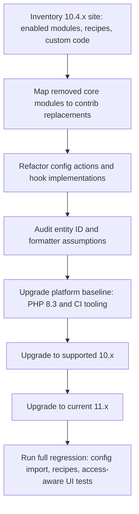

If your team is still on Drupal 10.4.x, treat Drupal 11 migration as active incident prevention, not roadmap hygiene: Drupal.org now flags 10.4.x security support as ended, and current supported lines are newer. The fastest safe path is to clear the high-impact change records first, then move to supported 10.5/10.6 and 11.x targets in one controlled sequence.
<!-- truncate -->

## The Problem

Teams on 10.4.x usually underestimate three traps:

| Trap | Why it breaks late | Real impact |
|---|---|---|
| Removed core modules/themes in 11.0 | Code/config still references modules that moved out of core | Composer/update failures or missing functionality after deploy |
| Config Actions model shift | Teams keep procedural assumptions while actions are pluginized | Recipe/config automation drifts or fails under newer workflows |
| Platform baseline jump | PHP/composer/test stack upgrades bundled with core major | CI starts failing before code deploy is attempted |

For Drupal CMS teams, another timing issue matters: the CMS release stream now shows `2.0.0` current and marks the `1.x` line unsupported, so upgrade planning must align core and CMS constraints together.

## The Solution

Build an impact map from official change records and release notes, then execute in this order.

### Impact map (10.4.x -> supported 10.x -> 11.x)

| Area | Change record / release note | Risk for 10.4.x teams | Concrete migration move |
|---|---|---|---|
| Core support window | Drupal releases page marks 10.4.x security support ended | Staying on 10.4.x leaves no security runway | Move first to latest supported 10.x branch, then 11.x |
| Removed extensions in 11.0 | 11.0.0 release notes + deprecated/obsolete modules docs | Config still depends on core modules removed in 11.0 | Install contrib replacements before major upgrade |
| Config Actions architecture | Change record: configuration actions are now plugins | Custom automation written around old assumptions | Refactor to plugin-based config actions and re-test recipes |
| OOP hooks | Change record: object-oriented hook implementations | Mixed procedural/OOP hook style causes maintenance drift | Standardize new hook code to OOP style, keep legacy only where needed |
| Entity ID assumptions | Change record: content entities may use UUID as entity ID | `(int)$entity->id()` and numeric route assumptions fail | Audit integrations and update typed ID assumptions |
| Access-aware label formatter | Change record: entity reference label formatter restricts links | Tests/UI code assume `<a>` always exists | Update assertions for link-or-text output by access context |
| Platform prerequisites | 11.0.0 release notes (PHP 8.3, Symfony 7, PHPUnit 10, Composer updates) | Upgrade blockers happen in CI/container images first | Upgrade runtime/tooling baseline before core major step |

### Code-level examples from upstream sources

`EntityPermissionsRouteProviderWithCheck` is explicitly deprecated in core 11.x:

```php
/**
 * @deprecated in drupal:11.1.0 and is removed from drupal:12.0.0.
 * Use EntityPermissionsRouteProvider instead.
 */
class EntityPermissionsRouteProviderWithCheck extends EntityPermissionsRouteProvider {}
```

Statistics removal in Drupal 11 also requires cleaning old `.htaccess` exceptions:

```apache
# Allow access to Statistics module's custom front controller.
RewriteCond %{REQUEST_URI} !/core/modules/statistics/statistics\.php$
```

### Recommended execution flow



Related posts:
- [Drupal 11.1 Breaking Changes for Custom Entities](/2026-02-17-drupal-11-1-custom-entity-breaking-changes/)
- [Drupal 12 Readiness Dashboard](/2026-02-08-drupal-12-readiness-dashboard/)
- [Drupal GitLab Issue Migration Workflow](/2026-02-16-drupal-gitlab-issue-migration-workflow/)

## What I Learned

- The largest Drupal 11 risk for 10.4.x teams is usually sequence, not code volume.
- Config actions and hook modernization should be treated as upgrade enablers, not optional cleanup.
- Drupal CMS version cadence can invalidate a technically successful core upgrade if CMS branch support is ignored.
- Access-aware rendering changes create noisy false negatives unless test assertions are updated early.

## References

- https://www.drupal.org/project/drupal/releases
- https://www.drupal.org/project/drupal/releases/11.0.0
- https://www.drupal.org/docs/core-modules-and-themes/deprecated-and-obsolete-modules-and-themes
- https://www.drupal.org/node/3512597
- https://www.drupal.org/node/3442349
- https://www.drupal.org/node/3458398
- https://www.drupal.org/node/3478634
- https://www.drupal.org/project/cms/releases
- https://api.drupal.org/api/drupal/core%21modules%21user%21src%21Entity%21EntityPermissionsRouteProviderWithCheck.php/11.x
