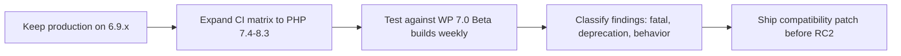

If you maintain WordPress 6.9.x sites, the main 7.0 Beta transition risks are clear on February 17, 2026: runtime drift from the new PHP minimum (7.4), regression churn during beta/RC, and plugin/theme compatibility assumptions that were safe on 6.9.x but fail on pre-release builds. The practical mitigation is a dual-track release process: keep production on 6.9.x while running structured 7.0 beta validation before RC freeze.

<!-- truncate -->

## The Problem: 6.9.x Stability Can Hide 7.0 Readiness Gaps

WordPress 6.9.1 is the latest stable release (February 3, 2026), while WordPress 7.0 Beta 1 is scheduled for February 19, 2026 and final release is currently scheduled for April 16, 2026.

That creates a short but high-risk window for maintainers:

| Risk | Why it matters for 6.9.x maintainers | Severity | Mitigation owner |
| --- | --- | --- | --- |
| PHP minimum raised to 7.4 | Plugins still tested only on PHP 7.2/7.3 will miss failures early | High | Maintainer + host team |
| Beta regression churn | Behavior can change weekly between Beta 1 and RCs | High | QA lead |
| Editor/admin integration drift | Script/style assumptions may break in 7.0 while 6.9.x stays stable | Medium | Frontend/plugin engineer |
| Schema/version assumptions | Core version and DB version movement can expose brittle checks | Medium | Backend maintainer |

## The Solution: Pre-Beta-to-RC Mitigation Checklist

### Source-backed transition signals

From WordPress core source (`wp-includes/version.php`):

```php
// 6.9 branch (development head)
$wp_version = '6.9.2-alpha-61583-src';
$required_php_version = '7.2.24';
```

```php
// 7.0 trunk
$wp_version = '7.0-alpha-61215-src';
$required_php_version = '7.4';
```

The PHP floor change is the most concrete migration trigger maintainers can act on immediately.

### Maintainer execution flow



### Concrete checklist

1. Freeze non-essential feature work on your plugin/theme branch used by production sites.
2. Update CI to include PHP 7.4, 8.0, 8.1, 8.2, and 8.3.
3. Run weekly tests against WordPress 7.0 Beta/RC builds from February 19 to April 16, 2026.
4. Separate issues into three queues: fatal errors, deprecations/warnings, and behavior regressions.
5. Patch fatals first, then deprecations, then UX regressions.
6. Set plugin metadata (`Requires PHP`) to match tested reality before 7.0 GA.
7. Publish a maintainer advisory: "6.9.x production safe, 7.0 readiness in progress," with tested versions.
8. Cut a compatibility release before RC2 so support teams have a stable package before final week volatility.

## What I Learned

- The biggest 7.0 risk is not one bug; it is release timing plus runtime floor change.
- Maintainers should treat Beta 1 as the start of migration operations, not passive observation.
- A dual-track approach (6.9.x production + 7.0 pre-release QA) reduces support incidents at launch.
- Tracking core `version.php` deltas is a fast way to detect compatibility pressure early.

## References

- [WordPress 6.9.1 Maintenance Release](https://wordpress.org/news/2026/02/wordpress-6-9-1-maintenance-release/)
- [WordPress 7.0 Release Party Schedule](https://make.wordpress.org/core/2026/02/12/wordpress-7-0-release-party-schedule/)
- [WordPress Roadmap](https://wordpress.org/about/roadmap/)
- [Dropping support for PHP 7.2 and 7.3](https://make.wordpress.org/core/2026/02/04/dropping-support-for-php-7-2-and-7-3-in-wordpress-7-0/)
- [WordPress core source: 6.9 `version.php`](https://raw.githubusercontent.com/WordPress/wordpress-develop/6.9/src/wp-includes/version.php)
- [WordPress core source: trunk `version.php`](https://raw.githubusercontent.com/WordPress/wordpress-develop/trunk/src/wp-includes/version.php)
- [Related: WordPress 7.0 Beta 1 expectations](/2026-02-17-wordpress-7-beta-1-feature-freeze-expectations)
- [Related: WordPress 7.0 always-iframed editor](/2026-02-17-wordpress-7-iframed-editor)
- [Related: WordPress 7 release readiness](/build-wp-7-release-readiness)
