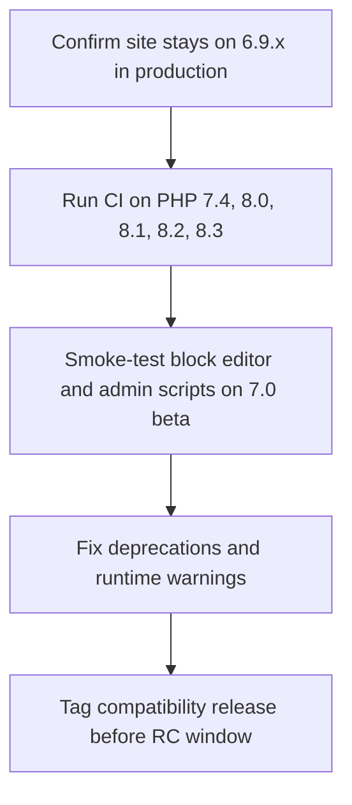

WordPress 7.0 Beta 1 is scheduled for **February 19, 2026**. At this stage, the release shifts from shipping new enhancements to hardening what is already merged, so maintainers should treat this week as a compatibility and regression window, not a feature window.

<!-- truncate -->

## The Problem: Teams Misread Beta as a Feature Window

The risk is operational, not theoretical:

- Teams keep merging optional improvements after freeze, then discover breakage too late.
- Plugin and theme maintainers validate only editor behavior, but miss runtime constraints like PHP floor changes.
- Support teams assume 6.9 patch behavior while 7.0 is tightening release gates.

WordPress 6.9 is the current stable major (released December 2, 2025), while 7.0 is still pre-release. That means you need dual-track validation for production users on 6.9.x and early adopters testing 7.0 beta builds.

## The Solution: Freeze-First Validation With Explicit Gates

### Release checkpoints to work against

| Milestone | Date (UTC) | Practical expectation |
| --- | --- | --- |
| Beta 1 | February 19, 2026 | New features stop; focus moves to bug fixes and regressions |
| Beta 2-4 | Feb 26 to Mar 19, 2026 | Iterative hardening and compatibility fixes |
| RC 1-3 | Mar 26 to Apr 9, 2026 | No risky changes; release-candidate quality only |
| Final | April 16, 2026 | Production release target |

### What changed technically (source-file evidence)

From WordPress core `wp-includes/version.php`:

```php
// 6.9 branch
$required_php_version = '7.2.24';
```

```php
// 7.0 trunk
$required_php_version = '7.4';
```

This lines up with the 7.0 dev note announcing support drop for PHP 7.2 and 7.3. If your plugin/theme still tests against 7.2/7.3 only, your matrix is now stale.

### Migration checklist for maintainers



1. Lock production to 6.9.x until at least RC 2.
2. Raise CI minimum to PHP 7.4 and update plugin metadata (`Requires PHP`) accordingly.
3. Run editor smoke tests on 7.0 beta (especially if your plugin injects editor scripts/styles).
4. Triage warnings by class: deprecation, fatal, and behavior regression.
5. Ship a compatibility patch before RC, then keep changes minimal.

## What I Learned

- Freeze windows are mostly release-risk management, not feature planning.
- `required_php_version` drift is an early warning signal worth monitoring from core source.
- For WordPress majors, the safest pattern is dual-track QA: current stable + next-beta.
- Avoid late non-critical refactors after Beta 1; they increase support load without release value.

## References

- [WordPress 7.0 Roadmap](https://make.wordpress.org/core/6-8/)
- [WordPress 7.0 release party schedule](https://make.wordpress.org/core/2026/02/12/wordpress-7-0-release-party-schedule/)
- [Dropping support for PHP 7.2 and 7.3 in WordPress 7.0](https://make.wordpress.org/core/2026/02/04/dropping-support-for-php-7-2-and-7-3-in-wordpress-7-0/)
- [WordPress 6.9 "Cecil" release](https://wordpress.org/news/2025/12/cecil/)
- [WordPress core source: trunk `version.php`](https://raw.githubusercontent.com/WordPress/wordpress-develop/trunk/src/wp-includes/version.php)
- [WordPress core source: 6.9 `version.php`](https://raw.githubusercontent.com/WordPress/wordpress-develop/6.9/src/wp-includes/version.php)
- [Related: Always-iframed editor in 7.0](/2026-02-17-wordpress-7-iframed-editor)
- [Related: WordPress AI search readiness](/2026-02-16-wp-ai-search-readiness)
- [Related: AI search optimization playbook](/2026-02-17-wordpress-ai-search-optimization-playbook)
