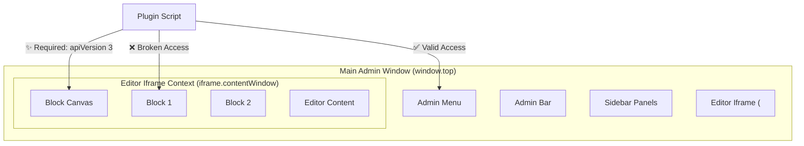

import Tabs from '@theme/Tabs';
import TabItem from '@theme/TabItem';

WordPress 7.0 marks a significant milestone in the evolution of the Block Editor (Gutenberg) by making the "iframed" editor the default and only mode for all post types. While this provides much-needed CSS isolation and accurate viewport-relative units, it introduces breaking changes for plugin scripts that rely on global DOM access.

<!-- truncate -->

## The Problem: The "Global Document" is Gone

Since the inception of Gutenberg, many developers have relied on `document.querySelector` or global jQuery selectors to interact with elements inside the editor canvas. In WordPress 7.0, the editor content is isolated within an `<iframe>`. This means a script running in the main admin window (the "top" window) can no longer see the editor's internals through the global `document` object.

This isolation breaks three common patterns:
1.  **Direct DOM Manipulation:** `document.getElementById('my-block-element')` will return `null` because the element lives inside the iframe's document.
2.  **Event Delegation:** Listening for clicks on `document` won't catch events bubbling up from inside the editor.
3.  **Styling Leaks:** Scripts that inject styles into `document.head` won't affect the blocks inside the iframe.

### The Scope of Isolation



## The Solution: Migrating to apiVersion 3

To support the iframed editor correctly, WordPress 7.0 enforces `apiVersion: 3` in `block.json`. This version tells WordPress that your block is "iframe-ready" and enables the necessary hooks to bridge the window gap.

### 1. Update block.json
You must specify `apiVersion: 3`. Blocks using version 2 or lower will now trigger console warnings and may fail to load correctly in the 7.0 environment.

```json
{
  "apiVersion": 3,
  "name": "my-plugin/my-block",
  "title": "My Awesome Block",
  "category": "widgets",
  "editorScript": "file:./index.js",
  "editorStyle": "file:./index.css"
}
```

### 2. Accessing the Document via Refs
In React-based blocks, you should use the `ownerDocument` of a ref to ensure you are targeting the correct context, whether it's iframed or not.

| Access Method | Old (Global) | New (Context-Aware) |
| :--- | :--- | :--- |
| **Document** | `document` | `elementRef.current.ownerDocument` |
| **Window** | `window` | `elementRef.current.ownerDocument.defaultView` |
| **Selectors** | `document.querySelector('.class')` | `ownerDocument.querySelector('.class')` |

### Code Comparison: Before vs. After

<Tabs>
<TabItem value="old" label="Old Approach (Pre-7.0)">

```javascript
// This fails in WordPress 7.0 iframed editor
useEffect(() => {
    const el = document.querySelector('.my-custom-element');
    if (el) el.classList.add('active');
}, []);
```

</TabItem>
<TabItem value="new" label="New Approach (WP 7.0+)">

```javascript
import { useRef, useEffect } from '@wordpress/element';

const MyBlockEdit = () => {
    const containerRef = useRef();

    useEffect(() => {
        // Get the document where the block actually lives
        const doc = containerRef.current.ownerDocument;
        const el = doc.querySelector('.my-custom-element');
        if (el) el.classList.add('active');
    }, []);

    return <div ref={containerRef} className="my-block">...</div>;
};
```

</TabItem>
</Tabs>

## What I Learned

- **Consistency over Convenience:** While the iframe makes it harder to "hack" the editor, it forces developers to use the standard `@wordpress/block-editor` APIs, leading to more stable plugins.
- **Media Queries are Finally Real:** In the iframed editor, `@media (max-width: 600px)` actually measures the width of the *editor canvas*, not the whole browser window. This is a massive win for responsive design.
- **Legacy Compatibility:** WordPress 7.0 includes a "Legacy Editor Wrapper" for blocks that haven't opted into the iframe, but it comes with a performance penalty and UI flickering.

## References
- [WordPress Core: Iframing the Editor](https://make.wordpress.org/core/tag/iframed-editor/)
- [Gutenberg Handbook: Block API Version 3](https://developer.wordpress.org/block-editor/reference-guides/block-api/block-api-versions/)
- [Block Editor: Handling Iframes Guide](https://developer.wordpress.org/block-editor/how-to-guides/block-tutorial/nested-blocks-inner-blocks/#iframing)
