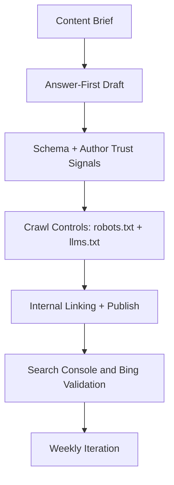

If you want your WordPress content to appear in AI-generated answers, prioritize this sequence: answer-first writing, schema accuracy, clean crawl controls, maintained plugins, and weekly validation in Search Console/Bing Webmaster Tools. As of February 17, 2026, this is practical on WordPress 6.9.1 and should be treated as an operational SEO workflow, not a one-time checklist.

<!-- truncate -->

## The Problem

Most WordPress SEO setups are still tuned for classic blue-link rankings, not answer engines. The gap shows up in three places:

1. Content opens slowly, so LLMs miss the direct answer.
2. Structured data is partial or stale, so entities are ambiguous.
3. AI crawl controls are unmanaged, so discovery is inconsistent.

There is also a maintenance risk in the plugin layer. For example, the `LLMs.txt Generator` plugin on WordPress.org shows low update velocity and older compatibility signals, while newer options such as `Website LLMs.txt` have materially stronger maintenance activity and adoption. That difference matters for long-term stability on modern WordPress versions.

## The Solution

### 9-Step Playbook

| Step | What to do | Why it matters for AI answers | WordPress implementation |
| --- | --- | --- | --- |
| 1 | Answer early (first ~100 words) | Improves extraction quality for AI summaries | Rewrite intro paragraphs in post templates |
| 2 | Enforce heading hierarchy (H1-H2-H3) | Helps chunking and retrieval quality | Block editor content guidelines + editorial review |
| 3 | Add complete schema (Article, Author, Organization, FAQ where valid) | Reduces entity ambiguity and improves trust signals | Yoast SEO or Rank Math with Rich Results validation |
| 4 | Strengthen author and source transparency | Supports E-E-A-T style trust evaluation | Author bio blocks, About page, clear source links |
| 5 | Improve crawlability and performance | Faster, cleaner fetch improves index freshness | Core Web Vitals work, caching, image optimization |
| 6 | Configure `robots.txt` correctly | Controls crawl paths without misusing indexing directives | Keep crawl directives in robots, use `noindex` where needed |
| 7 | Publish and maintain `llms.txt` (experimental standard) | Gives LLM-oriented site map for high-signal URLs | Prefer maintained plugin options or managed root file |
| 8 | Build semantic internal links across clusters | Improves contextual retrieval and citation paths | Link related posts by topic hub, not random chronology |
| 9 | Monitor, test, and remove deprecated patterns | Prevents regressions and outdated tactics | Weekly Search Console/Bing checks and content QA |

### Execution Flow



### Practical Config Patterns

`robots.txt` should manage crawling, not guaranteed de-indexing:

```txt
User-agent: *
Allow: /
Sitemap: https://example.com/sitemap_index.xml
```

OpenAI crawler controls can be explicit when policy requires it:

```txt
User-agent: OAI-SearchBot
Allow: /

User-agent: GPTBot
Disallow: /private/
```

### Maintained Plugin-First Recommendations

Before writing custom code, use maintained WordPress plugins:

| Need | Recommended path | Reason |
| --- | --- | --- |
| Core SEO + schema | Yoast SEO (tested up to WordPress 6.9.1) | Mature maintenance and broad compatibility |
| `llms.txt` generation | Website LLMs.txt | Higher active installs and frequent updates |
| Avoid for production baseline | Older low-velocity llms plugins | Higher breakage risk during WordPress minor updates |

Related reads: [WordPress 7.0 iframed editor impact](/2026-02-17-wordpress-7-iframed-editor/).

## What I Learned

- Treat AI SEO as a reliability loop, not a metadata task.
- `robots.txt` is for crawl management; indexing control belongs to `noindex` and access controls.
- Plugin maintenance cadence is now part of SEO risk management.
- `llms.txt` is useful but still emerging, so pair it with standard sitemap and schema hygiene.
- The fastest wins are intro rewrites, schema completion, and author/source clarity.

## References

- https://wordpress.org/download/
- https://wordpress.org/documentation/article/wordpress-versions/
- https://developer.wordpress.org/news/2026/02/whats-new-for-developers-february-2026/
- https://developers.google.com/search/docs/fundamentals/creating-helpful-content
- https://developers.google.com/search/docs/guides/intro-structured-data
- https://developers.google.com/search/docs/crawling-indexing/robots/intro
- https://search.google.com/test/rich-results
- https://platform.openai.com/docs/gptbot
- https://llmstxt.org/
- https://wordpress.org/plugins/wordpress-seo/
- https://wordpress.org/plugins/website-llms-txt/
- https://wordpress.org/plugins/llms-txt-generator/
