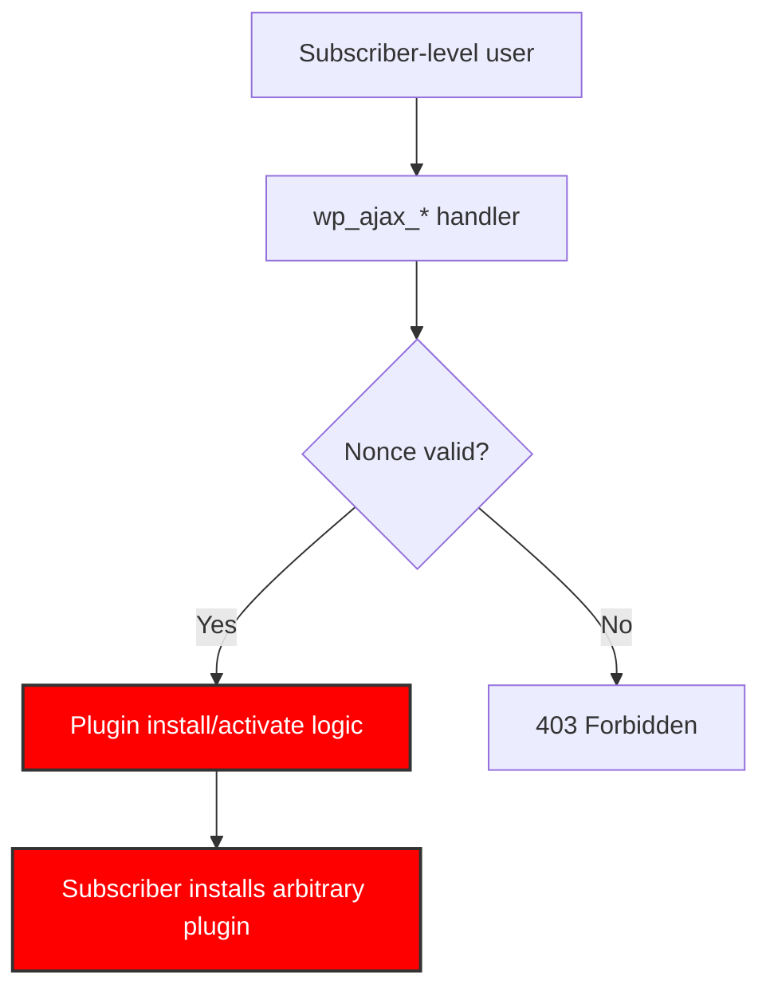

import Tabs from '@theme/Tabs';
import TabItem from '@theme/TabItem';

WowRevenue versions up to 2.1.3 can expose a high-risk path when authenticated low-privilege users can reach plugin installation or activation logic through AJAX handlers without strict capability checks. The practical fix is to enforce `current_user_can('install_plugins')` or `current_user_can('activate_plugins')` at handler entry and keep nonce checks as anti-CSRF only.

<!-- truncate -->

I built a small scanner that flags this exact pattern in plugin source and returns a non-zero exit code for high-risk findings so teams can wire it into CI and release checks.

## The problem

:::danger[Authorization Flaw]
AJAX handlers tied to plugin install/activation flows are reachable by any authenticated user (including subscribers) if the only protection is a nonce check. Nonces prevent CSRF. They do not enforce authorization.
:::



### Vulnerable vs. secure pattern

<Tabs>
<TabItem value="vulnerable" label="Vulnerable (Deprecated Pattern)" default>

```php title="ajax-handler.php" showLineNumbers
add_action('wp_ajax_install_plugin', 'handle_install');

function handle_install() {
// highlight-next-line
// WRONG: nonce only -- any authenticated user can reach this
check_ajax_referer('install_nonce', 'nonce');

// Install plugin logic...
$upgrader = new Plugin_Upgrader();
$upgrader->install($plugin_url);
wp_die();
}
```

</TabItem>
<TabItem value="secure" label="Secure (Required Pattern)">

```php title="ajax-handler.php" showLineNumbers
add_action('wp_ajax_install_plugin', 'handle_install');

function handle_install() {
check_ajax_referer('install_nonce', 'nonce');

// highlight-start
// REQUIRED: capability check at handler entry
if ( ! current_user_can('install_plugins') ) {
wp_send_json_error('Unauthorized', 403);
wp_die();
}
// highlight-end

// Install plugin logic...
$upgrader = new Plugin_Upgrader();
$upgrader->install($plugin_url);
wp_die();
}
```

</TabItem>
</Tabs>

The diff:

```diff
  function handle_install() {
      check_ajax_referer('install_nonce', 'nonce');
+
+     if ( ! current_user_can('install_plugins') ) {
+         wp_send_json_error('Unauthorized', 403);
+         wp_die();
+     }

      $upgrader = new Plugin_Upgrader();
```

## What I built

- A Python CLI scanner that checks:
  - Version gate (`<= 2.1.3`)
  - `wp_ajax_*` handlers tied to install/activation APIs
  - Missing admin-level capability enforcement
- A test suite with positive/negative cases
- A README with migration guidance and secure replacement pattern

:::info[Ecosystem Check]
I checked maintained ecosystem options first. WPScan and Wordfence feeds cover broad vulnerability intelligence, but I did not find a maintained focused tool for this exact WowRevenue authorization anti-pattern in local source review workflows. This project fills that narrow gap.
:::

### Scanner capabilities

| Check | What it flags | Exit code |
|---|---|---|
| Version gate | Plugin version `<= 2.1.3` | Non-zero if matched |
| AJAX handler audit | `wp_ajax_*` tied to install/activation | Non-zero if high-risk |
| Capability enforcement | Missing `current_user_can()` at handler entry | Non-zero if absent |
| Nonce-only auth | Nonce present but no capability check | Warning |

## Deprecation and migration guidance

| Pattern | Status | Replacement |
|---|---|---|
| Subscriber-reachable install handlers | Deprecated | Require `install_plugins` capability |
| Nonce as authorization | Deprecated | Nonce for CSRF only, capability for authz |
| Mixed privilege endpoints | Deprecated | Split into separate privileged/unprivileged handlers |

### Migration steps

- [ ] Enumerate `wp_ajax_*` handlers in the plugin
- [ ] Flag handlers calling `Plugin_Upgrader`, `activate_plugin`, `plugins_api`, or install helpers
- [ ] Add `current_user_can()` checks at handler entry
- [ ] Add explicit `wp_send_json_error()` forbidden responses
- [ ] Re-test with a subscriber account to confirm denial
- [x] Wire scanner into CI for ongoing enforcement

<details>
<summary>Functions that indicate privileged operations</summary>

- `Plugin_Upgrader`
- `activate_plugin()`
- `plugins_api()`
- `install_plugin_install_status()`
- `wp_install_plugin()`
- `deactivate_plugins()`

Any `wp_ajax_*` handler that calls these without a capability check is a high-risk finding.

</details>

## Why this matters for Drupal and WordPress

WordPress plugin developers must enforce `current_user_can()` capability checks at every AJAX handler entry point — nonces only prevent CSRF, not unauthorized access by low-privilege authenticated users. Drupal module developers face the same anti-pattern when custom route callbacks rely solely on CSRF tokens without explicit permission checks via `$account->hasPermission()`. The scanner pattern built here can be adapted for Drupal by searching for route callbacks that lack `_permission` requirements in routing YAML, catching the same class of authorization bypass that plagues WordPress plugins like WowRevenue.

**[View Code](https://github.com/victorstack-ai/wp-wowrevenue-authz-guard)**


***
*Looking for an Architect who doesn't just write code, but builds the AI systems that multiply your team's output? View my enterprise CMS case studies at [victorjimenezdev.github.io](https://victorjimenezdev.github.io) or connect with me on LinkedIn.*
