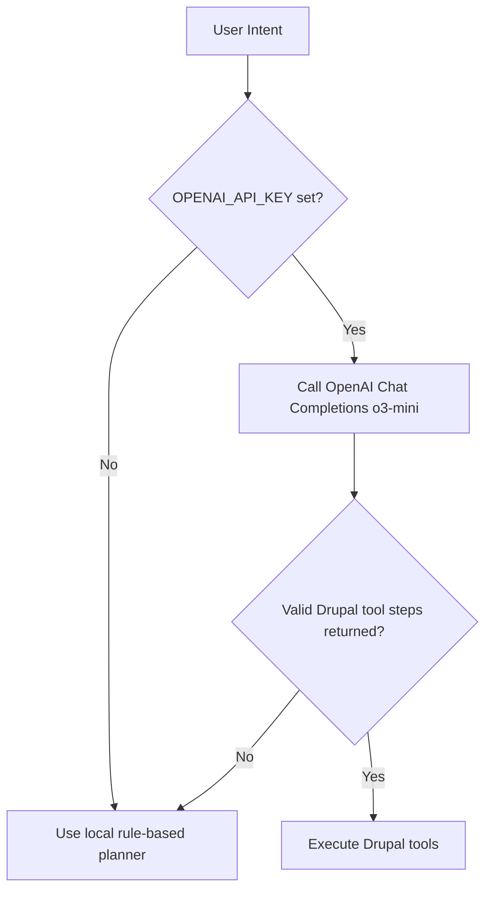

I shipped an OpenAI `o3-mini` planner for my Drupal CMS 2 AI agent and kept a local rule-based fallback, because Drupal's 2026 AI direction is clear: intelligent automation is coming fast, but production teams still need predictable behavior when external AI calls fail.

## The Hook
I built and shipped a hybrid planner that uses OpenAI when available and falls back locally, because that is the fastest way to align with Drupal's AI roadmap without betting uptime on a single provider.

## Why I Built It
Drupal is explicitly moving toward intelligent-agent workflows, and that changes how I design integrations: agentic features are now a near-term product concern, not a lab experiment.

The problem is operational, not conceptual. Cloud AI calls can fail, models can drift, and API keys can be missing in lower environments. If planning logic depends only on remote inference, content operations become fragile.

There is already a maintained Drupal AI module ecosystem, and I recommend starting there for most teams because it gives faster integration and community support. I chose a custom connector in this project because I needed strict control over tool-step generation and deterministic fallback behavior for testing and demos.

## The Solution
I added an OpenAI planner in `src/openAiPlanner.js`, wired it in `src/index.js`, and validated both paths with tests in `tests/openAiPlanner.test.js`.

:::warning
Do not treat model output as trusted commands. Constrain allowed tool names and validate argument shape before execution.
:::

The biggest gotcha was reliability, not syntax. The planner must degrade gracefully when the model returns irrelevant output. The fallback path is what keeps agent behavior stable under partial failure.

Related implementation context:
- [Drupal CMS 2 AI Agent POC](/build-drupal-cms-2-ai-agent-poc/)
- [AI in Drupal CMS 2.0: Day-One Tools](/2026-02-06-ai-in-drupal-cms-2-0-dayone-tools/)
- [Drupal AI Views Agent](/build-drupal-ai-views-agent/)

## The Code
[View Code](https://github.com/victorstack-ai/drupal-cms-2-ai-agent-poc)

Shipped scope in this run:
- OpenAI planning path using `OPENAI_API_KEY` and configurable `OPENAI_MODEL` (default `o3-mini`)
- Local planner fallback when key is missing or model response is unusable
- Tests covering fallback behavior and OpenAI request/model expectations
- Lint and test validation before push (`7 passing`, lint clean)

## What I Learned
- Hybrid planning is worth trying when you need AI speed but cannot accept AI-only runtime fragility.
- Use maintained Drupal AI modules first when your use case is standard integration and you want lower maintenance overhead.
- Build custom planner layers when you need strict tool contracts, deterministic tests, or provider-switching control.
- Avoid executing raw model intent in production; enforce an allowlist of tools and schema validation for each step.
- Keep fallback behavior explicit and tested, or you will eventually ship hidden outage paths.

## References
- [Drupal's AI Roadmap for 2026: Accelerating Innovation](https://www.drupal.org/about/core/blog/drupals-ai-roadmap-for-2026)
- [Drupal's Vision 2026: Transformation into an Intelligent Agent](https://www.drupal.org/blog/vision-2026-intelligent-agent)
