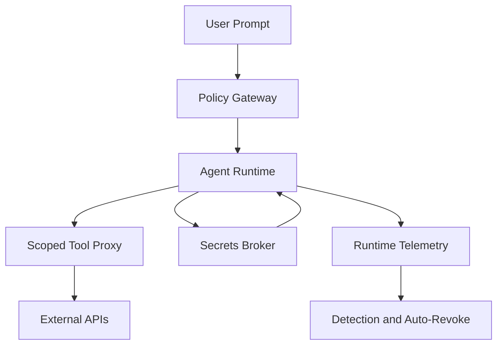

AI agent platform risk is not theoretical. In February 2026, public reporting around Moltbook and Operant AI highlighted the same core failure pattern: exposed secrets, weak authentication boundaries, and missing runtime policy controls. If you run agent infrastructure today, the practical answer is to treat agents as high-privilege workloads and enforce identity, secret rotation, and egress limits by default.
<!-- truncate -->

## The Problem

Moltbook-style incidents show how quickly a fast AI build can become a large blast radius event:

| Failure mode | Real impact in public reports | Why it matters |
| --- | --- | --- |
| Secrets in plaintext storage | API credentials exposed | Immediate account takeover and cost abuse |
| Weak auth boundaries | Unauthorized access to agent resources | Lateral movement across tools and data |
| Missing runtime controls | Unrestricted tool/API calls | Data exfiltration and policy bypass |

The pattern is consistent with broader AI-agent attack surfaces discussed in recent security reporting: prompt/context injection, over-permissioned tool connectors, and poor tenant isolation.

## The Solution

The useful response is a layered control model, not a single patch.

Minimum control set for production agents:

| Control | Implementation target | Verification signal |
| --- | --- | --- |
| Short-lived credentials | STS or brokered API tokens, no long-lived keys in prompts/logs | Token TTL and rotation logs |
| Tool permission boundaries | Per-tool allowlists with parameter validation | Denied-call telemetry |
| Egress restrictions | Domain/IP allowlists per agent role | Blocked outbound attempts |
| Tenant isolation | Per-tenant runtime context and secret scope | No cross-tenant access in tests |
| Detection and revocation | Runtime anomaly detection with key auto-revoke | Mean time to revoke |

Before/after operational baseline:
- Before: static keys in app config, global tool permissions, no forced revocation path.
- After: ephemeral credentials, scoped tool proxy, auditable deny/revoke pipeline.

## What I Learned

- Treating agents as "just app features" is the wrong model; they behave like autonomous privileged clients.
- Secret hygiene must include prompt and trace channels, not only environment variables.
- Runtime policy enforcement is worth trying when teams ship fast AI features under deadline pressure.
- Avoid production launches where agent egress is unrestricted or tool permissions are inherited globally.

## References

- CIO review item: https://www.cio.com/article/3456789/moltbook-breach-ai-agent-security
- Associated Press reporting on Moltbook exposure: https://apnews.com/article/moltbook-ai-security-breach
- Operant AI perspective on AI agent vulnerabilities: https://www.operant.ai/post/ai-agent-security-vulnerabilities-critical-risks-and-how-to-protect-your-business
- Dark Reading analysis of AI-agent security flaws in enterprise contexts: https://www.darkreading.com/application-security/critical-rce-vulnerability-found-servicenow-ai-agent
- Related post: [WordPress QSM SQL Injection Audit](/2026-02-07-wp-qsm-sql-injection-audit/)
- Related post: [WordPress AI Search Optimization Playbook](/2026-02-17-wordpress-ai-search-optimization-playbook/)
