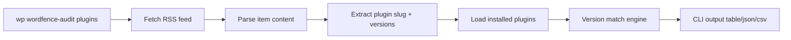

I built a WordPress plugin that adds `wp wordfence-audit plugins` and flags installed plugins that match vulnerability signals from the current Wordfence blog RSS feed. The goal is quick triage from existing RSS workflows, not replacing full vulnerability databases.
<!-- truncate -->

## The Problem

Security teams often receive Wordfence weekly advisories first, but still need a fast way to answer: "Do we run any of these plugins, and is our installed version inside an affected range?" Without CLI automation, this becomes manual spreadsheet work across many sites.

## The Solution

The plugin fetches RSS items, extracts plugin slugs from WordPress.org links, parses version constraints, and compares against installed plugin versions.

| Component | Responsibility |
| --- | --- |
| `WordfenceRssClient` | Download RSS and extract slugs, severity, version constraints |
| `SignalMatcher` | Compare constraints against installed versions with `version_compare` |
| `AuditCommand` | Expose `wp wordfence-audit plugins` and format output |



From `src/WordfenceRssClient.php`:

```php
preg_match_all('#https?://wordpress\.org/plugins/([a-z0-9-]+)/?#i', $html, $matches);
```

```php
if (preg_match_all('/versions?\s*(?:up to|<=|less than or equal to)\s*v?([0-9][0-9a-zA-Z.\-+]*)/i', $text, $maxMatches)) {
    $constraints[] = ['type' => 'max_inclusive', 'max' => $this->normalizeVersionToken($maxVersion)];
}
```

From `src/SignalMatcher.php`:

```php
if ($type === 'max_inclusive' && isset($constraint['max'])) {
    if (version_compare($installedVersion, (string) $constraint['max'], '<=')) {
        return true;
    }
}
```

Related reading:
- [WP Malware Sentinel Scanner](/2026-02-08-wp-malware-sentinel-scanner/)
- [WP QSM SQL Injection Audit](/2026-02-07-wp-qsm-sql-injection-audit/)

## What I Learned

- RSS can be useful as a lightweight signal source when API integration is not available yet.
- Slug extraction from canonical `wordpress.org/plugins/<slug>/` links is reliable for fast matching.
- Version parsing needs normalization (`2.1.3.` vs `2.1.3`) or risk false mismatches.
- For production-grade coverage, pair RSS triage with full database/API scanners.

## References

- [View Code](https://github.com/victorstack-ai/wp-wordfence-rss-signal-auditor)
- https://www.wordfence.com/blog/feed/
- https://wordpress.org/plugins/wpvulnerability/
- https://wordpress.org/plugins/fullworks-scanner/
