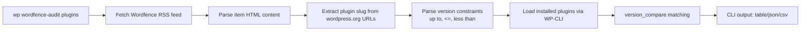

import Tabs from '@theme/Tabs';
import TabItem from '@theme/TabItem';

I built a WordPress plugin that adds `wp wordfence-audit plugins` and flags installed plugins that match vulnerability signals from the current Wordfence blog RSS feed. The goal is quick triage from existing RSS workflows, not replacing full vulnerability databases.

<!-- truncate -->

## The Problem

Security teams often receive Wordfence weekly advisories first, but still need a fast way to answer: "Do we run any of these plugins, and is our installed version inside an affected range?" Without CLI automation, this becomes manual spreadsheet work across many sites.

## The Solution

The plugin fetches RSS items, extracts plugin slugs from WordPress.org links, parses version constraints, and compares against installed plugin versions.


```mermaid
flowchart LR
    A[wp wordfence-audit plugins] --> B[Fetch Wordfence RSS feed]
    B --> C[Parse item HTML content]
    C --> D[Extract plugin slug from wordpress.org URLs]
    D --> E[Parse version constraints\nup to, <=, less than]
    E --> F[Load installed plugins via WP-CLI]
    F --> G[version_compare matching]
    G --> H[CLI output: table/json/csv]
```

## Tech Stack

| Component | Technology | Why |
|---|---|---|
| Platform | WordPress plugin + WP-CLI command | Runs on any WP site with CLI access |
| Signal source | Wordfence blog RSS feed | Lightweight, no API key needed |
| Slug extraction | Regex on `wordpress.org/plugins/<slug>/` | Reliable canonical URLs |
| Version matching | PHP `version_compare()` | Built-in, handles semver correctly |
| Output | Table, JSON, CSV | Whatever downstream tools need |

:::tip[RSS as a Lightweight Signal Source]
RSS is useful when API integration is not available yet. The Wordfence feed provides actionable signals without authentication, rate limits, or API keys. For production-grade coverage, pair RSS triage with a full vulnerability database.
:::

:::caution[Version Parsing Needs Normalization]
Version strings like `2.1.3.` vs `2.1.3` cause false mismatches with `version_compare()`. The `normalizeVersionToken` helper strips trailing dots and handles edge cases. Without it, you will miss real matches.
:::

<Tabs>
<TabItem value="rss" label="RSS Client" default>

```php title="src/WordfenceRssClient.php"
// Extract plugin slugs from WordPress.org links in RSS HTML
// highlight-next-line
preg_match_all('#https?://wordpress\.org/plugins/([a-z0-9-]+)/?#i', $html, $matches);
```

```php title="src/WordfenceRssClient.php"
// Parse version constraints from advisory text
if (preg_match_all('/versions?\s*(?:up to|<=|less than or equal to)\s*v?([0-9][0-9a-zA-Z.\-+]*)/i', $text, $maxMatches)) {
// highlight-next-line
$constraints[] = ['type' => 'max_inclusive', 'max' => $this->normalizeVersionToken($maxVersion)];
}
```

</TabItem>
<TabItem value="matcher" label="Signal Matcher">

```php title="src/SignalMatcher.php"
// Compare installed version against advisory constraint
if ($type === 'max_inclusive' && isset($constraint['max'])) {
// highlight-next-line
if (version_compare($installedVersion, (string) $constraint['max'], '<=')) {
return true;  // Installed version is in affected range
}
}
```

</TabItem>
<TabItem value="cli" label="CLI Usage">

```bash title="wp-cli-usage.sh"
# Table output (default)
wp wordfence-audit plugins

# JSON for scripting
wp wordfence-audit plugins --format=json

# CSV for spreadsheets
wp wordfence-audit plugins --format=csv > audit.csv
```

</TabItem>
</Tabs>

<details>
<summary>Architecture breakdown</summary>

| Component | Responsibility |
| --- | --- |
| `WordfenceRssClient` | Download RSS and extract slugs, severity, version constraints |
| `SignalMatcher` | Compare constraints against installed versions with `version_compare` |
| `AuditCommand` | Expose `wp wordfence-audit plugins` and format output |

</details>

Related reading:
- [WP Malware Sentinel Scanner](/2026-02-08-wp-malware-sentinel-scanner/)
- [WP QSM SQL Injection Audit](/2026-02-07-wp-qsm-sql-injection-audit/)

## Why this matters for Drupal and WordPress

WordPress sites running dozens of plugins face constant exposure to newly disclosed vulnerabilities. This WP-CLI auditor lets WordPress agencies and site maintainers automate weekly triage against Wordfence advisories without manual spreadsheet work. For multisite networks or managed hosting fleets, piping the JSON output into a dashboard gives immediate visibility into which sites need patching. Drupal teams can apply the same RSS-to-CLI pattern using Drush commands to cross-reference security advisories from drupal.org against installed modules.

## What I Learned

- RSS can be useful as a lightweight signal source when API integration is not available yet.
- Slug extraction from canonical `wordpress.org/plugins/<slug>/` links is reliable for fast matching.
- Version parsing needs normalization (`2.1.3.` vs `2.1.3`) or risk false mismatches.
- For production-grade coverage, pair RSS triage with full database/API scanners.

## References

- [View Code](https://github.com/victorstack-ai/wp-wordfence-rss-signal-auditor)
- https://www.wordfence.com/blog/feed/
- https://wordpress.org/plugins/wpvulnerability/
- https://wordpress.org/plugins/fullworks-scanner/


***
*Looking for an Architect who doesn't just write code, but builds the AI systems that multiply your team's output? View my enterprise CMS case studies at [victorjimenezdev.github.io](https://victorjimenezdev.github.io) or connect with me on LinkedIn.*
