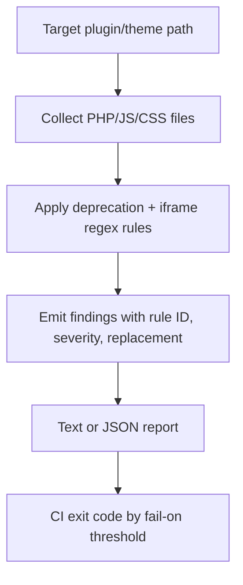

I built a WordPress 7.0 compatibility scanner CLI that detects deprecated editor integrations and iframe-unsafe code patterns in plugins/themes. It gives rule IDs, migration replacements, and CI exit codes so teams can block risky code before release windows.
<!-- truncate -->

## The Problem

WordPress 7.0 is targeted for April 9, 2026, while current stable is 6.9.1 (February 3, 2026). That gap creates a migration window where plugin and theme maintainers need actionable checks, not just manual QA.

Common break patterns include:

| Risk type | What breaks | Typical signal in code |
|---|---|---|
| Deprecated editor hooks | Future compatibility and context-aware behavior | `allowed_block_types`, `block_editor_settings` |
| Iframe editor assumptions | JS/CSS that depends on parent admin DOM | `window.parent.document`, `#poststuff` |
| Legacy injection points | Editor internals bypassed by hardcoded admin hooks | `admin_head-post.php` |

I checked for a maintained WordPress.org tool that combines deprecation scanning and iframe readiness checks as a local CLI, and did not find one with this specific combined scope, so I built a focused scanner.

## The Solution

The project is `wp-7-compat-scanner` and runs as a standalone Python CLI.



Core rule model from `scanner.py`:

```python
@dataclass(frozen=True)
class Rule:
    rule_id: str
    category: str
    severity: str
    pattern: str
    message: str
    replacement: str
```

Example iframe readiness detection from `scanner.py`:

```python
Rule(
    rule_id="WP-IFRAME-001",
    category="iframe-readiness",
    severity="high",
    pattern=r"""\bwindow\.(?:parent|top)\.document\b|\btop\.document\b""",
    message="Cross-frame DOM access will break when editor runs in isolated iframe.",
    replacement="Use editor data stores/events or postMessage contracts instead of parent/top DOM.",
),
```

CI behavior is controlled with `--fail-on`:

| Command | Result |
|---|---|
| `python3 scanner.py /path --fail-on high` | exits `1` only for high findings |
| `python3 scanner.py /path --fail-on medium` | exits `1` for medium/high findings |
| `python3 scanner.py /path --fail-on low` | exits `1` for any finding |

Related posts:
- [WordPress Dataform Settings Page Demo](/build-wp-dataform-settings-page-demo/)
- [WordPress Google Preferred Source Tool](/wp-google-preferred-source-tool/)

## What I Learned

- Context-aware replacements are mandatory: moving from legacy editor filters to `*_all` variants avoids brittle assumptions.
- Iframe safety checks should be treated as high-signal CI rules when direct `window.parent/top.document` access appears.
- Fast scanners are useful when they return migration guidance, not just “found match” output.

## References

- [View Code](https://github.com/victorstack-ai/wp-7-compat-scanner)
- https://wordpress.org/documentation/wordpress-version/version-7-0/
- https://wordpress.org/news/2026/02/wordpress-6-9-1-maintenance-release/
