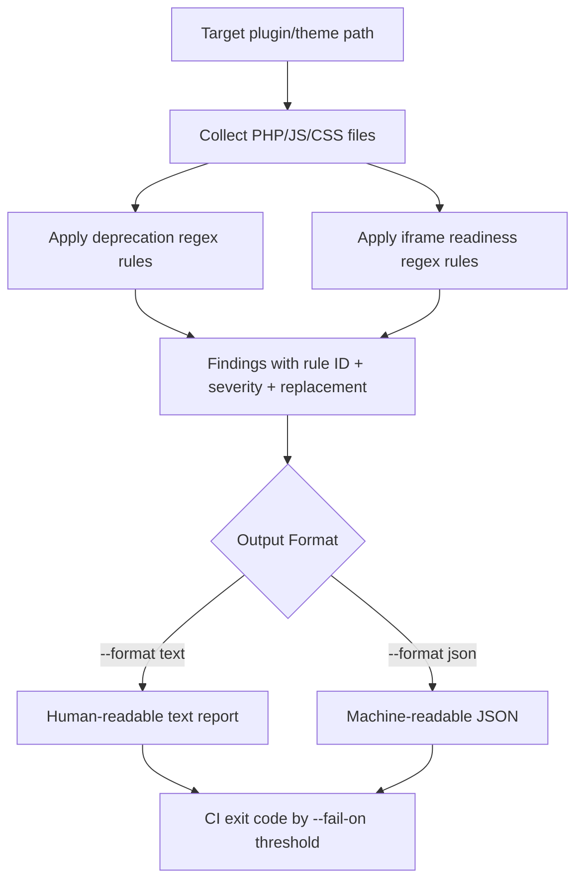

import Tabs from '@theme/Tabs';
import TabItem from '@theme/TabItem';

I built a WordPress 7.0 compatibility scanner CLI that detects deprecated editor integrations and iframe-unsafe code patterns in plugins/themes. It gives rule IDs, migration replacements, and CI exit codes so teams can block risky code before release windows.

<!-- truncate -->

## The Problem

WordPress 7.0 is targeted for April 9, 2026, while current stable is 6.9.1 (February 3, 2026). That gap creates a migration window where plugin and theme maintainers need actionable checks, not just manual QA.

| Risk type | What breaks | Typical signal in code |
|---|---|---|
| Deprecated editor hooks | Future compatibility and context-aware behavior | `allowed_block_types`, `block_editor_settings` |
| Iframe editor assumptions | JS/CSS that depends on parent admin DOM | `window.parent.document`, `#poststuff` |
| Legacy injection points | Editor internals bypassed by hardcoded admin hooks | `admin_head-post.php` |

I checked for a maintained WordPress.org tool that combines deprecation scanning and iframe readiness checks as a local CLI, and did not find one with this specific combined scope, so I built a focused scanner.

## The Solution

The project is `wp-7-compat-scanner` and runs as a standalone Python CLI.


```mermaid
flowchart TD
    A[Target plugin/theme path] --> B[Collect PHP/JS/CSS files]
    B --> C[Apply deprecation regex rules]
    B --> D[Apply iframe readiness regex rules]
    C --> E[Findings with rule ID + severity + replacement]
    D --> E
    E --> F{Output Format}
    F -->|--format text| G[Human-readable text report]
    F -->|--format json| H[Machine-readable JSON]
    G --> I[CI exit code by --fail-on threshold]
    H --> I
```

## Tech Stack

| Component | Technology | Why |
|---|---|---|
| Language | Python 3.11+ | Zero dependencies, runs anywhere |
| Detection | Regex pattern matching with frozen dataclass rules | Fast, auditable |
| Rule model | `@dataclass(frozen=True)` with rule_id, category, severity, pattern, message, replacement | Each rule is self-documenting |
| CI integration | `--fail-on` threshold flag | Exit code 1 for findings at or above severity |
| Output | Text and JSON | Human + machine readable |

:::tip[Include Migration Replacements in Every Rule]
Fast scanners are useful when they return migration guidance, not just "found match" output. Each rule includes a `replacement` field so developers know what to change, not just what is wrong.
:::

:::caution[Iframe Safety Checks Are High-Signal CI Rules]
Direct `window.parent/top.document` access will break when the editor runs in an isolated iframe. Treat these findings as high severity in CI -- they are not deprecation warnings, they are hard breakages.
:::

### Core Rule Model

```python title="scanner.py"
@dataclass(frozen=True)
class Rule:
    rule_id: str
    category: str
    severity: str
    pattern: str
    message: str
    # highlight-next-line
    replacement: str  # Every rule includes migration guidance
```

### Example Rules

<Tabs>
<TabItem value="iframe" label="Iframe Readiness" default>

```python title="scanner.py"
Rule(
rule_id="WP-IFRAME-001",
category="iframe-readiness",
severity="high",
pattern=r"""\bwindow\.(?:parent|top)\.document\b|\btop\.document\b""",
# highlight-next-line
message="Cross-frame DOM access will break when editor runs in isolated iframe.",
replacement="Use editor data stores/events or postMessage contracts instead of parent/top DOM.",
),
```

</TabItem>
<TabItem value="deprecation" label="Editor Deprecation">

```python title="scanner.py"
Rule(
rule_id="WP-DEPR-001",
category="editor-deprecation",
severity="medium",
pattern=r"""\ballowed_block_types\b""",
message="allowed_block_types filter is deprecated in favor of allowed_block_types_all.",
replacement="Use allowed_block_types_all filter which receives the block editor context.",
),
```

</TabItem>
</Tabs>

### CI Behavior

| Command | Result |
|---|---|
| `python3 scanner.py /path --fail-on high` | exits `1` only for high findings |
| `python3 scanner.py /path --fail-on medium` | exits `1` for medium/high findings |
| `python3 scanner.py /path --fail-on low` | exits `1` for any finding |

<details>
<summary>Sample JSON output</summary>

```json title="scan-report.json" showLineNumbers
{
  "findings": [
    {
      "rule_id": "WP-IFRAME-001",
      "category": "iframe-readiness",
      "severity": "high",
      "file": "assets/js/editor-integration.js",
      "line": 42,
      "message": "Cross-frame DOM access will break when editor runs in isolated iframe.",
      "replacement": "Use editor data stores/events or postMessage contracts instead of parent/top DOM."
    }
  ],
  "summary": {
    "high": 1,
    "medium": 0,
    "low": 0
  }
}
```

</details>

Related posts:
- [WordPress Google Preferred Source Tool](/wp-google-preferred-source-tool/)

## Why this matters for Drupal and WordPress

WordPress plugin and theme developers need to audit their codebases before the 7.0 release deadline. This scanner catches iframe-unsafe DOM access and deprecated editor hooks that will break in the always-iframed editor. Drupal teams facing a similar jQuery 4 and CKEditor 5 migration in Drupal 11 can adapt the regex-rule-plus-CI-exit-code pattern to scan contrib modules for deprecated APIs, using the same frozen-dataclass rule model with Drupal-specific patterns.

## What I Learned

- Context-aware replacements are mandatory: moving from legacy editor filters to `*_all` variants avoids brittle assumptions.
- Iframe safety checks should be treated as high-signal CI rules when direct `window.parent/top.document` access appears.
- Fast scanners are useful when they return migration guidance, not just "found match" output.

## References

- [View Code](https://github.com/victorstack-ai/wp-7-compat-scanner)
- https://wordpress.org/documentation/wordpress-version/version-7-0/
- https://wordpress.org/news/2026/02/wordpress-6-9-1-maintenance-release/
