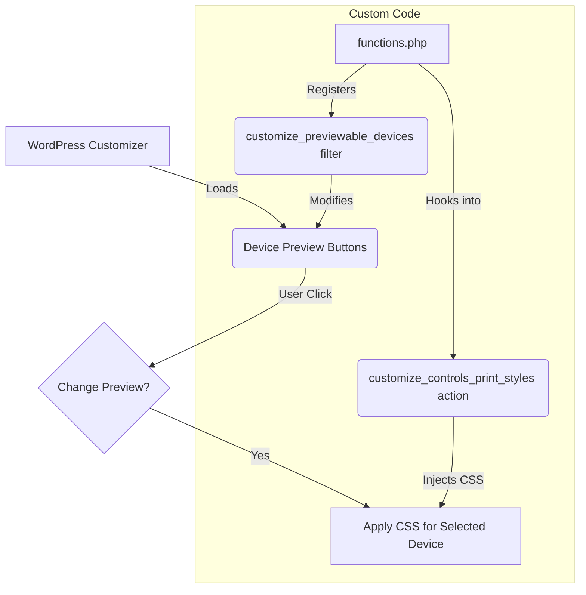

import Tabs from '@theme/Tabs';
import TabItem from '@theme/TabItem';

As a WordPress developer, ensuring your theme looks perfect across all devices is a top priority. The default device previews in the WordPress Customizer—Desktop, Tablet, and Mobile—are a great start, but they don't always cover the specific breakpoints you need for a truly polished design.

<!-- truncate -->

## The Problem

The standard WordPress Customizer preview options are limited. If you're developing a theme that needs to look sharp on a 13-inch laptop, a large phablet, or any other specific viewport size, constantly resizing your browser window or relying solely on browser developer tools can be a clunky and inefficient workflow. You need a way to integrate your target device sizes directly into the WordPress admin for seamless testing.

## The Solution

You can add your own custom device previews to the Customizer by using a combination of a PHP filter and an action hook. We'll use the `customize_previewable_devices` filter to register our new devices and the `customize_controls_print_styles` action to add the necessary CSS to control the preview iframe's dimensions.

Here’s a diagram illustrating how these pieces fit together:



### 1. Register Your Custom Devices

First, add the following PHP code to your theme's `functions.php` file or a custom plugin. This code hooks into the `customize_previewable_devices` filter to add a "Laptop" and a "Large Mobile" device to the list.

```php
<?php
/**
 * Add custom device sizes to the WordPress Customizer.
 *
 * @param array $devices Existing previewable devices.
 * @return array Modified array of previewable devices.
 */
function my_custom_preview_devices( $devices ) {
    // Add a custom 'Laptop' device
    $devices['laptop'] = array(
        'label'    => __( 'Laptop', 'your-text-domain' ),
        'width'    => 1280,
        'height'   => 800,
    );

    // Add a custom 'Large Mobile' device
    $devices['large_mobile'] = array(
        'label'    => __( 'Large Mobile', 'your-text-domain' ),
        'width'    => 414,
        'height'   => 896,
    );

    return $devices;
}
add_filter( 'customize_previewable_devices', 'my_custom_preview_devices' );
?>
```

### 2. Add the CSS for Preview Dimensions

Next, you need to add the CSS that will resize the preview pane. The following code uses the `customize_controls_print_styles` action to output the necessary styles into the Customizer's head.

```php
<?php
/**
 * Enqueue custom styles for the WordPress Customizer device previews.
 */
function my_custom_preview_styles() {
    ?>
    <style type="text/css">
        /* Styles for the 'Laptop' preview */
        .wp-customizer .preview-laptop .wp-full-overlay-main {
            width: 1280px;
            height: 800px;
            margin-left: -640px; /* Half of the width to center it */
            margin-top: -400px;  /* Half of the height to center it */
            left: 50%;
            top: 50%;
        }

        /* Styles for the 'Large Mobile' preview */
        .wp-customizer .preview-large_mobile .wp-full-overlay-main {
            width: 414px;
            height: 896px;
            margin-left: -207px; /* Half of the width */
            margin-top: -448px;  /* Half of the height */
            left: 50%;
            top: 50%;
        }
    </style>
    <?php
}
add_action( 'customize_controls_print_styles', 'my_custom_preview_styles' );
?>
```
With these two snippets in place, when you go to **Appearance > Customize**, you will see your new device icons in the preview selection footer, ready for you to use.

## What I Learned

*   The term "editor preview" can be ambiguous. While my initial thought was the Gutenberg block editor, that environment is not easily extensible for this purpose. The Customizer, however, provides the necessary hooks.
*   The `customize_previewable_devices` filter is the key to adding new device options to the Customizer's UI.
*   Simply adding the device isn't enough; you must also inject CSS via `customize_controls_print_styles` to control the preview iframe's dimensions.
*   This approach provides a much better developer experience (DX) than manually resizing browser windows, leading to faster and more accurate theme development.

## References

*   [WordPress.org Developer Resources: `customize_previewable_devices` filter](https://developer.wordpress.org/reference/hooks/customize_previewable_devices/)
*   [WordPress.org Developer Resources: `customize_controls_print_styles` action](https://developer.wordpress.org/reference/hooks/customize_controls_print_styles/)

