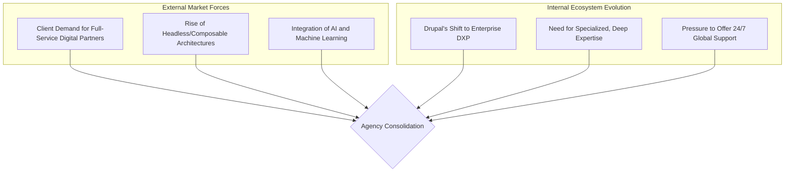

import Tabs from '@theme/Tabs';
import TabItem from '@theme/TabItem';

The Drupal ecosystem, long characterized by a vibrant and diverse landscape of independent agencies, is showing clear signs of a maturing market: consolidation. The recent acquisition of Chapter Three by Kanopi Studios in January 2026 is a prime example of a trend that is reshaping the Drupal service provider landscape.

<!-- truncate -->

## The Trend: A Shifting Landscape

For years, the Drupal community has thrived on the strength of its many small and medium-sized agencies. However, as the platform itself has evolved from a traditional CMS into a powerful Digital Experience Platform (DXP), the demands placed on these agencies have grown exponentially. This has led to a noticeable trend of mergers and acquisitions, where agencies are joining forces to expand their capabilities and market reach.

## The Drivers of Consolidation

This consolidation isn't happening in a vacuum. It's a response to several powerful forces both within and outside the Drupal ecosystem. A diagram helps to visualize these interconnected drivers:

These drivers create a feedback loop:
1.  **From CMS to DXP:** As Drupal has become the backbone for complex digital ecosystems, clients expect agencies to provide a wider range of services, from strategy and design to complex integrations and ongoing support.
2.  **Specialization is Key:** The rise of headless architectures, Next.js, and AI integration requires deep, specialized knowledge that can be difficult for smaller agencies to maintain across the board. The Kanopi/Chapter Three merger, for example, was explicitly about strengthening capabilities in headless Drupal.
3.  **Enterprise Demands:** Large enterprise clients, Drupal's sweet spot, demand partners with the scale to handle massive projects, provide global support, and ensure long-term stability. Larger, consolidated agencies are often better positioned to meet these needs.

## The Impact: What Does It Mean for Drupal?

This trend has significant implications for the entire ecosystem, with both potential benefits and drawbacks.

<Tabs>
<TabItem value="positives" label="The Positives">

*   **Deeper Expertise:** Consolidated agencies can pool talent to create centers of excellence around specific technologies like AI, personalization, or decoupled architectures.
*   **Comprehensive Offerings:** Clients can get more of what they need from a single partner, simplifying procurement and project management.
*   **Greater Stability:** Larger agencies may offer more stability and longevity, which is a crucial factor for enterprise clients investing in long-term platforms.

</TabItem>
<TabItem value="negatives" label="The Negatives">

*   **Reduced Choice:** Fewer, larger agencies could lead to less diversity in approach and potentially higher prices.
*   **Risk of Monoculture:** A landscape dominated by a few large players could stifle the innovation and experimentation that smaller, more agile agencies often bring.
*   **Challenges for Small Agencies:** Smaller shops may find it harder to compete for large projects, potentially being relegated to subcontractor status or niche markets.

</TabItem>
</Tabs>

## What I Learned

The consolidation trend in the Drupal agency world is a natural and, in many ways, inevitable sign of a maturing market. It mirrors similar trends seen in other enterprise software ecosystems. While it presents challenges, particularly for smaller agencies, it also reflects the success of Drupal in moving upmarket and becoming a true enterprise-grade DXP.

The key for the Drupal community will be to ensure that the ecosystem remains a place where agencies of all sizes can thrive. Fostering a culture of collaboration, supporting smaller agencies through community initiatives, and ensuring that the platform itself remains accessible will be crucial to maintaining the vibrant diversity that has always been one of Drupal's greatest strengths.

## References

*   [The Drop Times: Kanopi Studios Acquires Chapter Three, Enhancing Drupal Expertise](https://thedroptimes.com/34889/kanopi-studios-acquires-chapter-three-enhancing-drupal-expertise.html)
*   [Kanopi.com: Kanopi Acquires Chapter Three](https://kanopi.com/blog/kanopi-acquires-chapter-three)
*   [Anchor Points: The Future of the DXP](https://anchorpoints.io/the-future-of-the-dxp/)

