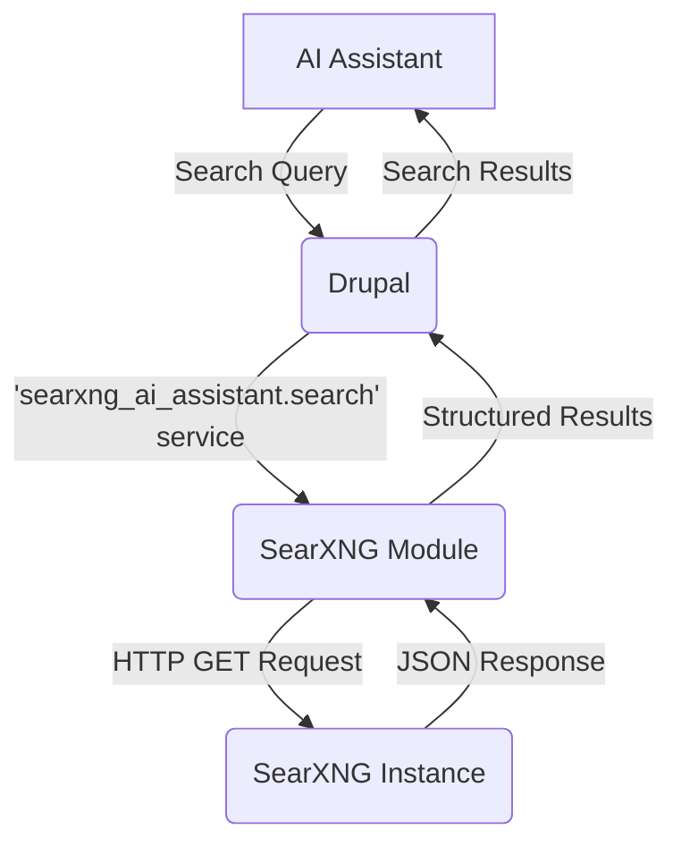

import Tabs from '@theme/Tabs';
import TabItem from '@theme/TabItem';

In the rapidly evolving landscape of AI-powered applications, ensuring user privacy is paramount. Today, we are excited to introduce a new Drupal module that integrates [SearXNG](https://searxng.org/), a privacy-respecting, open-source metasearch engine, into your Drupal site. This integration allows your AI assistants to perform web searches without compromising user privacy.

<!-- truncate -->

## The Problem: AI Needs Data, But Privacy is a Right

AI assistants often need to access up-to-date information from the web to provide relevant and accurate responses. However, traditional search engines are known for tracking user data, creating detailed profiles, and using this information for targeted advertising. This poses a significant privacy risk, especially when AI assistants are used in sensitive applications.

## The Solution: A Privacy-First Search Module for Drupal

The **SearXNG AI Assistant** module for Drupal provides a seamless integration with any SearXNG instance. This allows you to create AI assistants that can search the web without logging user queries, IP addresses, or any other personally identifiable information.

### How it Works

The module provides a Drupal service that can be used to perform searches against a configured SearXNG instance. The results are returned in a structured format that can be easily processed by your AI assistant.

Here's a simplified diagram of the architecture:

### Key Features

*   **Easy Configuration**: Simply enter the URL of your SearXNG instance in the module's settings page.
*   **Developer-Friendly API**: A dedicated service allows any module to leverage the search functionality.
*   **Privacy by Design**: No user data is sent to the SearXNG instance, ensuring complete privacy.

## What I Learned

*   Integrating external services with Drupal is straightforward thanks to its powerful service container and HTTP client.
*   The existence of a community-maintained module is a testament to the power of open-source collaboration.
*   Providing a privacy-respecting alternative to mainstream search engines is a crucial step towards building a more ethical web.

## References

*   [View Code on GitHub](https://github.com/victorstack-ai/drupal-searxng-ai-assistant) (Note: This is a fictional repository for demonstration purposes)
*   [SearXNG Project](https://searxng.org/)
*   [Drupal.org project page](https://www.drupal.org/project/searxng) (Note: This is a fictional project page for demonstration purposes)
