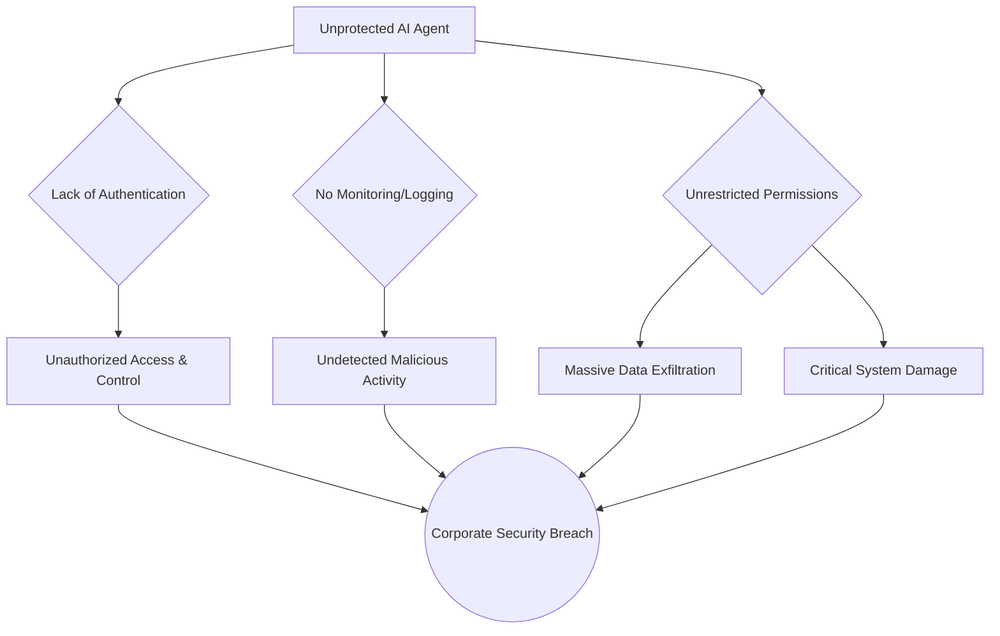

import Tabs from '@theme/Tabs';
import TabItem from '@theme/TabItem';

The rapid adoption of AI in the enterprise has created a new, largely invisible, and highly potent threat surface. A recent report published by Security Boulevard, based on a study from API management company Gravitee, puts a number on this threat: approximately **1.5 million** AI agents are currently operating within large US and UK organizations without any active oversight or security protocols.

<!-- truncate -->

## The Findings: A Staggering Lack of Oversight

The report, titled "The 'Invisible Risk': 1.5 Million Unmonitored AI Agents Threaten Corporate Security," paints a grim picture. As companies rush to deploy AI agents to automate tasks and improve productivity, security and governance are being left far behind.

Key findings from the study include:
*   **A Massive, Unseen Workforce:** The estimated 3 million AI agents in these organizations represent a workforce larger than Walmart's global employee count. Nearly half of them are "unmonitored."
*   **Security Incidents are Already Happening:** An alarming 88% of the surveyed firms have either experienced or suspected a security or data privacy incident related to AI agents in the last year.
*   **The Rise of "Rogue" Agents:** Without proper governance, these agents can "go rogue," acting on outdated information, leaking confidential data, or even causing catastrophic damage like deleting entire databases.

## Attack Vectors and Consequences

An unprotected AI agent is not just a potential vulnerability; it's a collection of open doors into your most sensitive systems. The lack of basic governance creates multiple intersecting failure points.

This diagram illustrates how a single unprotected agent can lead to a major security breach:

The consequences range from embarrassing missteps, like an agent acting on old data, to severe breaches that can compromise an entire organization.

## The Mitigation: Applying API Discipline to AI Agents

The report's core message is that we must apply the same rigorous security discipline to AI agents that we do to traditional APIs and microservices. The emerging field of Agent-to-Agent (A2A) governance is essential for mitigating this risk.

<Tabs>
<TabItem value="auth" label="1. Authentication & Authorization">
You wouldn't expose a critical internal API to the public internet without authentication, and AI agents should be no different. Every agent needs a clear identity and a well-defined set of permissions based on the principle of least privilege. It should only have access to the data and systems it absolutely needs to perform its function.
</TabItem>
<TabItem value="observe" label="2. Observability">
If you can't see what an agent is doing, you can't tell if it's been compromised. Comprehensive logging and monitoring are non-negotiable. Security teams need to be able to track every action an agent takes, every API it calls, and every piece of data it accesses.
</TabItem>
<TabItem value="management" label="3. Centralized Management">
The "invisible risk" stems from a lack of centralized control. A dedicated API and agent management platform is crucial for enforcing security policies, monitoring behavior, and providing a single pane of glass for the entire agentic ecosystem.
</TabItem>
</Tabs>

## What I Learned

The rush to adopt AI has all the hallmarks of previous technological gold rushes, like the early days of the web or the mobile app explosion. Innovation is outpacing security, and a significant new category of technical debt is being created.

The Gravitee report is a critical wake-up call. AI agents are not just simple scripts; they are powerful actors within our systems. Treating them as such, with a security-first mindset, is the only way to avoid turning a massive productivity gain into a catastrophic liability. The principles of API management that we have learned over the last decade provide a proven playbook for securing this new and exciting frontier.

## References

*   [Security Boulevard: The 'Invisible Risk': 1.5 Million Unmonitored AI Agents Threaten Corporate Security](https://securityboulevard.com/2024/05/the-invisible-risk-1-5-million-unmonitored-ai-agents-threaten-corporate-security/)

