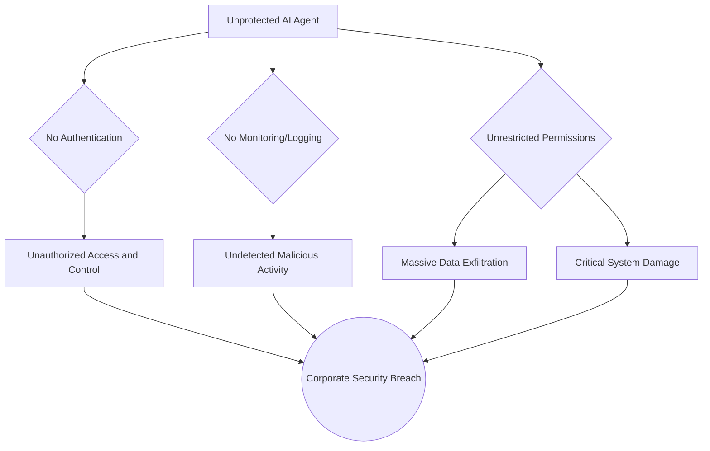
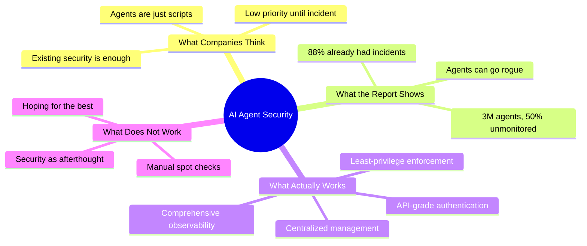

import Tabs from '@theme/Tabs';
import TabItem from '@theme/TabItem';

A recent report from Security Boulevard, based on a Gravitee study, puts a number on the AI agent security gap: approximately **1.5 million** AI agents operating in large US and UK organizations with zero active oversight. That is not a theoretical risk. That is a ticking time bomb with a billing address.

I read the full report. The findings are worse than the headline.

<!-- truncate -->

## The Findings

> "An alarming 88% of the surveyed firms have either experienced or suspected a security or data privacy incident related to AI agents in the last year."
>
> — Security Boulevard, [The Invisible Risk Report](https://securityboulevard.com/2024/05/the-invisible-risk-1-5-million-unmonitored-ai-agents-threaten-corporate-security/)

:::info[Context]
The estimated 3 million AI agents in these organizations represent a workforce larger than Walmart's global employee count. Nearly half of them are "unmonitored." This is not a future problem — 88% of firms already report incidents or suspected incidents.
:::

| Finding | Scale |
|---|---|
| Total AI agents in surveyed orgs | ~3 million |
| Unmonitored agents | ~1.5 million (50%) |
| Firms with security/privacy incidents | 88% |
| Rogue agent risk | Acting on outdated info, leaking data, deleting databases |

## How a Single Unprotected Agent Becomes a Breach

```mermaid
flowchart TD
    A[Unprotected AI Agent] --> B{No Authentication}
    A --> C{No Monitoring/Logging}
    A --> D{Unrestricted Permissions}
    B --> E[Unauthorized Access and Control]
    C --> F[Undetected Malicious Activity]
    D --> G[Massive Data Exfiltration]
    D --> H[Critical System Damage]
    E --> I((Corporate Security Breach))
    F --> I
    G --> I
    H --> I
```

The consequences range from embarrassing missteps (agent acting on old data) to severe breaches that can compromise an entire organization.

## The Fix: Apply API Discipline to AI Agents

The report's core message is simple: treat AI agents with the same security rigor you apply to APIs and microservices. The emerging field of Agent-to-Agent (A2A) governance is essential.

<Tabs>
<TabItem value="auth" label="Authentication and Authorization">

Nobody would expose a critical internal API to the public internet without authentication. AI agents need the same treatment.

| Control | Implementation |
|---|---|
| Clear identity per agent | Service accounts with unique credentials |
| Least-privilege permissions | Only access data and systems needed for function |
| Scoped API tokens | Per-agent, per-environment, time-limited |
| Regular access reviews | Quarterly permission audits |

</TabItem>
<TabItem value="observe" label="Observability">

Without visibility into what an agent is doing, there is no way to know if it has been compromised.

| Control | Implementation |
|---|---|
| Action logging | Every API call, data access, and mutation recorded |
| Anomaly detection | Baseline behavior profiles with deviation alerts |
| Real-time dashboards | Agent activity visible to security teams |
| Audit trails | Immutable logs linked to agent identity |

</TabItem>
<TabItem value="management" label="Centralized Management">

The "invisible risk" stems from lack of centralized control.

| Control | Implementation |
|---|---|
| Agent registry | Single source of truth for all deployed agents |
| Policy enforcement | Security policies applied consistently |
| Single pane of glass | Unified view of agent ecosystem health |
| Lifecycle management | Deploy, monitor, deprecate, decommission |

</TabItem>
</Tabs>

## Hype vs Reality: AI Agent Security

```mermaid
mindmap
  root((AI Agent Security))
    What Companies Think
      Agents are just scripts
      Existing security is enough
      Low priority until incident
    What the Report Shows
      3M agents, 50% unmonitored
      88% already had incidents
      Agents can go rogue
    What Actually Works
      API-grade authentication
      Comprehensive observability
      Centralized management
      Least-privilege enforcement
    What Does Not Work
      Hoping for the best
      Manual spot checks
      Security as afterthought
```

:::caution[Reality Check]
The rush to adopt AI has all the hallmarks of previous technology gold rushes — the early web, the mobile app explosion. Innovation is outpacing security, and a significant new category of technical debt is being created. AI agents are not scripts. They are powerful actors within your systems. Treating them as such is the only way to avoid turning a productivity gain into a catastrophic liability.
:::

Full report key statistics

- ~3 million AI agents across surveyed large US and UK organizations
- ~1.5 million agents operating without active oversight
- 88% of firms have experienced or suspected a security/data privacy incident
- Rogue agents can act on outdated information, leak confidential data, or cause catastrophic damage
- The agent workforce is larger than Walmart's global employee count
- Agent-to-Agent (A2A) governance is an emerging but essential field

## What I Learned

- The Gravitee report is a critical wake-up call. The scale of unmonitored AI agents is staggering.
- The principles of API management from the last decade provide a proven playbook for securing AI agents.
- "We will add security later" is the sentence that precedes every breach.
- The 88% incident rate means this is not a risk assessment exercise. It is incident response.

## Why this matters for Drupal and WordPress

Agencies and teams that run AI agents for Drupal or WordPress — content pipelines, code generation, triage, or deployment — are part of that 1.5M. Unmonitored means no inventory, no scoped credentials, and no audit trail. Apply the same discipline you would for any API or integration: inventory every agent that can touch CMS, hosting, or repos; give each the minimum scope it needs; log and alert on anomalies. If an agent can push code, change content, or call production APIs, it must be in scope for your governance. Start with one workflow, lock it down, then expand.

## References

- [Security Boulevard: The Invisible Risk: 1.5 Million Unmonitored AI Agents Threaten Corporate Security](https://securityboulevard.com/2024/05/the-invisible-risk-1-5-million-unmonitored-ai-agents-threaten-corporate-security/)

***
*Looking for an Architect who doesn't just write code, but builds the AI systems that multiply your team's output? View my enterprise CMS case studies at [victorjimenezdev.github.io](https://victorjimenezdev.github.io) or connect with me on LinkedIn.*
