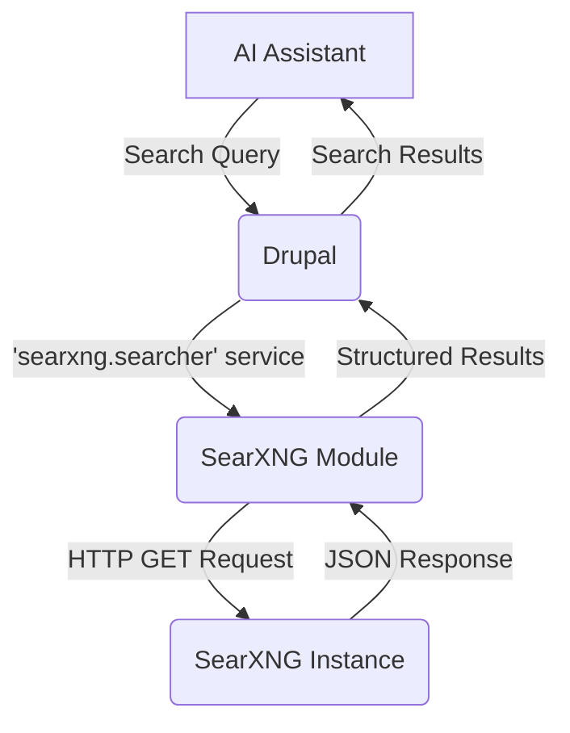

import Tabs from '@theme/Tabs';
import TabItem from '@theme/TabItem';

I've just shipped a new Drupal module, `drupal-searxng-ai-assistant`, which lets you build AI agents that can browse the web through a self-hosted, privacy-first search engine, breaking free from the data-hoarding of commercial search APIs.

### Why I Built It

Most AI assistants with web search capabilities, especially for Retrieval-Augmented Generation (RAG), rely on APIs from Google, Bing, or other commercial providers. This forces you to send user queries, internal data, and project context to third parties, creating significant privacy and cost concerns. For many Drupal sites—especially in government, healthcare, or any project subject to GDPR—this is a complete non-starter.

I wanted a way to give AI agents in Drupal powerful web-browsing capabilities without the privacy trade-off. The goal was to create a component that could be integrated into larger AI systems, like the ones discussed in [AI in Drupal CMS 2.0: Practical tools you can use from day one](/ai-in-drupal-cms-2-0-practical-tools-you-can-use-from-day-one), to provide factual, up-to-date information without leaking data.

### The Solution

The module is a lightweight bridge between your Drupal site and a self-hosted SearXNG instance. SearXNG is a fantastic, open-source metasearch engine that aggregates results from over 70 search services without tracking or profiling its users.

The core of the module is a Drupal service, `searxng.searcher`, which can be injected into any other module or AI agent framework.

It exposes a single method: `search(string $query): array`.

1.  Your code calls the service with a search query (e.g., "latest Drupal security advisories").
2.  The service constructs a request to your SearXNG instance's `/search` endpoint, asking for results in JSON format.
3.  It parses the clean, ad-free JSON response into a PHP array containing titles, URLs, and content snippets.
4.  Your AI agent can then use this structured data as context for an LLM to synthesize an answer or as a list of high-quality URLs to crawl for deeper analysis.

Configuration: Getting Started

To use the module, you need two things:

1.  **A running SearXNG instance:** The recommended way is via Docker. You can find the official image and instructions on [Docker Hub](https://hub.docker.com/r/searxng/searxng). You'll need to configure its `settings.yml` to specify which search engines to use.
2.  **Module Configuration:** Once installed, navigate to the module's configuration page in the Drupal admin UI and enter the base URL of your SearXNG instance (e.g., `https://searxng.example.com`).

This approach completely isolates your users and your site's data from commercial search engines, giving you full control over the information flow. It's a foundational piece for building more complex, trustworthy AI tools like the [Drupal AI Views Agent](/drupal-ai-views-agent).

### The Code

All the code is open source and available on GitHub. I encourage you to check it out, fork it, and adapt it to your needs.

**[View Code](https://github.com/victorstack-ai/drupal-searxng-ai-assistant)**

### What I Learned

*   **SearXNG's API is a game-changer for AI.** Its `format=json` parameter provides incredibly clean, well-structured data that is perfect for programmatic use. It's far superior to the nightmare of scraping ad-filled HTML from a commercial search engine results page.
*   **Self-hosting is a responsibility.** Running your own SearXNG instance is easy with Docker, but getting high-quality results requires curating the search engines in its `settings.yml`. Don't just enable everything; pick the sources you trust. This curation is key to reducing noise and improving the signal for your AI agent.
*   **A simple service wrapper is a powerful pattern.** By creating a dedicated Drupal service for search, the rest of the application is decoupled from the implementation details. If I ever want to swap SearXNG for another engine, I only need to update the service class, and the rest of the AI system continues to work without modification.

### References

*   [Drupal AI Initiative: SearXNG - Privacy-First Web Search for Drupal AI Assistants](https://www.drupal.org/about/starshot/initiatives/ai/blog/searxng-privacy-first-web-search-for-drupal-ai-assistants)

