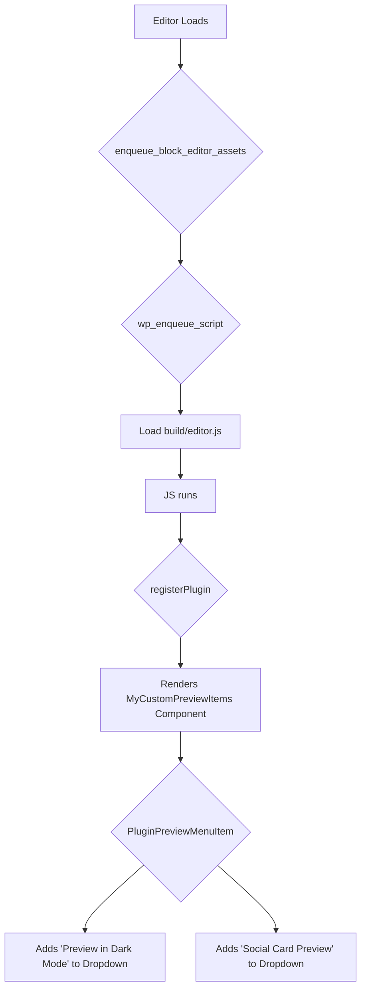

import Tabs from '@theme/Tabs';
import TabItem from '@theme/TabItem';

When developing WordPress themes, the editor's "Preview in new tab" dropdown is essential. However, its default options—Desktop, Tablet, and Mobile—don't always cover every testing scenario. You might need to preview a post as a specific social media card, in a dark mode, or with a particular query parameter. This guide shows you how to add your own custom entries to this dropdown.

<!-- truncate -->

## The Problem

Out of the box, the WordPress block editor's preview functionality is limited. While it provides responsive previews, it lacks the flexibility for more specialized use cases. For example, a theme developer might need to:

*   **Test social sharing metadata:** Verify how a post's title, description, and featured image will appear on platforms like X (formerly Twitter) or Facebook.
*   **Preview different color schemes:** Quickly check how content renders in a "dark mode" or other alternative styles.
*   **Validate against specific user roles:** See how a post appears to a subscriber versus an administrator.
*   **Test with specific URL parameters:** Check functionality that relies on query strings without manually constructing the URL.

Manually opening new tabs and adjusting URLs for these scenarios is inefficient and breaks the development flow.

## The Solution: `PluginPreviewMenuItem`

The solution lies in a React component provided by the WordPress editor itself: `PluginPreviewMenuItem`. This component, part of the `@wordpress/editor` package, uses the editor's "Slot/Fill" system to let you inject your own items into the preview dropdown menu.

The implementation requires two parts: a PHP function to enqueue our JavaScript assets and the JavaScript file itself to register the custom menu item.

### 1. Enqueue the Editor Script

First, you need to tell WordPress to load your custom script on the editor screen. Add this to your theme's `functions.php`:

```php
<?php
// In functions.php

/**
 * Enqueues custom script for the block editor to add a preview menu item.
 */
function my_theme_enqueue_editor_scripts() {
    $asset_file_path = get_theme_file_path('build/editor.asset.php');

    if (file_exists($asset_file_path)) {
        $asset_file = include($asset_file_path);

        wp_enqueue_script(
            'my-theme-editor-extensions', // A unique handle for your script
            get_theme_file_uri('build/editor.js'),
            $asset_file['dependencies'],
            $asset_file['version'],
            true // Load in the footer
        );
    }
}
add_action('enqueue_block_editor_assets', 'my_theme_enqueue_editor_scripts');
```

:::note
This example assumes you have a modern JavaScript build process (like `@wordpress/scripts`) that generates a `build/editor.js` file and a corresponding `build/editor.asset.php` file for managing dependencies and versions.
:::

### 2. Register the Custom Menu Item

Next, create the JavaScript file. In this example, `assets/js/editor.js`, we'll import the necessary components and register our new preview link.

This example demonstrates two common use cases: a direct link and a JavaScript action.

<Tabs>
<TabItem value="js" label="assets/js/editor.js">

```javascript
import { __ } from '@wordpress/i18n';
import { registerPlugin } from '@wordpress/plugins';
import { PluginPreviewMenuItem } from '@wordpress/editor';
import { store as coreStore } from '@wordpress/core-data';
import { useSelect } from '@wordpress/data';

const MyCustomPreviewItems = () => {
    // Get the site and post details.
    const { siteUrl, postPreviewLink } = useSelect((select) => {
        const { getSite } = select(coreStore);
        const { getPostType, getCurrentPostId } = select('core/editor');

        return {
            siteUrl: getSite()?.url,
            postPreviewLink: select('core/editor').getPermalink(),
        };
    }, []);

    // Function to handle a custom action, e.g., opening a modal or new window.
    const openSocialPreview = () => {
        // In a real app, you might fetch data and render a modal.
        // For this demo, we'll just open a new window with a specific parameter.
        if (postPreviewLink) {
            window.open(`${postPreviewLink}&preview_mode=social`, '_blank');
        }
    };

    return (
        <>
            {/* Item 1: Direct Link to Dark Mode Preview */}
            <PluginPreviewMenuItem
                href={`${postPreviewLink}&theme_mode=dark`}
                target="_blank"
            >
                {__('Preview in Dark Mode', 'my-theme')}
            </PluginPreviewMenuItem>

            {/* Item 2: Custom onClick Action */}
            <PluginPreviewMenuItem onClick={openSocialPreview}>
                {__('Social Card Preview', 'my-theme')}
            </PluginPreviewMenuItem>
        </>
    );
};

// Register the component as a plugin.
registerPlugin('my-theme-custom-preview-items', {
    render: MyCustomPreviewItems,
});
```
</TabItem>
</Tabs>

### How It Works



1.  **`enqueue_block_editor_assets`**: This action hook fires when the block editor is initialized.
2.  **`wp_enqueue_script`**: We load our compiled JavaScript file, telling WordPress it depends on packages like `wp-plugins` and `wp-editor`.
3.  **`registerPlugin`**: This function from `@wordpress/plugins` is the standard way to extend the editor. We give our extension a unique name and tell it which component to render.
4.  **`PluginPreviewMenuItem`**: This is the key component.
    *   **`href` & `target`**: For simple links, you can pass an `href` and `target` just like a standard `<a>` tag. We construct a URL with a `theme_mode=dark` query parameter.
    *   **`onClick`**: For more complex interactions, you can provide an `onClick` function. In our "Social Card Preview" example, it triggers the `openSocialPreview` function.
5.  **`useSelect`**: We use this hook from `@wordpress/data` to get the post's preview link (`getPermalink`) dynamically, ensuring our links are always correct.

## What I Learned

*   **Slot/Fill is Powerful:** The `PluginPreviewMenuItem` is a great example of WordPress's Slot/Fill pattern, which makes the editor interface highly extensible without needing to overwrite core components.
*   **React is Essential:** Customizing the modern WordPress editor requires a good understanding of React and JavaScript build tools. Trying to do this with jQuery or vanilla JS is not feasible.
*   **Data-driven Previews:** Using `@wordpress/data` and hooks like `useSelect` is crucial for creating dynamic, context-aware links that respond to the current post's state.
*   **Combine `href` and `onClick`:** You can have multiple `PluginPreviewMenuItem` components to offer a variety of preview options, mixing simple links with more complex JavaScript-driven actions.

## References

*   [Adding custom devices to the editor preview dropdown](/blog/2026-02-19-add-custom-preview-devices-to-wordpress-editor)
*   [Official WordPress Block Editor Handbook](https://developer.wordpress.org/block-editor/)
*   [`PluginPreviewMenuItem` Component Reference](https://developer.wordpress.org/block-editor/reference-guides/components/plugin-preview-menu-item/)
---
