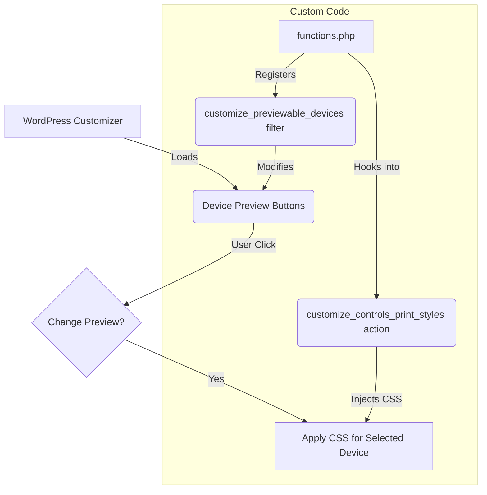
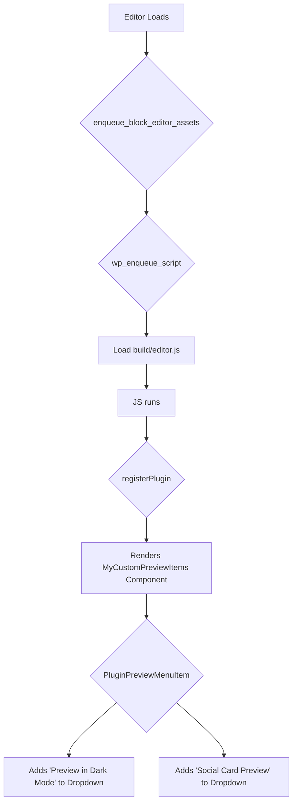

import Tabs from '@theme/Tabs';
import TabItem from '@theme/TabItem';

WordPress offers two distinct preview systems: the Customizer's device preview and the Block Editor's "Preview in new tab" dropdown. Both are extensible, but they require completely different approaches. This guide covers both.

<!-- truncate -->

## Part 1: Customizer Device Preview (PHP)

The WordPress Customizer (**Appearance > Customize**) shows device preview buttons for Desktop, Tablet, and Mobile. You can add custom device sizes using PHP hooks.

### How It Works



### 1. Register Your Custom Devices

Add this to your theme's `functions.php`. This hooks into `customize_previewable_devices` to add "Laptop" and "Large Mobile" options.

```php
<?php
/**
 * Add custom device sizes to the WordPress Customizer.
 *
 * @param array $devices Existing previewable devices.
 * @return array Modified array of previewable devices.
 */
function my_custom_preview_devices( $devices ) {
    $devices['laptop'] = array(
        'label'    => __( 'Laptop', 'your-text-domain' ),
        'width'    => 1280,
        'height'   => 800,
    );

    $devices['large_mobile'] = array(
        'label'    => __( 'Large Mobile', 'your-text-domain' ),
        'width'    => 414,
        'height'   => 896,
    );

    return $devices;
}
add_filter( 'customize_previewable_devices', 'my_custom_preview_devices' );
?>
```

### 2. Add CSS for Preview Dimensions

Register the CSS that resizes the preview pane for your custom devices.

```php
<?php
/**
 * Enqueue custom styles for the WordPress Customizer device previews.
 */
function my_custom_preview_styles() {
    ?>
    <style type="text/css">
        .wp-customizer .preview-laptop .wp-full-overlay-main {
            width: 1280px;
            height: 800px;
            margin-left: -640px;
            margin-top: -400px;
            left: 50%;
            top: 50%;
        }

        .wp-customizer .preview-large_mobile .wp-full-overlay-main {
            width: 414px;
            height: 896px;
            margin-left: -207px;
            margin-top: -448px;
            left: 50%;
            top: 50%;
        }
    </style>
    <?php
}
add_action( 'customize_controls_print_styles', 'my_custom_preview_styles' );
?>
```

---

## Part 2: Block Editor Preview Dropdown (React)

The Block Editor's "Preview in new tab" dropdown is a completely different system. You extend it with the `PluginPreviewMenuItem` React component from `@wordpress/editor`, using the editor's Slot/Fill pattern.

### How It Works



### 1. Enqueue the Editor Script

Tell WordPress to load your script on the editor screen:

```php
<?php
function my_theme_enqueue_editor_scripts() {
    $asset_file_path = get_theme_file_path('build/editor.asset.php');

    if (file_exists($asset_file_path)) {
        $asset_file = include($asset_file_path);

        wp_enqueue_script(
            'my-theme-editor-extensions',
            get_theme_file_uri('build/editor.js'),
            $asset_file['dependencies'],
            $asset_file['version'],
            true
        );
    }
}
add_action('enqueue_block_editor_assets', 'my_theme_enqueue_editor_scripts');
```

:::note
This assumes you have a build process (like `@wordpress/scripts`) generating `build/editor.js` and `build/editor.asset.php`.
:::

### 2. Register Custom Menu Items

Create `assets/js/editor.js` with both a direct link and a JavaScript action:

```javascript
import { __ } from '@wordpress/i18n';
import { registerPlugin } from '@wordpress/plugins';
import { PluginPreviewMenuItem } from '@wordpress/editor';
import { store as coreStore } from '@wordpress/core-data';
import { useSelect } from '@wordpress/data';

const MyCustomPreviewItems = () => {
    const { siteUrl, postPreviewLink } = useSelect((select) => {
        const { getSite } = select(coreStore);
        return {
            siteUrl: getSite()?.url,
            postPreviewLink: select('core/editor').getPermalink(),
        };
    }, []);

    const openSocialPreview = () => {
        if (postPreviewLink) {
            window.open(`${postPreviewLink}&preview_mode=social`, '_blank');
        }
    };

    return (
        <>
            {/* Direct link to Dark Mode Preview */}
            <PluginPreviewMenuItem
                href={`${postPreviewLink}&theme_mode=dark`}
                target="_blank"
            >
                {__('Preview in Dark Mode', 'my-theme')}
            </PluginPreviewMenuItem>

            {/* Custom onClick action */}
            <PluginPreviewMenuItem onClick={openSocialPreview}>
                {__('Social Card Preview', 'my-theme')}
            </PluginPreviewMenuItem>
        </>
    );
};

registerPlugin('my-theme-custom-preview-items', {
    render: MyCustomPreviewItems,
});
```

## What I Learned

*   The term "editor preview" is ambiguous in WordPress. The **Customizer** and **Block Editor** have completely separate extension APIs.
*   **Customizer**: PHP hooks (`customize_previewable_devices` filter + `customize_controls_print_styles` action). Simple, no build tools needed.
*   **Block Editor**: React components (`PluginPreviewMenuItem` via Slot/Fill). Requires `@wordpress/scripts` and a JavaScript build process.
*   `useSelect` from `@wordpress/data` is key for creating dynamic, context-aware preview links that respond to the current post's state.
*   You can mix `href` links and `onClick` handlers across multiple `PluginPreviewMenuItem` components.

## References

*   [WordPress Developer Resources: `customize_previewable_devices` filter](https://developer.wordpress.org/reference/hooks/customize_previewable_devices/)
*   [WordPress Developer Resources: `customize_controls_print_styles` action](https://developer.wordpress.org/reference/hooks/customize_controls_print_styles/)
*   [`PluginPreviewMenuItem` Component Reference](https://developer.wordpress.org/block-editor/reference-guides/components/plugin-preview-menu-item/)
*   [Official WordPress Block Editor Handbook](https://developer.wordpress.org/block-editor/)
