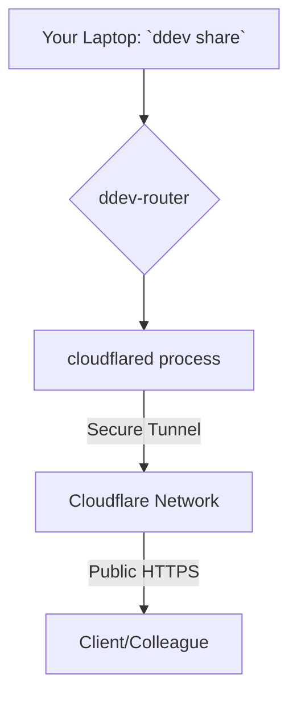

import Tabs from '@theme/Tabs';
import TabItem from '@theme/TabItem';

DDEV v1.25.0 has landed, introducing a redesigned, modular `ddev share` command that significantly improves how developers share local projects. The headline feature is the integration of Cloudflare Tunnel as a new, free, and secure default sharing provider, moving away from the previous reliance on ngrok.

<!-- truncate -->

## The Problem

Sharing a local development site with clients or colleagues has often been a frustrating experience. Traditional tools like ngrok, while functional, came with limitations in the free tier, such as:

*   **Volatile URLs:** Free ngrok accounts generate a new random subdomain every time you start a session, making it difficult to share a stable link.
*   **Costs:** Achieving a stable, custom subdomain required a paid ngrok plan.
*   **Configuration Overhead:** Setting up and managing API tokens for different services could be cumbersome.

These issues added unnecessary friction to the development workflow, turning a simple task like getting feedback on a work-in-progress into a recurring chore.

## The Solution: Modular Sharing with Cloudflare Tunnel

DDEV v1.25.0 replaces the monolithic `ddev share` command with a flexible, provider-based system. This new architecture allows DDEV to support various sharing services, and it debuts with first-class support for `cloudflared`, the command-line client for Cloudflare Tunnel.

This change means you can now share your local DDEV project with a secure, publicly accessible URL for free, with no sign-up required.

### How It Works

When you run `ddev share`, DDEV now uses `cloudflared` by default to create a secure tunnel from your local machine to the Cloudflare network. This instantly generates a unique, shareable `*.trycloudflare.com` URL that remains stable for the duration of your session.

Here is a diagram illustrating the process:



The best part is the simplicity. You don't need a Cloudflare account or an API token. To start sharing, you just run:

```bash
ddev share
```

This modularity also means that ngrok is still available as a provider if you prefer it. You can explicitly select it:

```bash
ddev share --provider ngrok
```

### Provider Comparison

This table highlights the key differences between the new default and the legacy option:

| Feature          | Cloudflare Tunnel (`cloudflared`) | ngrok (Legacy)                   |
|------------------|-----------------------------------|----------------------------------|
| **Cost**         | **Free**                          | Freemium (Paid for stable URLs)  |
| **Setup**        | **None required**                 | Requires ngrok account and authtoken |
| **URL Stability**| Stable `*.trycloudflare.com` URL per session | Random URL on free tier        |
| **Default**      | **Yes, in v1.25.0+**              | No (was default pre-v1.25.0)     |

## What I Learned

*   **Cloudflare Tunnel is a game-changer for local dev sharing:** The ability to get a stable, secure, and free sharing URL with zero configuration is a massive improvement to the developer experience.
*   **Modular architecture is the future:** By abstracting the sharing provider, DDEV has future-proofed this feature, making it easy to add new services like `tmate` or other tunneling solutions down the line.
*   **Performance is a continuous focus:** Beyond sharing, this release also made `ddev snapshot` significantly faster by switching to `zstd` compression, showing a commitment to optimizing core workflows.
*   **Embracing modern container tech:** The experimental support for [Podman and rootless Docker](/ddev-podman-rootless-review) shows DDEV is staying on the cutting edge of container technology.

## References

*   [DDEV v1.25.0 Release Notes](https://github.com/ddev/ddev/releases/tag/v1.25.0)
*   [DDEV Documentation: Sharing](/ddev-podman-rootless-review)
