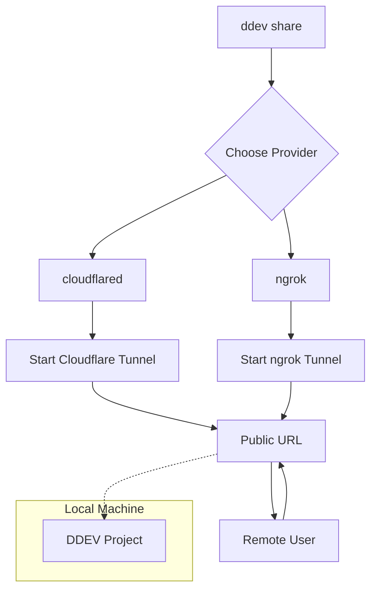
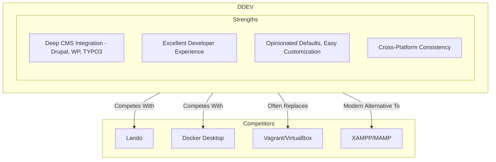

import Tabs from '@theme/Tabs';
import TabItem from '@theme/TabItem';

DDEV v1.25.0 has landed with a major headline feature: free, zero-config site sharing via Cloudflare Tunnel. But the release goes much deeper, with PHP 8.4 and Node.js 24 by default, a revamped Windows installer, and faster snapshots. Here's the full picture.

<!-- truncate -->

## What's New in DDEV v1.25.0

*   **PHP 8.4 and Node.js 24 by Default**: New projects start with the latest language features, no configuration needed.
*   **MariaDB 11.8**: Default database version bumped to MariaDB 11.8.
*   **Modular `ddev share` with Cloudflare Tunnel**: The star feature, free site sharing without accounts or API tokens.
*   **Faster Snapshots**: Significantly faster thanks to `zstd` compression.
*   **Debian Trixie Base**: The `ddev-webserver` is now based on Debian Trixie.
*   **Improved Windows Installer**: Completely rewritten, allows per-user installation with WSL2 without admin privileges.
*   **Experimental Features**: Podman and Docker Rootless support, FrankenPHP as an official add-on.

## The Star Feature: Free Site Sharing with Cloudflare Tunnel

Sharing a local dev site with a client, colleague, or webhook service has always been a hassle. Services like ngrok simplified this but required accounts, API tokens, and potentially paid plans.

DDEV v1.25.0 makes `ddev share` modular. The new `cloudflared` provider leverages Cloudflare Tunnel for completely free, no-account-needed sharing.

```bash
# Install cloudflared (if you haven't already)
brew install cloudflared

# Share your DDEV project
ddev share --provider=cloudflared
```

That's it. DDEV gives you a temporary public URL that tunnels directly to your local project.

### Architecture



### Provider Comparison

| Feature              | `cloudflared` (Default)                 | `ngrok`                                   |
| -------------------- | --------------------------------------- | ----------------------------------------- |
| **Cost**             | Free                                    | Free tier available, paid plans for more features |
| **Account Required** | No                                      | Yes, for authtoken                       |
| **Setup**            | Install `cloudflared` binary            | `ddev config global --ngrok-authtoken=<TOKEN>` |
| **Use Case**         | Quick, temporary sharing; webhook testing | Stable subdomains, custom domains, OAuth |
| **Command**          | `ddev share` or `ddev share --provider=cloudflared` | `ddev share --provider=ngrok`             |

## Market Position: Why DDEV Dominates

DDEV's strategic dominance within the PHP CMS ecosystem is undeniable. It strikes a perfect balance between being opinionated and flexible.



Key success factors:

1.  **Deep Community Roots**: Built *for* and often *by* members of the Drupal, WordPress, and TYPO3 communities.
2.  **"Just Works" Philosophy**: Pre-configured recipes for CMS projects remove hours of setup time.
3.  **Gentle On-ramp to Docker**: Provides containerization power without requiring Docker expertise.

## What I Learned

*   **Frictionless sharing is a huge DX win**: The `cloudflared` integration removes nearly all barriers to sharing a local site. Invaluable for quick feedback loops and webhook testing.
*   **Modularity is smart design**: By abstracting the provider system, DDEV has future-proofed this feature.
*   **Defaults matter**: By shipping PHP 8.4 and Node.js 24 as defaults, DDEV actively encourages modern development practices.
*   **Cloudflare is doubling down on developer tools**: Between this, R2, and Pages, Cloudflare is building a powerful free ecosystem that complements tools like DDEV.

## References

*   [DDEV v1.25.0 Release Notes](https://github.com/ddev/ddev/releases/tag/v1.25.0)
*   [DDEV Documentation: Sharing](https://ddev.readthedocs.io/en/latest/users/usage/sharing/)
*   [DDEV Website](https://ddev.com/)
*   Related post: [DDEV, Podman, and Rootless Docker: A New Era?](/2026-02-06-ddev-podman-rootless-review)
