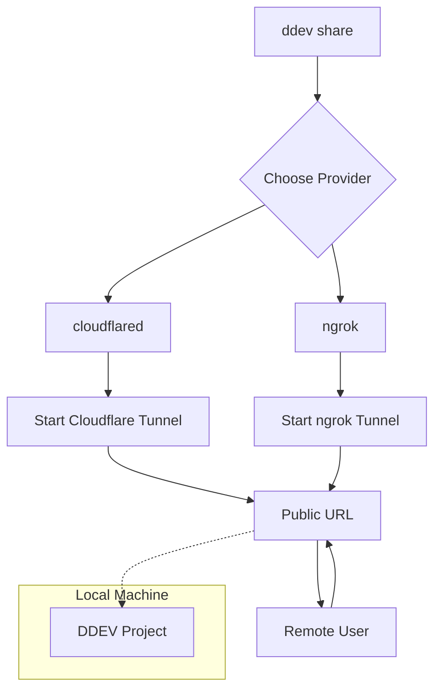

import Tabs from '@theme/Tabs';
import TabItem from '@theme/TabItem';

DDEV v1.25.0 has landed, and with it comes a major enhancement to its sharing capabilities: a new, modular provider system for `ddev share` that includes built-in, free integration with Cloudflare Tunnel. This is a significant quality-of-life improvement for developers who need to quickly share their local work with colleagues or test webhooks without complex setup or paid services.

<!-- truncate -->

## The Problem: Sharing Local Dev is a Hassle

Sharing a local development website with a client for feedback, a colleague for debugging, or an external service for webhook testing has always been a friction point. Traditional methods involve deploying to a staging server, which is slow and cumbersome for quick checks.

Services like ngrok simplified this by creating secure tunnels to your local machine. However, this often required creating an account, managing API tokens, and potentially paying for features like stable URLs. For a quick, one-off share, this was often more overhead than necessary.

## The Solution: `ddev share` Gets Modular with Cloudflare

DDEV v1.25.0 revolutionizes this workflow by making `ddev share` modular. You can now choose your sharing provider. While ngrok is still a supported option, the star of this release is the new `cloudflared` provider, which leverages Cloudflare Tunnel.

The best part? It's completely free, and you don't even need a Cloudflare account.

### How It Works

The new system is designed for simplicity. If you have the `cloudflared` command-line tool installed, you can start sharing instantly.

```bash
# 1. Install cloudflared (if you haven't already)
# On macOS with Homebrew:
brew install cloudflared

# 2. Share your DDEV project
ddev share --provider=cloudflared
```

DDEV handles the rest, giving you a temporary public URL that tunnels directly to your local project.

### Architecture Overview

The new modular approach allows for more providers to be added in the future. Here’s a high-level look at the new `ddev share` flow.



### Provider Comparison: `cloudflared` vs. `ngrok`

| Feature              | `cloudflared` (Default)                 | `ngrok`                                   |
| -------------------- | --------------------------------------- | ----------------------------------------- |
| **Cost**             | Free                                    | Free tier available, paid plans for more features |
| **Account Required** | No                                      | Yes, for authtoken                       |
| **Setup**            | Install `cloudflared` binary            | `ddev config global --ngrok-authtoken=<TOKEN>` |
| **Use Case**         | Quick, temporary sharing; webhook testing | Stable subdomains, custom domains, OAuth |
| **Command**          | `ddev share` or `ddev share --provider=cloudflared` | `ddev share --provider=ngrok`             |


## What I Learned

*   **Frictionless sharing is a huge DX win:** The new `cloudflared` integration removes nearly all barriers to sharing a local site. This is invaluable for quick feedback loops and integration testing.
*   **Modularity is smart design:** By abstracting the provider system, DDEV has future-proofed this feature. It's easy to imagine other providers being added in the future.
*   **Cloudflare is doubling down on developer tools:** Between this, their R2 storage, and Pages, Cloudflare is building a powerful, free ecosystem for developers that nicely complements tools like DDEV.
*   This is a great example of listening to the community. The request for easier, free sharing has been a long-standing one, and the DDEV team delivered an elegant solution.

This update makes DDEV an even more indispensable tool for local web development. The ability to share a project with a single command, for free, is a massive productivity boost.

## References

*   [DDEV v1.25.0 Release Notes](https://github.com/ddev/ddev/releases/tag/v1.25.0)
*   [DDEV Documentation: Sharing](https://ddev.readthedocs.io/en/latest/users/usage/sharing/)
*   [Related Post: DDEV, Podman, and Rootless Docker: A New Era?](/2026-02-06-ddev-podman-rootless-review)
*   [Related Post: DDEV v1.25 Market Analysis](/2026-02-19-ddev-v1-25-and-market-analysis)

