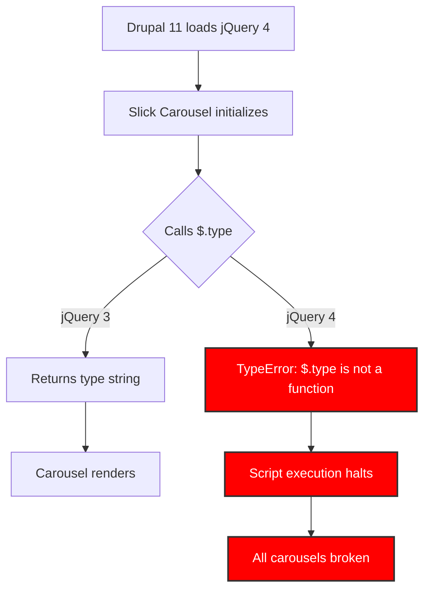

import Tabs from '@theme/Tabs';
import TabItem from '@theme/TabItem';

Drupal 11 ships with jQuery 4. jQuery 4 removes `$.type()`. Slick Carousel uses `$.type()`. The result is a fatal JavaScript error that kills every carousel on the page. I tracked down the exact failure chain and the fix.

<!-- truncate -->

## The problem: `$.type` is no more

:::danger[Breaking Change]
When a site running an older Slick Carousel module is upgraded to Drupal 11, the browser console shows: `Uncaught TypeError: $.type is not a function`. This halts script execution and every Slick carousel on the page fails to initialize.
:::

### The failure chain



### jQuery API removals that affect Drupal contrib

| Removed API | jQuery 3 | jQuery 4 | Native replacement |
|---|---|---|---|
| `$.type()` | Works | Removed | `typeof` operator |
| `$.isArray()` | Works | Removed | `Array.isArray()` |
| `$.isFunction()` | Works | Removed | `typeof fn === 'function'` |
| `$.isNumeric()` | Works | Removed | `!isNaN(parseFloat(n))` |
| `$.isWindow()` | Works | Removed | Manual check |

## The fix

The Slick Carousel module maintainers patched `slick.js` to replace `$.type()` with the native `typeof` operator. Update to version 3.0.3+ to get the fix.

<Tabs>
<TabItem value="old" label="Old slick.js (Incompatible)" default>

```javascript title="slick.js (broken on jQuery 4)"
// highlight-next-line
if ( $.type( something ) === 'object' ) {
  // ... do object things
}
```

</TabItem>
<TabItem value="new" label="New slick.js (Compatible)">

```javascript title="slick.js (jQuery 4 safe)" showLineNumbers
// highlight-next-line
if ( typeof something === 'object' ) {
  // ... do object things
}
```

</TabItem>
</Tabs>

The diff:

```diff
- if ( $.type( something ) === 'object' ) {
+ if ( typeof something === 'object' ) {
```

### Update with Composer

```bash title="Terminal"
composer update drupal/slick --with-dependencies
```

After updating, clear Drupal's caches and test all pages where carousels are used.

```bash title="Terminal"
drush cr
```

:::tip[Version Check]
Always prefer the latest stable release. Version 3.0.3+ contains the jQuery 4 compatibility fix, but later versions may include additional fixes.
:::

## Drupal + jQuery compatibility matrix

| Drupal Version | jQuery Version | Slick 2.x | Slick 3.0.0-3.0.2 | Slick 3.0.3+ |
|---|---|---|---|---|
| Drupal 10.x | jQuery 3.x | Works | Works | Works |
| Drupal 11.x | jQuery 4.x | Broken | Broken | Works |
| Drupal 12.x | jQuery 4.x+ | Broken | Broken | Works |

## Migration checklist

- [ ] Check current Slick module version: `composer show drupal/slick`
- [ ] Update to 3.0.3+: `composer update drupal/slick --with-dependencies`
- [ ] Clear Drupal caches: `drush cr`
- [ ] Test all pages with carousels
- [ ] Check browser console for remaining jQuery deprecation warnings
- [ ] Audit other contrib modules for `$.type()` usage
- [x] Verify carousels render correctly on all breakpoints

<details>
<summary>How to check for other jQuery 4 issues in contrib</summary>

Search your project's JavaScript files for removed jQuery APIs:

```bash
grep -rn '$.type\|$.isArray\|$.isFunction\|$.isNumeric\|$.isWindow' web/modules/contrib/
```

Any matches indicate modules that may break on Drupal 11/jQuery 4.

</details>

## What I learned

- **Upstream dependencies are your dependencies.** The Slick Carousel module relies on an external JavaScript library. When a Drupal core dependency (jQuery) changes, it cascades to contributed modules.
- **Proactive maintenance is key.** Simply keeping contributed modules up-to-date is the single most effective way to prepare for major Drupal version upgrades. The fix was available long before Drupal 11's release.
- **Consult the issue queue.** Before any major upgrade, the Drupal.org issue queue for your key modules is an invaluable resource. A quick search for "Drupal 11" or "jQuery 4" would have highlighted this problem early.

## References

- [Drupal 11.1 Custom Entity Breaking Changes](/2026-02-17-drupal-11-1-custom-entity-breaking-changes)
- [Drupal 11 Change Record Impact Map](/2026-02-17-drupal-11-change-record-impact-map-10-4x-teams)
- [Drupal.org Issue: Slick Carousel Fails on Drupal 11 with jQuery 4](https://www.drupal.org/project/slick/issues/3412532)
