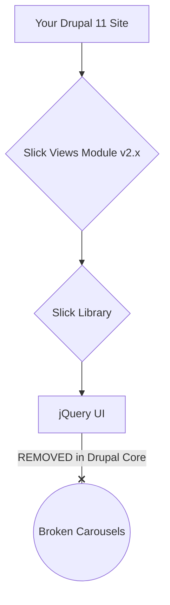

import Tabs from '@theme/Tabs';
import TabItem from '@theme/TabItem';

If your Drupal site relies on Slick Carousel, be aware of a major gotcha when planning your upgrade to Drupal 11: the complete removal of jQuery UI from core. Older versions of the Slick module depend on jQuery UI, and without a proactive update, your carousels will break.

<!-- truncate -->

## The Problem: A Chain of Deprecated Dependencies

Slick Carousel is a popular, versatile library for creating carousels, and the `slick` and `slick_views` modules make it easy to integrate with Drupal. However, the underlying Slick.js library was built on jQuery and, for some features, relied on components from the jQuery UI library.

The Drupal community has progressively removed jQuery UI from core, a process that started in Drupal 8 and was completed in Drupal 10. jQuery UI is now considered an end-of-life project by the OpenJS Foundation and is no longer maintained.

This creates a breaking dependency chain for sites upgrading to Drupal 11 with an outdated Slick module:

Any module or theme that lists a jQuery UI library as a dependency will fail to load that asset, causing JavaScript errors that prevent the carousel from initializing.

## The Solution: Update and Plan Your Migration

The good news is that the maintainers of the Slick module have addressed this issue.

### 1. Update the Slick Module

The primary solution is to **update the `slick` module to the latest 2.x version or the 3.x development branch BEFORE you upgrade to Drupal 11.** Recent versions have removed the hard dependency on jQuery UI and fixed other incompatibilities with jQuery 4, which is used in modern Drupal versions.

By updating the module first, you ensure that the necessary libraries are compatible with Drupal 11's core environment. Always check the module's release notes for the specific version you are using.

### 2. Consider a Modern Alternative: Swiper

While updating Slick is a valid path, the removal of jQuery UI is a strong signal to consider more modern alternatives for new projects or major redesigns. The most popular and well-supported carousel library in the Drupal ecosystem today is **Swiper**.

The [Swiper module](https://www.drupal.org/project/swiper) provides similar functionality to Slick but with several key advantages:
-   **No jQuery Dependency:** It's a modern, vanilla JavaScript library.
-   **Actively Maintained:** Swiper is under active development.
-   **Rich Feature Set:** It supports touch gestures, responsive breakpoints, vertical scrolling, and more out of the box.

Migrating from Slick to Swiper involves replacing the Slick Formatter in your Views or the Slick field formatter with the corresponding Swiper configuration. While there is no automatic upgrade path, the configuration options are often similar.

## What I Learned

*   **Audit Dependencies Before Upgrades:** The Slick Carousel issue is a perfect example of a hidden dependency problem. Before any major Drupal upgrade, it's critical to audit not just your direct module dependencies, but also the JavaScript libraries they rely on. Tools like `drupal-check` can help identify deprecated code usage.
*   **Embrace Modern JavaScript:** The move away from jQuery and jQuery UI is a long-term trend. When building new features or refactoring old ones, prioritize vanilla JavaScript libraries or frameworks that align with Drupal's modern architecture.
*   **Swiper is the New Standard:** For carousels, sliders, and galleries in Drupal, Swiper is now the community-preferred and more future-proof choice.

## References
*   [Drupal.org Change Record: jQuery UI library definitions are removed from core](https://www.drupal.org/node/3152336)
*   [Slick Module](https://www.drupal.org/project/slick)
*   [Swiper Module](https://www.drupal.org/project/swiper)
