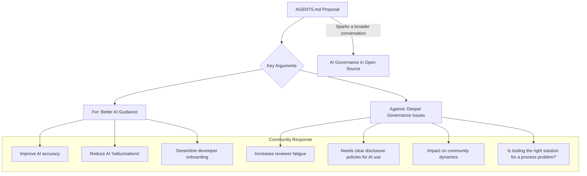

import Tabs from '@theme/Tabs';
import TabItem from '@theme/TabItem';

A proposal to add a machine-readable `AGENTS.md` file to Drupal core ignited a firestorm of debate, revealing deep-seated questions about the role of artificial intelligence in open-source development. While the proposal itself was short-lived, the conversation it started about AI guardrails and governance is a pivotal moment for the community.

<!-- truncate -->

## The Problem: Unpredictable AI Contributions

As developers increasingly use AI coding assistants, there's a growing risk of low-quality, "hallucinated," or non-idiomatic code being submitted to projects. These tools, lacking context about a project's specific architecture, coding standards, and tooling, can generate suggestions that don't align with best practices. This creates a significant burden on human reviewers, who must spend extra time validating and correcting AI-generated patches, potentially leading to reviewer fatigue and slowing down development.

The core issue is the gap between the generic knowledge of large language models (LLMs) and the specialized, nuanced conventions of a mature codebase like Drupal. How can we guide AI to be a productive contributor without overwhelming the very human processes that ensure quality and stability?

## The Solution: The `AGENTS.md` Proposal and the Ensuing Debate

The proposed solution, initiated by Theodore Biadala, was to introduce an `AGENTS.md` file in Drupal's root directory. This file, inspired by the `ROBOTS.txt` standard for web crawlers, would provide structured metadata for AI agents. Proponents, like Jacob Rockowitz, argued it could offer clear instructions on everything from directory structure and coding standards to specific API usage, thereby improving the quality of AI-assisted contributions.

The debate that followed quickly expanded beyond the technical merits of the file, branching into a broader discussion on AI governance.

As the diagram illustrates, the community was divided. While some saw a pragmatic tool for improving AI output, others saw a technical patch for a complex social and procedural problem. Concerns were raised that formalizing a channel for AI contributions might open the floodgates, straining the project's human review capacity. The discussion highlighted a fundamental tension: how to leverage AI's power without undermining the community-driven quality control that defines open source.

Ultimately, the proposal was closed, not because the idea was invalid, but because the conversation revealed that the community first needed to establish a clearer policy and philosophy on AI contributions.

## What I Learned: Key Takeaways

This debate was a microcosm of a conversation happening across the tech industry. Here are my key takeaways:

*   **Governance First, Tooling Second:** Jumping to a technical solution like `AGENTS.md` without first establishing clear policies for AI contributions is putting the cart before the horse. Communities need to decide *what* they want from AI before standardizing *how* to ask for it.
*   **Disclosure is Non-Negotiable:** There's a clear need for a standard way for contributors to disclose when a patch was generated or assisted by AI. This transparency is essential for reviewers to apply the appropriate level of scrutiny.
*   **Human Review Remains Paramount:** AI can be a powerful assistant, but it is not a replacement for experienced human developers. The role of the reviewer as a gatekeeper of quality is more important than ever in the age of AI.
*   **The Conversation Continues:** While the core proposal was closed, the effort is far from over. Ongoing work in the Drupal community, such as the [AI Guardrails module](https://www.drupal.org/project/ai_guardrails) and other policy discussions, shows a commitment to finding a sustainable path forward.

The `AGENTS.md` debate was not a failure; it was a catalyst. It forced a necessary and challenging conversation that will ultimately help the Drupal project—and other open-source communities—navigate the complex and exciting future of AI-assisted development.

## References

*   [Original `AGENTS.md` Proposal on Drupal.org](https://www.drupal.org/project/drupal/issues/3421568)
*   [The Drop Times: "Debate Over AGENTS.md In Drupal Core Sparks Broader AI Discussions"](https://thedroptimes.com/32284/debate-over-agents-md-drupal-core-sparks-broader-ai-discussions)
*   [Jacob Rockowitz: "What is AGENTS.md?"](https://jrockowitz.com/blog/what-is-agents-md)
*   Related post: [Drupal AGENTS.md and AI Governance](/2026-02-19-drupal-agents-md-and-ai-governance)
*   Related post: [AI in Drupal CMS 2.0: Practical Tools You Can Use From Day One](/2026-02-06-ai-in-drupal-cms-2-0-dayone-tools)
---
