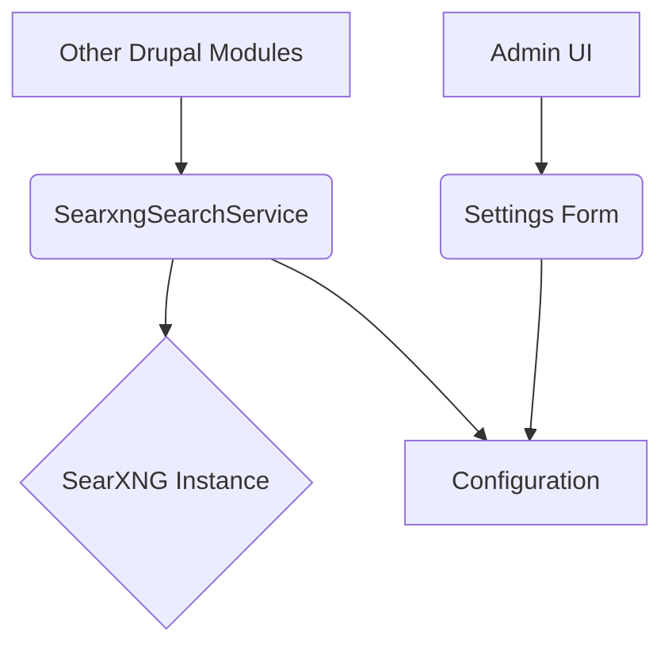

import Tabs from '@theme/Tabs';
import TabItem from '@theme/TabItem';

The Drupal AI Initiative is exploring new ways to integrate artificial intelligence into the CMS, and a recent addition to its toolkit is the SearXNG AI Assistant module. This module provides a foundation for building privacy-first AI search experiences within Drupal by leveraging the power of SearXNG, a free and open-source metasearch engine.

<!-- truncate -->

## The Problem: Balancing AI Innovation with User Privacy

As AI-powered search becomes more common, concerns about user privacy are growing. Many third-party search APIs require sending user data to external servers, creating potential privacy risks and dependencies on external services. For privacy-conscious organizations, this trade-off is often unacceptable. They need a way to innovate with AI without compromising their users' data.

## The Solution: A Self-Hosted Search Backend

The SearXNG AI Assistant module for Drupal 10 and 11 offers a solution by enabling integration with a self-hosted SearXNG instance. This allows organizations to have complete control over their search infrastructure and data.

The module is simple but effective. It consists of two main parts:

1.  **A Configuration Form:** A site administrator can easily set the URL of their SearXNG instance.
2.  **A Search Service:** A Drupal service that allows other modules to perform searches against the configured SearXNG instance.

Here's a look at the module's architecture:



The `SearxngSearchService` class handles the communication with the SearXNG instance. It takes a query string, sends it to the SearXNG API, and returns the results as a JSON object.

<Tabs>
<TabItem value="service" label="SearxngSearchService.php">

```php
<?php

namespace Drupal\searxng_ai_assistant;

use Drupal\Core\Config\ConfigFactoryInterface;
use GuzzleHttp\ClientFactory;
use GuzzleHttp\Exception\RequestException;

/**
 * Service to interact with a SearXNG instance.
 */
class SearxngSearchService {

  // ... (constructor and properties)

  /**
   * Performs a search on the configured SearXNG instance.
   */
  public function search(string $query): ?array {
    $config = $this->configFactory->get('searxng_ai_assistant.settings');
    $searxng_url = $config->get('instance_url');

    if (empty($searxng_url)) {
      return NULL;
    }

    $client = $this->httpClientFactory->fromOptions([
      'base_uri' => $searxng_url,
    ]);

    try {
      $response = $client->get('', [
        'query' => [
          'q' => $query,
          'format' => 'json',
        ],
      ]);
      return json_decode($response->getBody()->getContents(), TRUE);
    }
    catch (RequestException $e) {
      // Log the error.
      watchdog_exception('searxng_ai_assistant', $e);
      return NULL;
    }
  }

}
```
</TabItem>
<TabItem value="settings" label="src/Form/SettingsForm.php">

```php
<?php

namespace Drupal\searxng_ai_assistant\Form;

use Drupal\Core\Form\ConfigFormBase;
use Drupal\Core\Form\FormStateInterface;

/**
 * Configure SearXNG settings for this site.
 */
class SettingsForm extends ConfigFormBase {

  // ... (form setup)

  public function buildForm(array $form, FormStateInterface $form_state) {
    $config = $this->config('searxng_ai_assistant.settings');

    $form['instance_url'] = [
      '#type' => 'textfield',
      '#title' => $this->t('SearXNG instance URL'),
      '#description' => $this->t('The URL of your SearXNG instance. For example, https://searx.example.com'),
      '#default_value' => $config->get('instance_url'),
      '#required' => TRUE,
    ];

    return parent::buildForm($form, $form_state);
  }
  
  // ... (form submission)
}
```
</TabItem>
</Tabs>

## What I Learned

*   **Privacy-first AI is possible:** This module demonstrates that you don't have to rely on big tech companies for AI-powered search. By self-hosting SearXNG, you can build powerful search tools without sacrificing user privacy.
*   **A modular approach is key:** The SearXNG AI Assistant module doesn't try to do everything. It provides a solid foundation that other modules can build upon. This is a smart, flexible approach that allows for a wide range of use cases.
*   **Drupal's service architecture is powerful:** The module makes excellent use of Drupal's service container to provide a reusable search service. This makes it easy for other developers to integrate with the module.

## References

*   [View Code](https://github.com/victorstack-ai/drupal-searxng-ai-assistant)

