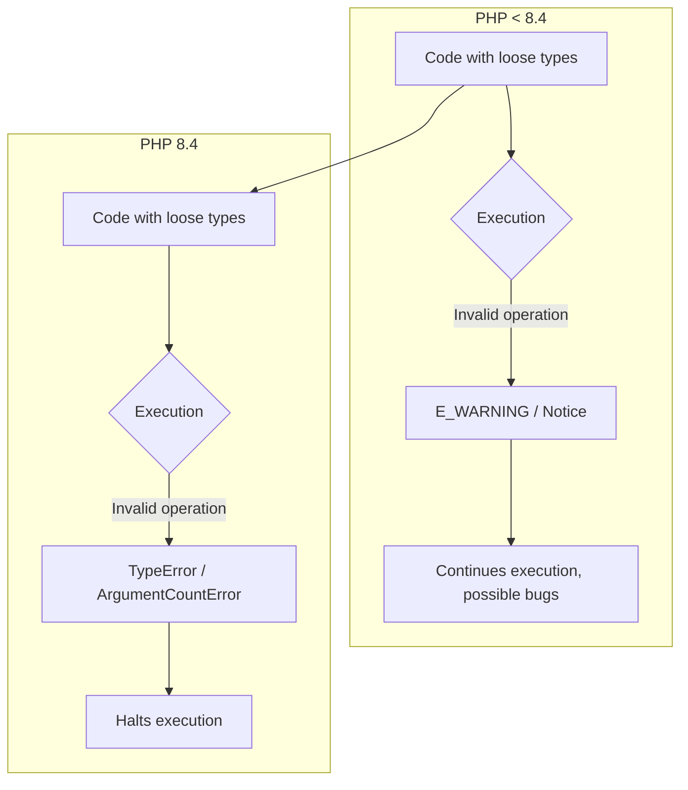

import Tabs from '@theme/Tabs';
import TabItem from '@theme/TabItem';

PHP 8.4 is set to introduce stricter type and error handling, leading to more frequent `TypeError` and `ArgumentCountError` exceptions. This guide provides a playbook for identifying potential issues in your codebase and mitigating them before you upgrade.

<!-- truncate -->

## The Problem: More Exceptions, Less Warning

Historically, PHP has been lenient with type mismatches and incorrect argument counts for internal functions, often resulting in warnings, notices, or silent buggy behavior. With PHP 8.4, the engine is becoming stricter, converting many of these issues into hard-throwing exceptions. This shift, while beneficial for code quality in the long run, can cause significant disruption during an upgrade if you're not prepared.

Your applications might break in unexpected ways if you have code that relies on the old, more forgiving behavior. For example, passing a non-countable value to `count()` or performing arithmetic operations on arrays could suddenly trigger fatal `TypeError` exceptions instead of `E_WARNING` messages.

## The Solution: A Proactive Mitigation Strategy

The key to a smooth upgrade is proactive analysis and refactoring. This involves static analysis, targeted code reviews, and updating your codebase to be more explicit and type-safe.

### Phase 1: Static Analysis

The first step is to get a broad overview of where potential problems lie. Tools like PHPStan and Psalm are invaluable here. Configure them to run at their highest levels to catch subtle type-related bugs.

```bash
# For PHPStan
vendor/bin/phpstan analyse src/ --level=max

# For Psalm
vendor/bin/psalm --level=1
```

Pay close attention to errors related to:
*   Invalid types passed to core functions.
*   Incorrect argument counts.
*   Usage of arithmetic operators on non-numeric types.

### Phase 2: Targeted Code Review

Static analysis won't catch everything. You need to manually inspect areas where PHP 8.4 introduces significant changes.

#### Key Breaking Changes in PHP 8.4

<Tabs>
<TabItem value="typeerror" label="TypeError Changes">

| Change Description | Before (PHP < 8.4) | After (PHP 8.4) | Mitigation |
| :--- | :--- | :--- | :--- |
| `count()` on invalid types | `E_WARNING` | `TypeError` | Use `is_countable()` before calling `count()`. |
| Arithmetic/Bitwise on arrays/objects | `E_WARNING` | `TypeError` | Ensure operands are numeric or cast them explicitly. |
| Illegal string offset | `E_WARNING` | `TypeError` | Validate array keys before access; use `array_key_exists()`. |
| `exit()`/`die()` with invalid type | Inconsistent | `TypeError` | Only pass `string` or `int` arguments. |
| Magic method type checks | No strict check | `TypeError` if declared types mismatch | Add or correct type hints for magic methods. |

</TabItem>
<TabItem value="argumentcounterror" label="ArgumentCountError Changes">

| Change Description | Before (PHP < 8.4) | After (PHP 8.4) | Mitigation |
| :--- | :--- | :--- | :--- |
| Wrong argument count for built-in functions | `E_WARNING` (since 7.1) / `ArgumentCountError` (since 8.0) | `ArgumentCountError` | Review all calls to built-in PHP functions and ensure the number of arguments is correct. |

</TabItem>
</Tabs>

#### Code Examples: Before and After

Here are some practical examples of code that will break and how to fix it.

**`count()` on a non-countable variable:**

```php
// Before: Generates a warning
$value = null;
$count = count($value); // Returns 0

// After: Throws TypeError
if (is_countable($value)) {
    $count = count($value);
} else {
    $count = 0;
}
```

**Arithmetic on an array:**

```php
// Before: Generates a warning
$items = [1, 2];
$new_items = $items + 1; // $new_items is null

// After: Throws TypeError
// Fix: Re-evaluate the logic. What was the intent?
// If you meant to add an element, use array_push or $items[]
$items[] = 1;
```

### Phase 3: Visualize the Flow

Understanding the change in error handling can be simplified with a diagram.



## What I Learned

*   **Proactive static analysis is non-negotiable.** Running tools like PHPStan and Psalm at their strictest levels is the most effective first line of defense.
*   **The `is_countable()` function is your new best friend.** Its usage should become standard practice before calling `count()` on any variable whose type isn't guaranteed.
*   **PHP is continuing its journey toward stricter typing.** These changes are not isolated; they are part of a larger trend. Embracing explicit typing now will save you headaches later.
*   **Don't just suppress errors, understand the intent.** When you find code that triggers these new exceptions, the goal isn't just to make the error go away. It's to understand the original developer's intent and fix the underlying logical flaw.
*   A gradual upgrade path, moving through minor versions (8.1, 8.2, 8.3) first, can make the final jump to 8.4 much smoother by addressing deprecations and changes incrementally.

## References

*   [PHP 8.4: Tighter Type and Error Handling](https://php.watch/versions/8.4)
*   [PHP RFC: Stricter implicit boolean coercions](https://wiki.php.net/rfc/deprecate_implicit_bool_coercion)
*   [Drupal 12 Readiness Dashboard](/blog/drupal-12-readiness-dashboard)
*   [WordPress 7.0 Compatibility Scanner](/blog/wp-7-compat-scanner-cli)
