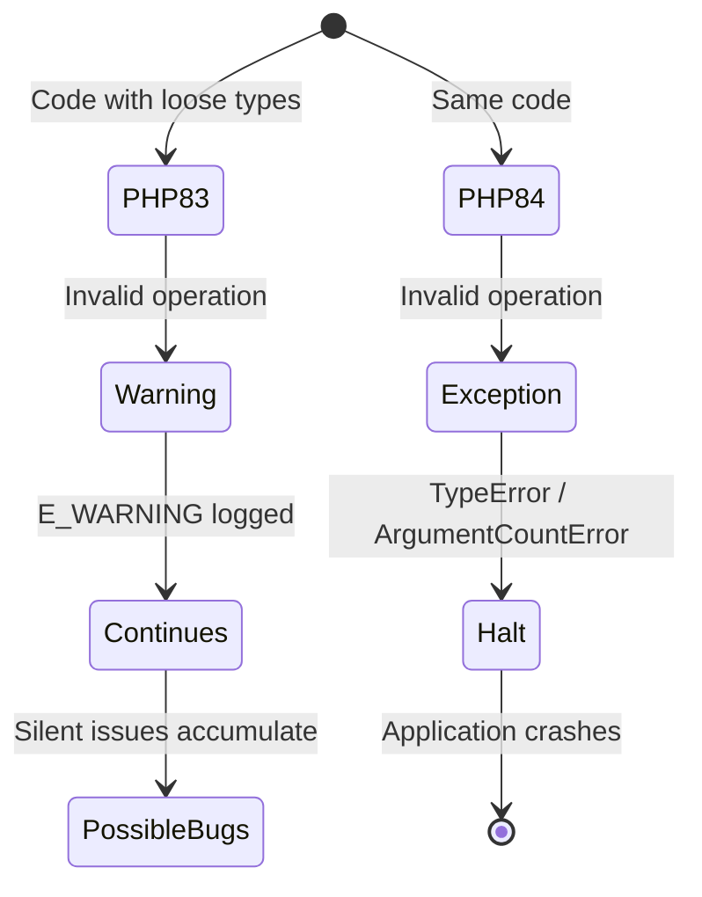

import Tabs from '@theme/Tabs';
import TabItem from '@theme/TabItem';

PHP 8.4 introduces stricter type and error handling, converting many `E_WARNING` messages into hard-throwing `TypeError` and `ArgumentCountError` exceptions. I built this playbook for identifying potential issues and mitigating them before upgrading.

<!-- truncate -->

## The problem: more exceptions, less warning

Historically, PHP has been lenient with type mismatches and incorrect argument counts for internal functions, often resulting in warnings, notices, or silent buggy behavior. With PHP 8.4, the engine throws hard exceptions instead.

:::danger[Breaking Behavior]
Code that "works with warnings" in PHP 8.3 can fatally crash in PHP 8.4. A `count(null)` that returned `0` with a warning now throws a `TypeError`.
:::

### The error handling shift


```mermaid
stateDiagram-v2
    [*] --> PHP83: Code with loose types
    PHP83 --> Warning: Invalid operation
    Warning --> Continues: E_WARNING logged
    Continues --> PossibleBugs: Silent issues accumulate

    [*] --> PHP84: Same code
    PHP84 --> Exception: Invalid operation
    Exception --> Halt: TypeError / ArgumentCountError
    Halt --> [*]: Application crashes
```

## The solution: a proactive mitigation strategy

### Phase 1: static analysis

```bash title="Terminal" showLineNumbers
# For PHPStan
vendor/bin/phpstan analyse src/ --level=max

# For Psalm
vendor/bin/psalm --level=1
```

Pay close attention to errors related to:
- Invalid types passed to core functions
- Incorrect argument counts
- Usage of arithmetic operators on non-numeric types

### Phase 2: targeted code review

<Tabs>
<TabItem value="typeerror" label="TypeError Changes" default>

| Change Description | Before (PHP < 8.4) | After (PHP 8.4) | Mitigation |
|---|---|---|---|
| `count()` on invalid types | `E_WARNING` | `TypeError` | Use `is_countable()` before calling `count()` |
| Arithmetic/Bitwise on arrays/objects | `E_WARNING` | `TypeError` | Ensure operands are numeric or cast explicitly |
| Illegal string offset | `E_WARNING` | `TypeError` | Validate array keys before access; use `array_key_exists()` |
| `exit()`/`die()` with invalid type | Inconsistent | `TypeError` | Only pass `string` or `int` arguments |
| Magic method type checks | No strict check | `TypeError` if declared types mismatch | Add or correct type hints for magic methods |

</TabItem>
<TabItem value="argumentcounterror" label="ArgumentCountError Changes">

| Change Description | Before (PHP < 8.4) | After (PHP 8.4) | Mitigation |
|---|---|---|---|
| Wrong argument count for built-in functions | `E_WARNING` (since 7.1) / `ArgumentCountError` (since 8.0) | `ArgumentCountError` | Review all calls to built-in PHP functions and ensure argument count is correct |

</TabItem>
</Tabs>

### Phase 3: fix the code

**`count()` on a non-countable variable:**

```diff
- $value = null;
- $count = count($value); // Returns 0 with warning
+ $value = null;
+ $count = is_countable($value) ? count($value) : 0;
```

**Arithmetic on an array:**

```diff
- $items = [1, 2];
- $new_items = $items + 1; // null with warning
+ $items = [1, 2];
+ $items[] = 1; // Append element instead
```

### Full code examples

```php title="Before: generates warning in PHP 8.3" showLineNumbers
// highlight-next-line
// count() on null -- returns 0 with E_WARNING
$value = null;
$count = count($value);
```

```php title="After: safe for PHP 8.4" showLineNumbers
$value = null;
// highlight-next-line
if (is_countable($value)) {
    $count = count($value);
} else {
    $count = 0;
}
```

```php title="Before: arithmetic on array" showLineNumbers
// highlight-next-line
// Array + int -- E_WARNING, result is null
$items = [1, 2];
$new_items = $items + 1;
```

```php title="After: fix the intent" showLineNumbers
// highlight-next-line
// If you meant to add an element, use array_push or []
$items = [1, 2];
$items[] = 1;
```

## PHP version compatibility matrix

| Behavior | PHP 8.1 | PHP 8.2 | PHP 8.3 | PHP 8.4 |
|---|---|---|---|---|
| `count(null)` | Warning + 0 | Warning + 0 | Warning + 0 | TypeError |
| Array arithmetic | Warning | Warning | Warning | TypeError |
| Illegal string offset | Warning | Warning | Warning | TypeError |
| Wrong arg count (built-in) | ArgumentCountError | ArgumentCountError | ArgumentCountError | ArgumentCountError |
| Implicit nullable params | Works | Works | Works | Deprecated |
| `exit()` with invalid type | Inconsistent | Inconsistent | Inconsistent | TypeError |

:::tip[Gradual Upgrade Path]
A gradual upgrade through minor versions (8.1, 8.2, 8.3) first can make the final jump to 8.4 much smoother by addressing deprecations and changes incrementally.
:::

## Migration checklist

- [ ] Run PHPStan at `--level=max` on all custom code
- [ ] Run Psalm at `--level=1` on all custom code
- [ ] Search for `count()` calls on potentially null/non-countable variables
- [ ] Audit arithmetic operations for non-numeric operands
- [ ] Review magic method type declarations
- [ ] Check all `exit()`/`die()` calls for valid argument types
- [ ] Run full test suite on PHP 8.4 in CI
- [x] Fix all TypeError and ArgumentCountError findings before production deploy

<details>
<summary>Quick grep patterns to find risky code</summary>

```bash
# Find count() on variables that might be null
grep -rn 'count(\$' src/ | head -20

# Find arithmetic on array variables
grep -rn '\$.*\[\].*[+\-\*\/]' src/ | head -20

# Find exit/die with variables
grep -rn 'exit(\$\|die(\$' src/ | head -20
```

</details>

## What I learned

- **Proactive static analysis is non-negotiable.** Running tools like PHPStan and Psalm at their strictest levels is the most effective first line of defense.
- **The `is_countable()` function is your new best friend.** Its usage should become standard practice before calling `count()` on any variable whose type is not guaranteed.
- **PHP is continuing its journey toward stricter typing.** These changes are not isolated; they are part of a larger trend. Embracing explicit typing now will save headaches later.
- **Do not just suppress errors, understand the intent.** When you find code that triggers these new exceptions, the goal is to understand the original developer's intent and fix the underlying logical flaw.

## References

- [PHP 8.4: Tighter Type and Error Handling](https://php.watch/versions/8.4)
- [PHP RFC: Stricter implicit boolean coercions](https://wiki.php.net/rfc/deprecate_implicit_bool_coercion)
- [Drupal 12 Readiness Dashboard](/2026-02-08-drupal-12-readiness-dashboard)
