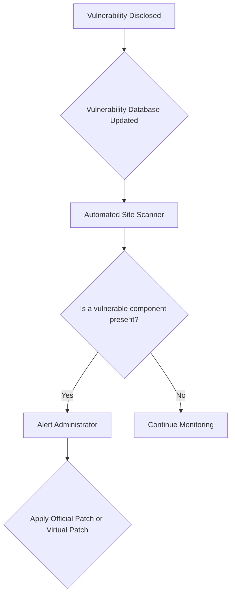

import Tabs from '@theme/Tabs';
import TabItem from '@theme/TabItem';

The WordPress ecosystem faced another busy week, with Wordfence Intelligence reporting 174 new vulnerabilities between February 9 and February 15, 2026. This analysis breaks down the numbers and what they mean for anyone managing a WordPress site.

<!-- truncate -->

## The Problem: A Constant Stream of Vulnerabilities

The sheer volume of weekly vulnerabilities poses a significant challenge for WordPress administrators. This past week saw vulnerabilities impacting a wide range of components, from plugins to themes. Keeping track of, prioritizing, and patching these issues is a relentless task that can easily overwhelm even experienced teams.

The breakdown for the week is as follows:
- **Total Vulnerabilities:** 174
- **Affected Plugins:** 139
- **Affected Themes:** 28

This continuous cycle of disclosures highlights the critical need for robust, automated security processes. Without them, sites are left exposed to potential exploits.

## The Solution: Automated Auditing and Proactive Defense

Manually tracking vulnerabilities is not a scalable solution. Instead, developers and administrators should rely on automated tools to monitor their sites. Tools that tap into vulnerability databases can provide timely alerts and, in some cases, even apply virtual patches before official fixes are released.

Here's a high-level overview of a proactive security workflow:

This automated approach ensures that new threats are identified quickly, reducing the window of opportunity for attackers. For those looking to build their own security tooling, our guide on building a [Wordfence RSS auditor with WP-CLI](/2026-02-18-wordfence-rss-wp-cli-auditor) provides a practical starting point. Combining this with a comprehensive malware scanner, like the one detailed in our [WP Malware Sentinel](/2026-02-08-wp-malware-sentinel-scanner) post, creates a stronger defense posture.

## What I Learned: Key Takeaways

*   **The Pace is Relentless:** The number of vulnerabilities (174 in one week) confirms that security cannot be an afterthought. It must be a continuous, integrated part of site operations.
*   **Plugins are the Primary Vector:** With 139 affected plugins, it's clear that third-party extensions remain the largest attack surface for most WordPress sites. Rigorous vetting of new plugins and prompt removal of abandoned ones is crucial.
*   **Automation is Non-Negotiable:** Relying on manual checks is a recipe for failure. Automated scanning and alerting are essential for effective security management at any scale.
*   **Community Contribution is Vital:** The report mentioned that 64 security researchers contributed to these disclosures. This highlights the positive impact of the open-source community in identifying and reporting security issues.

While this report focuses on WordPress, the principles of automated security and proactive defense are universal, applying to other platforms like Drupal as well. Concepts like the [AI Vulnerability Guardian](/2026-02-08-drupal-ai-vulnerability-guardian) for Drupal showcase a similar trend towards intelligent, automated security monitoring.

## References

*   **Original Report:** The data is based on the Wordfence Intelligence Weekly WordPress Vulnerability Report (Feb 9-15, 2026), which is compiled from their extensive vulnerability database.
